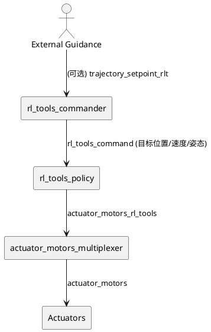

# RLtools PX4: 轨迹如何被执行（悬停 vs 八字）

> 本文基于 RLtools PX4 外部模块的源码解释“轨迹执行”机制。RLtools 模块仓库：<https://github.com/rl-tools/px4> <br>
<https://github.com/rl-tools>

## 目录

- [1. 概览与适用场景](#1-概览与适用场景)
- [2. 关键概念与链路](#2-关键概念与链路)
- [3. 深入解析（按主题拆分）](#3-深入解析按主题拆分)
- [4. 实操 / 排障（按需选择）](#4-实操--排障按需选择)
- [5. 术语与参考](#5-术语与参考)

---

## 1. 概览与适用场景

本文回答“RLtools PX4 的视频里为何能在悬停与八字之间切换”，以及“RL policy 是否接收期望轨迹”。结论是：**policy 接收的是“误差状态”而非“轨迹本身”**，轨迹通过移动参考点来实现。

适用读者：

- 已经把 RLtools 模块编进固件，并希望理解真实飞行中的轨迹执行方式。
- 需要把外部轨迹（如 ROS2 生成的八字）送入 RL policy 的工程师。

## 2. 关键概念与链路

**核心思路：** policy 永远尝试“把误差归零”。悬停与八字的区别只在于“误差参考点是否随时间变化”。



关键数据流：

- 目标由 `rl_tools_command` 提供（目标位置、速度、姿态）。
- `rl_tools_policy` 计算“当前状态与目标的误差”，输出电机命令。
- `actuator_motors_multiplexer` 在原生控制与 RL 输出之间切换。

## 3. 深入解析（按主题拆分）

### 3.1 输入是“相对误差”，不是轨迹

RL policy 的观测由 **当前状态 - 目标状态** 构成：

- 位置误差：`position - target_position`
- 速度误差：`velocity - target_linear_velocity`
- 姿态误差：`target_orientation` 与当前姿态的差

源码位置：

- `rl_tools_command` 定义：[`px4/external_modules/msg/RlToolsCommand.msg`](https://github.com/rl-tools/px4/blob/main/external_modules/msg/RlToolsCommand.msg)
- 误差构造与观测：[`RLtoolsPolicy::observe`](https://github.com/rl-tools/px4/blob/main/external_modules/src/modules/rl_tools_policy/RLtoolsPolicy.cpp)

因此，**policy 并不“知道”当前是悬停还是八字**，它只看到“我离目标有多远”。

### 3.2 悬停与八字的切换方式

- **悬停**：目标位置保持固定（激活瞬间的位置）。
- **八字**：目标位置随时间变化（内部 FigureEight 轨迹）。

切换逻辑在 `rl_tools_commander`：

- 内置八字轨迹生成器：[`RLtoolsCommander::FigureEight`](https://github.com/rl-tools/px4/blob/main/external_modules/src/modules/rl_tools_commander/RLtoolsCommander.cpp)
- 轨迹模式：`TRAJECTORY_TRACKING`

在代码里，`rl_tools_commander` 发布不断变化的目标位置/速度到 `rl_tools_command`，policy 只管“把误差拉回 0”。

### 3.3 电机输出路径

RL policy 直接发布 `actuator_motors_rl_tools`，多路复用器决定是否使用它：

| 模块 | GitHub 链接 | 作用 |
| --- | --- | --- |
| RL policy | [`RLtoolsPolicy.cpp`](https://github.com/rl-tools/px4/blob/main/external_modules/src/modules/rl_tools_policy/RLtoolsPolicy.cpp) | 生成 `actuator_motors_rl_tools` |
| Multiplexer | [`actuator_motors_multiplexer.cpp`](https://github.com/rl-tools/px4/blob/main/external_modules/src/modules/actuator_motors_multiplexer/actuator_motors_multiplexer.cpp) | 在 PX4 原生输出与 RL 输出之间切换 |

### 3.4 “没有前瞻”的限制

RL policy 只看“当前误差”，**没有轨迹前瞻**，因此对于急转弯会滞后反应。这是其性能上限。

## 4. 实操 / 排障（按需选择）

### 4.1 内置八字轨迹

在 MAVLink shell 中设置：

```sh
rl_tools_commander set_mode TRAJECTORY_TRACKING
rl_tools_commander set_trajectory_scale 2
rl_tools_commander set_trajectory_interval 5.5
```

随后通过 AUX1/按钮激活 policy（由 `RLT_ACTIV_SRC` / `RLT_ACTIV_BTN` 控制）。

### 4.2 外部轨迹输入（高级）

思路：外部程序持续发布目标到 `rl_tools_command`。

注意事项：

- policy 有 **100 ms 的命令超时**，需要持续更新目标（>10 Hz）。
  - 见 [`COMMAND_TIMEOUT`](https://github.com/rl-tools/px4/blob/main/external_modules/src/modules/rl_tools_policy/RLtoolsPolicy.hpp)
- 若要通过 ROS2/uXRCE-DDS 发送，需把 `rl_tools_command` 映射进 DDS 或编写 PX4 侧桥接。

### 4.3 常见现象

| 现象 | 诊断 | 对应源码 | 解决 |
| --- | --- | --- | --- |
| policy 突然失活 | 目标更新频率低，超时 | [`COMMAND_TIMEOUT`](https://github.com/rl-tools/px4/blob/main/external_modules/src/modules/rl_tools_policy/RLtoolsPolicy.hpp) | 提高目标发布频率 |
| 多路复用切回 PX4 | RL 输出停止更新 | [`actuator_motors_multiplexer.cpp`](https://github.com/rl-tools/px4/blob/main/external_modules/src/modules/actuator_motors_multiplexer/actuator_motors_multiplexer.cpp) | 确认 policy 正在输出 `actuator_motors_rl_tools` |

## 5. 术语与参考

- **rl_tools_command**：RL policy 的目标输入（位置/速度/姿态）。
- **actuator_motors_rl_tools**：RL policy 直接输出的电机指令。
- **FigureEight**：内置的八字轨迹生成器。

延伸阅读：

- RLtools PX4 仓库：<https://github.com/rl-tools/px4>
- RL policy 模块说明：[`rl_tools_policy`](https://github.com/rl-tools/px4/tree/main/external_modules/src/modules/rl_tools_policy)
- 多路复用器：[`actuator_motors_multiplexer`](https://github.com/rl-tools/px4/tree/main/external_modules/src/modules/actuator_motors_multiplexer)
