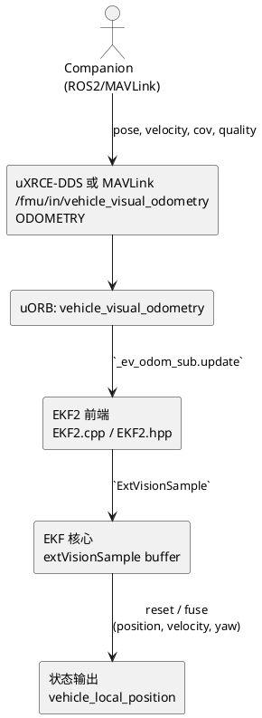

# PX4 外部视觉融合与原点同步

## 目录

- [1. 概览与适用场景](#1-概览与适用场景)
- [2. 数据链路与参数总览](#2-数据链路与参数总览)
- [3. 深入解析](#3-深入解析)
  - [3.1 EKF2 订阅与缓冲](#31-ekf2-订阅与缓冲)
  - [3.2 `EKF2_EV_CTRL` 位掩码、延迟与位置重置](#32-ekf2_ev_ctrl-位掩码延迟与位置重置)
  - [3.3 原点对齐与 reset 行为](#33-原点对齐与-reset-行为)
  - [3.4 `vehicle_visual_odometry` vs `vehicle_mocap_odometry`](#34-vehicle_visual_odometry-vs-vehicle_mocap_odometry)
- [4. 实操与排障](#4-实操与排障)
- [5. 术语与参考](#5-术语与参考)

---

## 1. 概览与适用场景

面向需要把动捕/VIO 位姿经 ROS2 `/fmu/in/vehicle_visual_odometry` 或 MAVLink `ODOMETRY` 提供给 PX4 EKF2 的开发者。重点解答：

- EKF2 如何订阅并融合 EV 数据？
- PX4 的 NED 原点何时会重置到外部视觉原点？
- `vehicle_visual_odometry` 与 `vehicle_mocap_odometry` 有何区别？

## 2. 数据链路与参数总览

| 项 | 说明 |
| --- | --- |
| 订阅者 | [`src/modules/ekf2/EKF2.hpp#L330`](https://github.com/PX4/PX4-Autopilot/blob/main/src/modules/ekf2/EKF2.hpp#L330)：`uORB::Subscription _ev_odom_sub{ORB_ID(vehicle_visual_odometry)}` |
| 缓冲 | [`src/modules/ekf2/EKF2.cpp#L2207`](https://github.com/PX4/PX4-Autopilot/blob/main/src/modules/ekf2/EKF2.cpp#L2207)：`_ev_odom_sub.update(&_ev_odom)` → `_ext_vision_buffer.push(extVisionSample)` |
| 融合控制 | [`src/modules/ekf2/EKF/aid_sources/external_vision`](https://github.com/PX4/PX4-Autopilot/tree/main/src/modules/ekf2/EKF/aid_sources/external_vision)：`ev_pos_control.cpp`, `ev_vel_control.cpp`, `ev_yaw_control.cpp` |
| 参数 | [`src/modules/ekf2/params_external_vision.yaml`](https://github.com/PX4/PX4-Autopilot/blob/main/src/modules/ekf2/params_external_vision.yaml) (`EKF2_EV_CTRL`, `EKF2_EV_DELAY`, `EKF2_EV_POS_*`, `EKF2_EV_QMIN`) |

## 3. 深入解析

### 3.1 EKF2 订阅与缓冲

- **订阅入口**：[`EKF2.hpp#L330`](https://github.com/PX4/PX4-Autopilot/blob/main/src/modules/ekf2/EKF2.hpp#L330) 创建 `_ev_odom_sub`；在 [`EKF2.cpp#L2207`](https://github.com/PX4/PX4-Autopilot/blob/main/src/modules/ekf2/EKF2.cpp#L2207) 的 `EKF2::Run()` 中调用 `update` 并填充 `extVisionSample`。
- **拷贝逻辑**：[`estimator_interface.cpp#L372-L395`](https://github.com/PX4/PX4-Autopilot/blob/main/src/modules/ekf2/EKF/estimator_interface.cpp#L372-L395) 把 `vehicle_visual_odometry` 的位置/速度/姿态、协方差、质量写入 `_ext_vision_buffer`，并限制频率（默认 30 Hz）。
- **融合调度**：[`ev_control.cpp#L47-L97`](https://github.com/PX4/PX4-Autopilot/blob/main/src/modules/ekf2/EKF/aid_sources/external_vision/ev_control.cpp#L47-L97) 中 `EKF::controlExternalVisionFusion()` 弹出样本，根据 `EKF2_EV_CTRL` 位掩码调用 `EvPosControl`/`EvVelControl`/`EvYawControl`，再通过 `fuseVelPosYaw()` 更新状态。
- **缺失超时**：`EV_MAX_INTERVAL` 在 [`common.h#L72`](https://github.com/PX4/PX4-Autopilot/blob/main/src/modules/ekf2/EKF/common.h#L72) 设为 200 ms，超时会停止对应融合并触发 `estimator_event_flags.starting_vision_* = false`。

### 3.2 `EKF2_EV_CTRL` 位掩码、延迟与位置重置

- `EKF2_EV_CTRL` bit 含义（参见 [`params_external_vision.yaml`](https://github.com/PX4/PX4-Autopilot/blob/main/src/modules/ekf2/params_external_vision.yaml)）：
  - bit0：水平位置；bit1：垂直位置；
  - bit2：速度；bit3：航向（yaw）。
- 例如 `0b1011` 表示融合水平/垂直位置 + Yaw，不融合速度；若希望 EKF 速度与视觉一致需打开 bit2。
- `EKF2_EV_DELAY` 定义 EV 相对 IMU 的延迟（毫秒），`EKF2_EV_POS_X/Y/Z` 描述传感器在机体系下的安装偏移。
- `EvPosControl` 中的 `reset_pos_to_vision`（[`ev_pos_control.cpp#L224-L289`](https://github.com/PX4/PX4-Autopilot/blob/main/src/modules/ekf2/EKF/aid_sources/external_vision/ev_pos_control.cpp#L224-L289)）在残差超阈值且质量满足时触发，最终由 [`EKF2.cpp#L1157-L1166`](https://github.com/PX4/PX4-Autopilot/blob/main/src/modules/ekf2/EKF2.cpp#L1157-L1166) 将 `estimator_event_flags.reset_pos_to_vision` 发布给上层。

### 3.3 原点对齐与 reset 行为

- PX4 `vehicle_local_position` 的原点在 EKF 初始化时锁定（参考 [`msg/versioned/VehicleLocalPosition.msg`](https://github.com/PX4/PX4-Autopilot/blob/main/msg/versioned/VehicleLocalPosition.msg) 备注），等同于“飞控上电位置”。EV 融合不会改变 `ref_lat/lon/alt`。
- 当外部视觉与 PX4 原点不同，EKF 将差值视为观测残差：若误差小 → 仅渐进修正；若误差大且满足条件 → `reset_pos_to_vision` 把当前状态平移，但原点仍然是 PX4 设定。
- 若想完全对齐：
  1. **主动 reset**：在视觉数据稳定后执行 `ekf2 reset` 或修改参数触发一次 `reset_pos_to_vision`；可用 `listener estimator_event_flags` 确认。
  2. **外部对齐**：在外部视觉节点中读取 PX4 的 `vehicle_local_position` 原点（`x`, `y`, `z`, `ref_lat`, `ref_lon`, `ref_alt`），将动捕坐标转换到 PX4 NED 再发送。
- 注意：`reset_pos_to_vision` 只对状态向量生效，不改 `ref_lat/lon`，因此 GPS/其他传感器仍以原始原点计算。

### 3.4 `vehicle_visual_odometry` vs `vehicle_mocap_odometry`

- EKF2 只订阅 `vehicle_visual_odometry`；`vehicle_mocap_odometry` 主要用于 MAVLink 透传或日志。参见 `EKF2.hpp`，未出现对 `vehicle_mocap_odometry` 的订阅。
- 若把动捕数据发布到 `/fmu/in/vehicle_mocap_odometry`，PX4 会继续转发给 MAVLink，但 EKF 不会使用。若需要融合，务必改用 `vehicle_visual_odometry`。

## 4. 实操与排障

| 症状 | 排查步骤 | 参考逻辑/源码 | 解决建议 |
| --- | --- | --- | --- |
| EKF 未开始融合视觉 | `listener estimator_status_flags`：`vision_position_valid=false` | [`ev_control.cpp`](https://github.com/PX4/PX4-Autopilot/blob/main/src/modules/ekf2/EKF/aid_sources/external_vision/ev_control.cpp) gating | 检查 `EKF2_EV_CTRL` 位、`EKF2_EV_QMIN`、`quality` 字段；确保 200 ms 内持续发布 |
| 视觉位置与 PX4 本地坐标偏移 | `listener estimator_event_flags` 看 `reset_pos_to_vision` 是否触发；读取 `vehicle_local_position` 原点 | [`ev_pos_control.cpp`](https://github.com/PX4/PX4-Autopilot/blob/main/src/modules/ekf2/EKF/aid_sources/external_vision/ev_pos_control.cpp) | 触发 reset 或在外部节点做坐标平移 |
| 速度仍由 IMU 推导而漂移 | `EKF2_EV_CTRL` bit2 未置位 | [`ev_vel_control.cpp`](https://github.com/PX4/PX4-Autopilot/blob/main/src/modules/ekf2/EKF/aid_sources/external_vision/ev_vel_control.cpp) | 打开 bit2，并提供 `velocity`/`velocity_covariance` |
| Yaw 不收敛 | `EKF2_EV_CTRL` bit3 未置位或 `pose_frame` 非 NED | [`ev_yaw_control.cpp`](https://github.com/PX4/PX4-Autopilot/blob/main/src/modules/ekf2/EKF/aid_sources/external_vision/ev_yaw_control.cpp) | 设 `pose_frame=POSE_FRAME_NED`，确保 `orientation` 四元数合法；打开航向融合 |
| 视觉数据突然中断 | 检查 `estimator_event_flags.starting_vision_*` 由 true→false | [`ev_control.cpp`](https://github.com/PX4/PX4-Autopilot/blob/main/src/modules/ekf2/EKF/aid_sources/external_vision/ev_control.cpp) timeout | 确保 ROS2 发布率 ≥20 Hz，网络延迟 <200 ms；必要时调大 `EV_MAX_INTERVAL` (代码常量) |

## 5. 术语与参考

- **External Vision (EV)**：外部视觉/动捕系统提供的位姿或速度观测，通过 `vehicle_visual_odometry` 输入 EKF2。
- **NED 原点**：EKF2 上电时定义的本地坐标原点（`vehicle_local_position.ref_lat/lon/alt`）。
- **reset_pos_to_vision**：EKF 检测到视觉观测可信且偏差过大时的状态平移事件，会在 `estimator_event_flags` 中标注。

**源码与文档**：

- [`src/modules/ekf2/EKF2.cpp`](https://github.com/PX4/PX4-Autopilot/blob/main/src/modules/ekf2/EKF2.cpp) & [`EKF2.hpp`](https://github.com/PX4/PX4-Autopilot/blob/main/src/modules/ekf2/EKF2.hpp)：uORB 订阅与缓冲。
- [`src/modules/ekf2/EKF/aid_sources/external_vision`](https://github.com/PX4/PX4-Autopilot/tree/main/src/modules/ekf2/EKF/aid_sources/external_vision)：姿态/速度/位置融合实现。
- [`src/modules/ekf2/params_external_vision.yaml`](https://github.com/PX4/PX4-Autopilot/blob/main/src/modules/ekf2/params_external_vision.yaml)：参数定义。
- PX4 官方文档：[docs/en/ros2/px4_ros2_control_interface.md](https://github.com/PX4/PX4-Autopilot/blob/main/docs/en/ros2/px4_ros2_control_interface.md)（EV setpoint 入口）。
