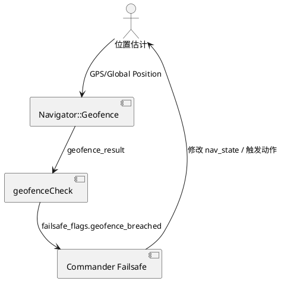

## PX4 电子围栏机制与 3×3×3 m 实验方案

> 参考文档： [Safety > Geofence Failsafe](../../docs/en/config/safety.md#geofence-failsafe)、[Flying > Geofence](../../docs/en/flying/geofence.md)、`src/modules/navigator/geofence.cpp`、`src/modules/commander/HealthAndArmingChecks/checks/geofenceCheck.cpp` 与 `src/modules/commander/failsafe/failsafe.cpp`。

### 1. 基本工作原理

1. **Navigator 加载围栏**：`Geofence::run()` 会从 Dataman 读取地理围栏（SD 卡 `geofence.txt` 或 QGC 上传的任务）。在 `checkPointAgainstAllGeofences()` (`src/modules/navigator/geofence.cpp:343-402`) 中分别执行垂直 (`_altitude_min/max`) 与平面多边形/圆形检查。若当前位置超限，函数返回 `false` 并在 `geofence_result_s` 中标记触发项。
2. **Health & Arming Checks**：`geofenceCheck.cpp:38-101` 订阅 `geofence_result`，一旦 `geofence_max_dist_triggered` / `geofence_max_alt_triggered` / `geofence_custom_fence_triggered` 为真即设置 `failsafeFlags().geofence_breached`，同时发布 MAVLink 提示（当动作不是 `GF_ACTION_NONE` 时）。
3. **Commander 处理动作**：`failsafe.cpp:90-118` 根据 `GF_ACTION` 参数映射为 Warning/Hold/RTL/Terminate/Land；`failsafe.cpp:562` 会在 `geofence_breached` 为真时将动作加入 fail-safe 队列。最终 `Commander` 切换飞行模式或终止。
4. **模式兼容性**：Geofence 检查运行在 Navigator/Commander 层，与飞行模式无关。无论 Position Mode、Offboard Mode 还是 External Mode，只要 nav_state 保持外部控制，`failsafe_flags` 触发后同样会覆盖 setpoint 或切换模式（例如从 Offboard 拉回 RTL）。

### 2. 3×3×3 m 电子围栏配置

由于 PX4 的内置“简单围栏”是一个围绕 Home 的圆柱体，可通过 `GF_MAX_HOR_DIST` 和 `GF_MAX_VER_DIST` 近似一个 3 m 的立方体：

- 水平 3 m 边长 ≈ 半径 `1.5 m` → `GF_MAX_HOR_DIST = 1.5`。
- 垂直高度 3 m，可设置 `GF_MAX_VER_DIST = 1.5`，这样 Home 上下各 1.5 m。
- 失败动作为保持模式并悬停：`GF_ACTION = 2 (Hold mode)`，若希望自动返航可改为 `3 (Return mode)`。
- 位置源沿用估计器输出：`GF_SOURCE = 0`（global position）。
- 如需更严格的立方体边界，可以在 QGroundControl 的 Plan > Geofence 中绘制一个 3×3 m 的正方形并上传（参考 `docs/en/flying/geofence.md`），对应的点列会被存入 Dataman 并由 `Geofence` 模块解析成多边形。

### 3. 实验方案

#### 3.1 测试环境准备

1. **Firmware & 参数**：编译/刷写 PX4 v1.14+；设置上述 `GF_*` 参数。若使用自定义多边形，创建 `geofence.txt`（Home 四周 1.5 m 正方形）并复制到 SD 卡 `etc/` 或通过 QGC 上传。
2. **Home 初始化**：上电并等待 GPS Fix（或 SITL 中等待 EKF 原点），确保 Home 位于围栏中心。
3. **日志/监控**：在 MAVLink 控制台开启 `listener geofence_result` 或使用 QGC 安全面板观察 `Geofence` 状态。

#### 3.2 Position Mode 验证

1. 起飞至 1 m 高度，切换至 Position Mode。
2. 缓慢飞向 X 方向边界（1.3~1.4 m）。
3. **期望行为**：
   - 当剩余距离 <0.2 m 时，`geofence_result.geofence_max_dist_triggered` 置位，QGC 弹出警告（来自 `geofenceCheck.cpp:93-96`）。
   - 若继续越界，`GF_ACTION=Hold` 触发：Commander 切回 HOLD（或 POSCTL 中止推进）并保持在围栏内侧。
   - 飞行日志中 `failsafe_flags.geofence_breached`=true，`geofence_result` 标记的触发项为 1。

4. 重复 Y 方向、升高至 1.4 m（验证 `GF_MAX_VER_DIST`），以及下降至 -1.4 m（若支持低于 Home 的飞行）。

#### 3.3 Offboard / External Mode 验证

1. 建立 ROS 2 External Controller 或 Offboard 节点，周期性发送位置 setpoint（例如圆形轨迹）。
2. 在 Offboard 模式下把轨迹半径设为 2 m，让 setpoint 超出 1.5 m：
   - Navigator 会检测到当前估计位置将违反围栏；`geofence_result` 触发。
   - Commander 根据 `GF_ACTION` 立刻退出 Offboard，切到 HOLD 或 RTL，终止外部指令。
3. 若使用 External Mode（`px4_ros2_interface_lib`）：
   - Mode Executor 可在 `onDeactivate()` 中收到 Commander 的 mode 切换并记录 geofence 事件，外部程序应在日志中看到 `failsafeFlags().geofence_breached` 置位。
   - 重新进入 External Mode 前需手动解除围栏告警（飞回中心，`GF_ACTION` 完成）。

#### 3.4 计算确认

- 日志检查：确认 `vehicle_status.nav_state` 由 `NAVIGATION_STATE_OFFBOARD`/`EXTERNALx` 切至 `HOLD` 或 `AUTO_RTL`；`geofence_result.geofence_custom_fence_triggered` 或 `geofence_max_dist_triggered`=true。
- 若需要自动恢复 Offboard/External，可在外部程序检测 `failsafe` 后重新发送 `set_mode`，但确保飞机仍在围栏内。

### 4. 注意事项

- 围栏载入失败时 `Geofence::run()` 会在 `DatamanState::Error` 中输出 `PX4_ERR`，需检查 geofence 文件或 QGC 上传。
- Preemptive 模式 (`GF_PREDICT=1`) 会根据速度预测是否越界，可在快速运动时使用，不过 `docs/en/releases/1.12.md` 指出仍为实验特性。
- Terminator (`GF_ACTION=4`) 会触发 flight termination (`failsafe.cpp:110`)，需搭配降落伞等装置时慎用。

通过上述步骤，即可在 Position Mode 与 Offboard/External Mode 下验证 PX4 电子围栏：飞行器在接近 3×3×3 m 边界时会得到警告，并在越界时自动切换到指定的安全模式，确保不离开围栏区域。
