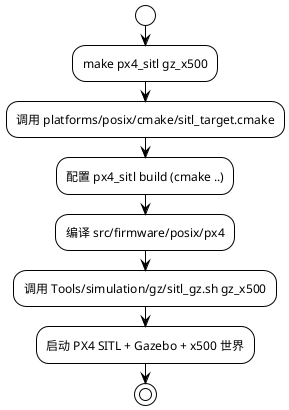
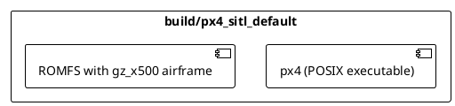
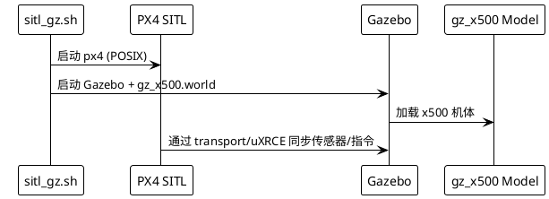

# `make px4_sitl gz_x500` 执行流程解析

本文说明：当运行 `make px4_sitl gz_x500` 时，PX4 构建系统都做了什么，如何启动 Gazebo 并在仿真中出现 X500 机型。同时也解释“如何知道还可以带哪些机型参数”。

## 1. 命令结构与入口

`make <platform> <sim_model>` 是 PX4 的常用快捷方式。`px4_sitl` 表示 **posix/SITL 平台**，`gz_x500` 表示 Gazebo 仿真的 X500 机型。

执行顺序：

### 关键文件

- `platforms/posix/cmake/sitl_target.cmake`：定义 `px4_sitl` 目标和可用 `SIM_TARGETS`。
- `platforms/posix/cmake/sitl_tests.cmake`：列出 SITL 机型及其 airframe/脚本映射（`SIM_MODELS` 表）。
- `ROMFS/px4fmu_common/init.d-posix/airframes/`：存放 `gz_x500` 等仿真机型的参数脚本。
- `Tools/simulation/gz/`：Gazebo 启动脚本、模型、World 文件。

## 2. 构建阶段发生了什么？

1. `make px4_sitl gz_x500` → `cmake` 调用 SITL preset，生成 `build/px4_sitl_default`。
2. `ROMFS/.../gz_x500` 的 airframe 脚本被打包进 ROMFS，以便 PX4 在启动时读取。
3. 生成可执行文件 `build/px4_sitl_default/src/firmware/posix/px4`。

### PlantUML：构建过程

## 3. 运行阶段如何启动 Gazebo？

`make px4_sitl gz_x500` 结束编译后，会调用 `Tools/simulation/gz/sitl_gz.sh gz_x500`，这个脚本做了：

1. 根据 `gz_x500` 参数，设置 `PX4_GZ_MODEL`、路径。
2. 启动 PX4 SITL (`px4 -s etc/init.d-posix/rcS -i 0 -d`)。
3. 启动 Gazebo（Ignition）并加载 `Tools/simulation/gz/models/gz_x500`、`worlds/gz_x500.world`。
4. PX4 与 Gazebo 通过 uXRCE-DDS 或 Gazebo Transport 互相通信。

### PlantUML：运行流程

## 4. 机型配置文件在哪里？

- **Airframe 脚本**：`ROMFS/px4fmu_common/init.d-posix/airframes/6011_gz_x500`（数字为 airframe ID）。脚本里设置 PX4 参数、启动传感器驱动。
- **Gazebo 模型/世界**：`Tools/simulation/gz/models/gz_x500/`、`Tools/simulation/gz/worlds/gz_x500.world`。
- **SIM_TARGETS 列表**：`platforms/posix/cmake/sitl_tests.cmake` 中的 `set(SIM_MODELS ...)` 列出了 `gz_x500`、`gz_x500_opt_flow` 等可用参数。

## 5. 如何知道还能带哪些参数？

1. 查看 `platforms/posix/cmake/sitl_tests.cmake` 中的 `SIM_MODELS`/`SITL_TARGETS`，列出了所有支持的机型（`gazebo`, `gz_x500`, `iris`, `plane`, 等）。
2. `ROMFS/px4fmu_common/init.d-posix/airframes/` 目录下的文件名也代表可用 airframe（例如 `4030_iris`, `6011_gz_x500`）。通常命令写成 `make px4_sitl <airframe_short_name>` 即可。
3. `Tools/simulation/gz/models/`、`worlds/` 目录列出可启动的 Gazebo 模型。

## 6. 总结

- `make px4_sitl gz_x500` = 构建 POSIX/SITL + Gazebo 的 X500 机型。
- 构建阶段：CMake preset + airframe 打包 + px4 可执行文件。运行阶段：执行 `Tools/simulation/gz/sitl_gz.sh`，启动 PX4 与 Gazebo。
- 想知道还能用哪些参数，可阅读 `sitl_tests.cmake` 的 `SIM_MODELS` 列表、以及 `ROMFS/.../airframes` 中的仿真脚本。
