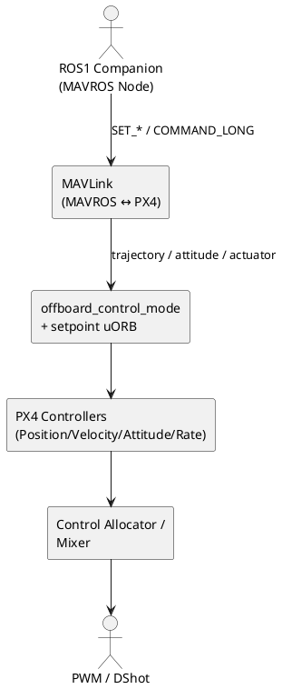

# MAVROS 控制接口与 PX4 控制链

## 目录

- [1. 概览与适用场景](#1-概览与适用场景)
- [2. 控制链路总览](#2-控制链路总览)
- [3. 深入解析：Topic → MAVLink → uORB](#3-深入解析topic--mavlink--uorb)
  - [3.1 位置/速度层](#31-位置速度层)
  - [3.2 姿态/角速度/推力层](#32-姿态角速度推力层)
  - [3.3 力矩与电机层](#33-力矩与电机层)
- [4. 实操与排障清单](#4-实操与排障清单)
- [5. 术语与参考](#5-术语与参考)

---

## 1. 概览与适用场景

本文定位于 ROS1 + MAVROS 使用者，梳理各类 `/mavros/setpoint_*` Topic 与 PX4 控制链的对应关系，以及底层在 `src/modules/mavlink/mavlink_receiver.cpp` 中的处理逻辑。阅读前需了解 PX4 Offboard 模式以及 MAVROS 插件的基础封装。

## 2. 控制链路总览

PX4 多旋翼控制链是级联结构：**位置 → 速度 → 加速度 → 姿态 → 角速度 → Mixer → 执行机构**。MAVROS 在不同层级提供接入口。

| Topic | MAVROS Msg | MAVLink 命令 | PX4 接收路径 | 控制层级 |
| --- | --- | --- | --- | --- |
| `/mavros/setpoint_position/local` | `geometry_msgs/PoseStamped` | `SET_POSITION_TARGET_LOCAL_NED` | [`handle_message_set_position_target_local_ned`](https://github.com/PX4/PX4-Autopilot/blob/main/src/modules/mavlink/mavlink_receiver.cpp#L1029-L1212) | 位置/速度/加速度 |
| `/mavros/setpoint_velocity/cmd_vel` | `geometry_msgs/Twist` | 同上（Velocity 字段） | 同上 | 速度 |
| `/mavros/setpoint_raw/local` | `mavros_msgs/PositionTarget` | `SET_POSITION_TARGET_LOCAL_NED / GLOBAL_INT` | 同上 | 位置/速度/加速度任选 |
| `/mavros/setpoint_raw/attitude` | `mavros_msgs/AttitudeTarget` | `SET_ATTITUDE_TARGET` | [`handle_message_set_attitude_target`](https://github.com/PX4/PX4-Autopilot/blob/main/src/modules/mavlink/mavlink_receiver.cpp#L1437-L1588) | 姿态 + 角速 + 推力 |
| `/mavros/setpoint_attitude/cmd_vel` | `geometry_msgs/TwistStamped` | `SET_ATTITUDE_TARGET` (`type_mask` 仅角速) | 同上 | 角速度 |
| `/mavros/setpoint_attitude/thrust` | `geometry_msgs/Point` | `SET_ATTITUDE_TARGET` (`thrust` 字段) | 同上 | 推力 |
| `/mavros/setpoint_actuator_control` | `mavros_msgs/ActuatorControl` | `SET_ACTUATOR_CONTROL_TARGET` | [`handle_message_set_actuator_control_target`](https://github.com/PX4/PX4-Autopilot/blob/main/src/modules/mavlink/mavlink_receiver.cpp#L1795-L1888) | 力矩/推力 (Mixer 输入) |
| `/mavros/motor_control/setpoint` | `mavros_msgs/ActuatorControl` | `COMMAND_LONG` → `VEHICLE_CMD_DO_SET_ACTUATOR` | [`handle_message_command_long`](https://github.com/PX4/PX4-Autopilot/blob/main/src/modules/mavlink/mavlink_receiver.cpp#L2305-L2695) | 直接电机输出（无保护） |

## 3. 深入解析：Topic → MAVLink → uORB

### 3.1 位置/速度层

#### `/mavros/setpoint_position/local` & `/mavros/setpoint_velocity/cmd_vel`

- MAVROS 的 `setpoint_position`、`setpoint_velocity` 插件会把 Pose/Twist 转换为 `SET_POSITION_TARGET_LOCAL_NED` 帧，并设置 `type_mask` 来选择位置或速度字段。
- PX4 通过 `MavlinkReceiver::handle_message_set_position_target_local_ned()` 将这些字段写入 `trajectory_setpoint` 和 `offboard_control_mode` uORB（参考 [源码](https://github.com/PX4/PX4-Autopilot/blob/main/src/modules/mavlink/mavlink_receiver.cpp#L1029-L1212)）。
- 关键细节：
  - `type_mask` 决定 Position、Velocity、Acceleration 哪些有效；PX4 会根据是否含 `NAN` 来设置 `offboard_control_mode.position/velocity/acceleration`。
  - 若 `coordinate_frame=MAV_FRAME_BODY_NED`，PX4 使用当前姿态矩阵将机体系速度/加速度旋转为 NED。
  - 只有当前导航状态为 `Offboard` 时，PX4 才会真正发布 `trajectory_setpoint`，否则仅刷新模式守护（防止 failsafe）。

#### `/mavros/setpoint_raw/local`

- `mavros_msgs/PositionTarget` 可以同时携带位置、速度、加速度、偏航和偏航速率，利用 `type_mask` 按位屏蔽。
- 同一处理函数负责 GLOBAL / LOCAL 版本，若使用全球坐标，则先通过 `vehicle_local_position` 的原点将经纬度转换到本地米制。
- 若设置 `POSITION_TARGET_TYPEMASK_FORCE_SET`，PX4 会拒绝（未实现力控制），相关报错会被 `mavlink_log_critical` 打印。

### 3.2 姿态/角速度/推力层

#### `/mavros/setpoint_raw/attitude`

- MAVROS 把 `mavros_msgs/AttitudeTarget` 编码为 `SET_ATTITUDE_TARGET` 帧；`type_mask` 决定是否使用姿态或角速度字段。
- PX4 在 [`handle_message_set_attitude_target`](https://github.com/PX4/PX4-Autopilot/blob/main/src/modules/mavlink/mavlink_receiver.cpp#L1437-L1588) 中：
  - 解析四元数、body_rate、thrust。
  - 将姿态命令写入 `vehicle_attitude_setpoint`，同时写 `vehicle_rates_setpoint`（若 `body_rate` 可用）。
  - 使用 `offboard_control_mode.attitude/rate` 指示当前外部控制层级，防止 failsafe。

#### `/mavros/setpoint_attitude/cmd_vel` & `/mavros/setpoint_attitude/thrust`

- 这两个 Topic 只是对 `SET_ATTITUDE_TARGET` 的轻量封装：`cmd_vel` 只填 `body_rate`，`thrust` 只填 `thrust` 字段，姿态部分置空。
- 因此它们与上一接口共享同一处理逻辑；在 `type_mask` 中屏蔽未使用字段，即可只接管角速度或推力。

### 3.3 力矩与电机层

#### `/mavros/setpoint_actuator_control`

- MAVROS 将 `mavros_msgs/ActuatorControl` 转为 `SET_ACTUATOR_CONTROL_TARGET` 帧。
- PX4 在 [`handle_message_set_actuator_control_target`](https://github.com/PX4/PX4-Autopilot/blob/main/src/modules/mavlink/mavlink_receiver.cpp#L1795-L1888) 中：
  - 直接把 `controls[0..3]` 写入 `vehicle_attitude_setpoint` 的 `thrust_body` / `control` 数组，并标记 `offboard_control_mode.body_rate = true`。
  - 绕过姿态/速度控制器，要求外部算法自行闭环并提供 roll/pitch/yaw 力矩 + 集体推力（或其它控制量）。
  - 该路径仍然会经过 PX4 Mixer 和输出限幅，因此相比直接写电机更安全。

#### `/mavros/motor_control/setpoint`

- 该 Topic 通过 `COMMAND_LONG (VEHICLE_CMD_DO_SET_ACTUATOR)` 直接下发执行器值。PX4 在 [`handle_message_command_long`](https://github.com/PX4/PX4-Autopilot/blob/main/src/modules/mavlink/mavlink_receiver.cpp#L2305-L2695) 中将 `param1..param7` 映射到 `actuator_controls` 或直接写 `actuator_servos/actuator_motors`。
- 一旦启用，该通道完全绕过 PX4 控制器、Mixer、Failsafe，极易导致失控。仅用于台架测试或自定义固件调试。

## 4. 实操与排障清单

| 场景 | 诊断步骤 | 对应源码/话题 | 建议 |
| --- | --- | --- | --- |
| Offboard 1 秒内掉线 | `listener offboard_control_mode` 检查时间戳；确认 `/mavros/setpoint_*` 发布 ≥2 Hz | [`offboard_control_mode.msg`](https://github.com/PX4/PX4-Autopilot/blob/main/msg/OffboardControlMode.msg) | 使用 `ros::Rate(20)` 发布；必要时启用 `SYS_COMPANION=CompanionLink` 提高带宽 |
| 发送位置但机体无响应 | 检查 `type_mask` 是否屏蔽了位置字段；`rosbag` 查看 `MSG` | [`handle_message_set_position_target_local_ned`](https://github.com/PX4/PX4-Autopilot/blob/main/src/modules/mavlink/mavlink_receiver.cpp#L1029-L1212) | 若使用 `setpoint_raw/local`，确保 `POSITION_TARGET_TYPEMASK_X_IGNORE` 置 0 |
| 姿态 setpoint 被覆盖 | 监听 `vehicle_attitude_setpoint`，确认非 NAN；若 `offboard_control_mode` 未设置 attitude=1，PX4 会自动退回速度环 | [`handle_message_set_attitude_target`](https://github.com/PX4/PX4-Autopilot/blob/main/src/modules/mavlink/mavlink_receiver.cpp#L1437-L1588) | 发布 `AttitudeTarget` 时记得设置 `type_mask`，不要混淆姿态/角速字段 |
| 使用 `/mavros/motor_control` 后无法复位 | PX4 认为外部仍在驱动，需要重新进入 Manual/Offboard | [`handle_message_command_long`](https://github.com/PX4/PX4-Autopilot/blob/main/src/modules/mavlink/mavlink_receiver.cpp#L2305-L2695) | 谨慎使用，完成测试后重启飞控或发送零值命令 |

## 5. 术语与参考

- **Offboard Control Mode**：PX4 的 uORB 消息，用于声明外部控制激活了哪些层（位置/速度/姿态/角速/推力）。MAVROS 话题被解析后都会刷新该结构，以防止 offboard failsafe。
- **MAVLink Type Mask**：`mavros_msgs/PositionTarget` / `AttitudeTarget` 使用的位掩码，用于屏蔽无效字段，详见 [MAVLink spec](https://mavlink.io/en/messages/common.html)。
- **参考资料**：
  - PX4 官方控制架构图：`docs/en/config_mc/` → `mc_control_arch.png`
  - MAVROS 插件源：`mavros/mavros_extras/src/plugins/**`
  - PX4 MAVLink 解析：[`src/modules/mavlink/mavlink_receiver.cpp`](https://github.com/PX4/PX4-Autopilot/blob/main/src/modules/mavlink/mavlink_receiver.cpp)
