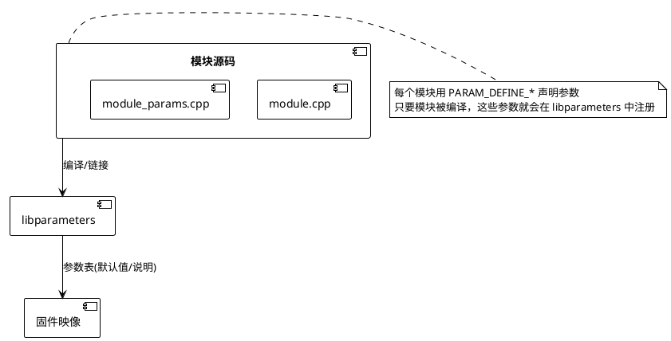
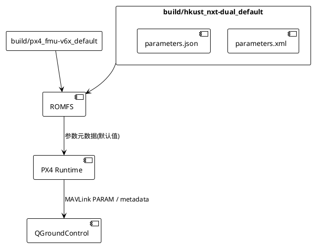

# PX4 参数生成机制与不同固件差异

本文说明 PX4 参数是如何在源码里定义、编译进固件，并最终被 QGroundControl (QGC) 显示的。并对比 **HKUST NXT-Dual** 与 **PX4 FMU-V6X** 两个固件，说明不同板/版本为什么看到的参数不一样，并指出在 build 输出中到哪里找最终的参数 metadata。

## 1. 参数从何而来？

PX4 的参数并非写在统一配置文件，而是分散在各个模块的源码中：

```cpp
// 例：src/modules/commander/commander_params.cpp
PARAM_DEFINE_FLOAT(COM_FLTMODE1, 0);
```

这些 `PARAM_DEFINE_*` 宏在编译时被收集进 `libparameters`。只要模块被链接进固件，它定义的参数就会进入最终的参数表；若模块没被编译，参数就不存在。这也是不同板/不同版本参数差异的根本原因。

### PlantUML：参数从源码到固件


## 2. 固件中的参数表是什么？

编译时，PX4 会生成两类参数文件：

- `build/<config>/parameters.xml`/`.json`：参数元数据，包含名称、类型、默认值、说明。
- QGC 连接时，PX4 会通过 MAVLink `PARAM`/`PARAM_EXT` 发送参数；新版本还会通过 `COMP_METADATA_TYPE_PARAMETER` 发送 `parameters.json`，QGC 根据这个 metadata 构建参数树。

运行中，参数表存放在 `ROMFS/px4fmu_common/misc/parameters.xml`（或内嵌 `uORB` ID）中，并由 `param.cpp` 管理。

### PlantUML：编译后的参数流向


## 3. 为什么不同固件参数不同？

1. **模块启用差异**：每个 `.px4board` 在 `default.px4board` 里指定要编译的模块，例如 `CONFIG_MODULES_UXRCE_DDS_CLIENT=y`。若某板没启用某模块，那模块内的参数不会出现在固件里。
2. **驱动/外设差异**：例如 HKUST NXT-Dual 有双 BMI088、TFmini 等驱动，对应参数只在该固件出现。
3. **版本差异**：不同 PX4 版本的模块可能新增/移除/重命名参数，这也会改变可见参数列表。
4. **厂商定制**：一些厂商会改动源码、删除/改默认值，因此同样的板在不同固件中参数也可能不一致。

## 4. HKUST NXT-Dual vs PX4 FMU-V6X

| 项目 | HKUST NXT-Dual | PX4 FMU-V6X |
| --- | --- | --- |
| 配置文件 | `boards/hkust/nxt-dual/default.px4board` <br>`init/rc.board_*` | `boards/px4/fmu-v6x/default.px4board` <br>`init/rc.board_*` |
| 模块差异举例 | `CONFIG_MODULES_UXRCE_DDS_CLIENT=y` <br>`CONFIG_DRIVERS_DISTANCE_SENSOR_TFMINI=y` | 可能全量启用 MAVLink、uXRCE，也含更多传感器驱动（GPS 三路、ADS-B、无人机 CAN 等） |
| 参数输出路径 | `build/hkust_nxt-dual_default/parameters.{xml,json}` | `build/px4_fmu-v6x_default/parameters.{xml,json}` |
| 在 QGC 中差异 | HKUST 固件会出现 `UXRCE_*`、`SENS_TFMINI_*` 等特有参数；某些 PX4FMU 的参数（如特定 CAN 驱动、PX4IO 参数）可能不存在 | FMU-V6X 提供官方全量参数，包括 PX4IO、Ethernet、CAN、ADS-B 等配置；若没有 TFmini/UART 映射，则那些板级参数不会出现 |

再举两个具体差异：

- **板级参数**：`boards/hkust/nxt-dual/init/rc.board_defaults` 内写入 `param set-default SENS_TFMINI_CFG ...`，这些参数会随固件出现；而 FMU-V6X 的 `rc.board_defaults` 更倾向配置 PX4IO、Ethernet、CAN，因此你在 QGC 里看到的默认参数也不同。
- **驱动参数**：HKUST 编译了双 BMI088（`src/drivers/imu/bmi088`），因此 QGC 会看到 `BMI088_*` 参数；FMU-V6X 则可能有 `ICM42688_*`、`GPS_YAW_*`、`Ethernet_*` 等。

## 5. 在哪里查看最终参数表？

编译后，进入 build 目录：

```
PX4-Autopilot/build/hkust_nxt-dual_default/parameters.xml
PX4-Autopilot/build/hkust_nxt-dual_default/parameters.json

PX4-Autopilot/build/px4_fmu-v6x_default/parameters.xml
PX4-Autopilot/build/px4_fmu-v6x_default/parameters.json
```

这些文件可以直接在 QGC 的 “通过 metadata 文件导入” 中查看，也可以用脚本解析（例如 `Tools/px4params`）。

## 6. QGC 如何呈现？

当 QGC 连接到 PX4 时，固件会：

1. 发送 `COMP_METADATA_TYPE_PARAMETER`，内含 `parameters.json` 的 URL（uXRCE 或 MAVLink URI）。
2. 或直接逐条通过 MAVLink `PARAM_VALUE` 推送。QGC 维护一个参数列表，按 metadata 进行分组与显示。

因此，**QGC 所显示的参数完全取决于固件内置的参数表**。如果你希望在 QGC 中出现特定参数，需要确保对应模块被编译，且 `PARAM_DEFINE` 宏存在。

## 7. 快速总结

- 参数定义在模块源码里的 `PARAM_DEFINE_*`；只有链接进固件的模块才会导出参数。
- 不同板卡通过 `.px4board` / `rc.board_*` 决定启用哪些模块，直接影响参数集合。
- 编译输出在 `build/<config>/parameters.xml/json`，QGC 根据固件提供的 metadata 渲染参数树。
- HKUST NXT-Dual 定制了 uXRCE、TFmini 等模块，因此参数集与 PX4 FMU-V6X 不同；QGC 显示差异源于固件本身，而非 QGC。

这就是“为什么不同固件在 QGC 中看到的参数不同”的根本原因：它们实质上打包了不同的模块/驱动/参数定义。只要理解参数生成的链条，就能准确预测每种固件的参数集。
