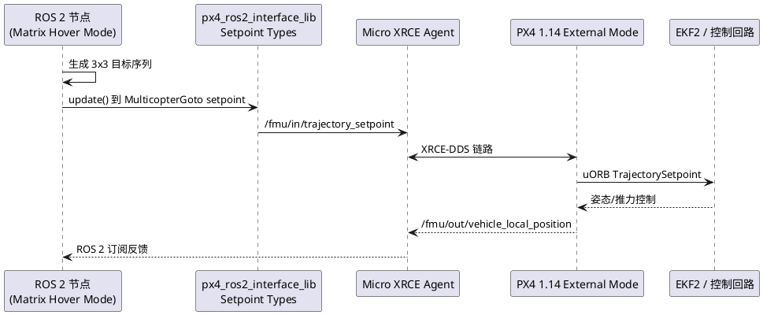
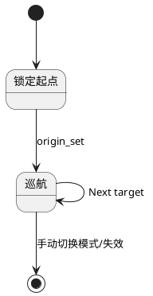

## ROS 2 External Flight Mode 实战：Matrix 悬停

> 本文基于 PX4 v1.14 起新增的 ROS 2 External Flight Modes（详见 `docs/en/ros2/px4_ros2_control_interface.md`），演示如何实现一个“Matrix 悬停”模式：在本地 NED 坐标系内生成 3x3 网格（9 个目标点），多旋翼按照“蛇形”顺序逐点悬停、绕完后回到起点继续循环。目标读者为熟悉 PX4 SITL、ROS 2 构建流程并希望迁移自定义飞控模式到 Companion Computer 的开发者。

### 1. 运行机理



- 外部模式与 PX4 通过 Micro XRCE-DDS 交换 setpoint 与反馈（`uxrce_dds_client`/`dds_topics.yaml` 已默认启用 `/fmu/in/trajectory_setpoint` 与 `/fmu/out/vehicle_local_position`）。
- ROS 2 端使用 `px4-ros2-interface-lib` 提供的 `ModeBase` 与 `MulticopterGotoSetpointType`，编写状态机即可。

### 2. 环境准备

1. **PX4 仓库**：使用当前仓库（`PX4-Autopilot`），编译 `px4_sitl` 或目标板固件。
2. **ROS 2**：推荐 Jazzy/Humble。安装 `colcon`, `rosdep`, `cyclonedds` 等依赖。
3. **px4_msgs**：确保 ROS 2 工作区包含与固件版本匹配的 `px4_msgs`（可从本仓库 `msg/` 同步）。
4. **PX4 ROS2 Interface Library**：在 ROS 2 工作区 clone：
   ```sh
   cd ~/ros2_px4_ws/src
   git clone --recursive https://github.com/Auterion/px4-ros2-interface-lib
   ```
5. **构建工作区**：
   ```sh
   cd ~/ros2_px4_ws
   colcon build --symlink-install
   source install/setup.bash
   ```
6. **运行组件**：
   - 启动 PX4 SITL：`make px4_sitl gazebo-classic`（或任意模型）。
   - 启动 Micro XRCE Agent：`MicroXRCEAgent udp4 -p 8888`。
   - 打开 QGroundControl Daily 版本以动态显示外部模式列表。

### 3. 新建 Matrix Hover 示例包

参考 `px4-ros2-interface-lib/examples/cpp/modes/goto`，在 ROS 2 工作区创建独立目录 `matrix_hover_mode`（保持与官方示例分离，便于版本控制）。

```sh
cd ~/ros2_px4_ws/src
ros2 pkg create --build-type ament_cmake matrix_hover_mode \
  --dependencies rclcpp px4_ros2_interface_lib px4_ros2_msgs
```

将 `CMakeLists.txt` 更新为：

```cmake
cmake_minimum_required(VERSION 3.10)
project(matrix_hover_mode)

find_package(ament_cmake REQUIRED)
find_package(rclcpp REQUIRED)
find_package(px4_ros2_interface_lib REQUIRED)

ament_export_dependencies(px4_ros2_interface_lib)

add_executable(matrix_hover_node
  src/main.cpp)

target_include_directories(matrix_hover_node PRIVATE include)

target_link_libraries(matrix_hover_node
  px4_ros2_interface_lib::px4_ros2_interface_lib)

target_compile_features(matrix_hover_node PUBLIC c_std_17 cxx_std_17)

install(TARGETS matrix_hover_node
  DESTINATION lib/${PROJECT_NAME})

ament_package()
```

`package.xml` 中声明依赖（省略部分标签）：

```xml
<depend>rclcpp</depend>
<depend>px4_ros2_interface_lib</depend>
<depend>px4_ros2_msgs</depend>
```

### 4. Matrix Hover 模式实现

#### 4.1 主入口 `src/main.cpp`

```cpp
#include "rclcpp/rclcpp.hpp"
#include <mode.hpp>
#include <px4_ros2/components/node_with_mode.hpp>

using MatrixHoverNode = px4_ros2::NodeWithMode<MatrixHoverMode>;

int main(int argc, char * argv[])
{
  rclcpp::init(argc, argv);
  rclcpp::spin(std::make_shared<MatrixHoverNode>("matrix_hover_mode", true));
  rclcpp::shutdown();
  return 0;
}
```

#### 4.2 关键逻辑 `include/mode.hpp`

下面的实现基于仓库 `examples/cpp/modes/goto`，改造成 3x3 网格巡航。NED 坐标约定为北、东、下（高度以负值表示向上）。

```cpp
#pragma once

#include <px4_ros2/components/mode.hpp>
#include <px4_ros2/control/setpoint_types/multicopter/goto.hpp>
#include <px4_ros2/odometry/local_position.hpp>
#include <px4_ros2/utils/geometry.hpp>

#include <Eigen/Core>
#include <rclcpp/rclcpp.hpp>

using namespace px4_ros2::literals; // for _deg suffix

static const std::string kModeName = "Matrix Hover";

class MatrixHoverMode : public px4_ros2::ModeBase
{
public:
  explicit MatrixHoverMode(rclcpp::Node & node)
  : ModeBase(node, Settings{kModeName}.preventArming(false))
  {
    _goto_setpoint = std::make_shared<px4_ros2::MulticopterGotoSetpointType>(*this);
    _local_position = std::make_shared<px4_ros2::OdometryLocalPosition>(*this);
  }

  void onActivate() override
  {
    _origin_set = false;
    _target_index = 0;
    _heading_set = false;
  }

  void onDeactivate() override {}

  void updateSetpoint(float dt_s) override
  {
    if (!_origin_set && _local_position->valid()) {
      _origin = _local_position->positionNed();
      buildGrid(_origin);
      _origin_set = true;
      RCLCPP_INFO(getLogger(), "Matrix Hover origin locked at N=%.2f E=%.2f D=%.2f", _origin.x(), _origin.y(), _origin.z());
    }

    if (!_origin_set) {
      return; // 等待首次定位
    }

    const Eigen::Vector3f target = _grid_points[_target_index];
    Eigen::Vector2f delta_xy = target.head<2>() - _local_position->positionNed().head<2>();
    float heading_sp = 0.f;

    if (delta_xy.norm() > 0.2f) {
      heading_sp = atan2f(delta_xy.y(), delta_xy.x());
      _last_heading = heading_sp;
      _heading_set = true;
    } else if (_heading_set) {
      heading_sp = _last_heading;
    }

    _goto_setpoint->update(
      target,
      heading_sp,
      kMaxHorizontalVelocity,
      kMaxVerticalVelocity,
      kMaxHeadingRate);

    if (positionReached(target)) {
      _target_index = nextIndex(_target_index);
      RCLCPP_INFO(getLogger(), "Reached grid %zu, next %zu", (_target_index + _grid_points.size() - 1) % _grid_points.size(), _target_index);
    }
  }

private:
  static constexpr float kSpacing = 5.f;                 // 网格间距 [m]
  static constexpr float kHoverAltitude = -3.f;          // NED 向下，因此 -3f 表示 3 m 高度
  static constexpr float kSettleRadius = 0.4f;
  static constexpr float kSettleVelocity = 0.25f;
  static constexpr float kMaxHorizontalVelocity = 2.0f;  // [m/s]
  static constexpr float kMaxVerticalVelocity = 1.0f;    // [m/s]
  static constexpr float kMaxHeadingRate = px4_ros2::degToRad(30.f);

  std::shared_ptr<px4_ros2::MulticopterGotoSetpointType> _goto_setpoint;
  std::shared_ptr<px4_ros2::OdometryLocalPosition> _local_position;

  Eigen::Vector3f _origin{0.f, 0.f, 0.f};
  bool _origin_set{false};
  bool _heading_set{false};
  float _last_heading{0.f};

  std::array<Eigen::Vector3f, 9> _grid_points{};
  size_t _target_index{0};

  void buildGrid(const Eigen::Vector3f & origin)
  {
    size_t cursor = 0;
    for (int row = 0; row < 3; ++row) {
      for (int col = 0; col < 3; ++col) {
        int snake_col = (row % 2 == 0) ? col : (2 - col);
        const Eigen::Vector3f offset{static_cast<float>(row) * kSpacing,
                                     static_cast<float>(snake_col) * kSpacing,
                                     kHoverAltitude};
        _grid_points[cursor++] = origin + offset;
      }
    }
  }

  size_t nextIndex(size_t current) const
  {
    return (current + 1) % _grid_points.size();
  }

  bool positionReached(const Eigen::Vector3f & target) const
  {
    const Eigen::Vector3f pos_err = target - _local_position->positionNed();
    return (pos_err.norm() < kSettleRadius) &&
           (_local_position->velocityNed().norm() < kSettleVelocity);
  }
};
```

关键点：
- 继承 `ModeBase` 并在构造函数中初始化需要的 setpoint/telemetry 组件。
- `buildGrid()` 以“蛇形”顺序生成 3x3 坐标，保证车辆完成一圈后回到起点并继续循环。
- `updateSetpoint()` 持续调用 `_goto_setpoint->update()`，依赖 PX4 的轨迹控制器完成位置保持；通过 `heading_sp` 让机体面向运动方向。

#### 4.3 状态机示意



### 5. 构建与运行

1. 重新构建 ROS 2 工作区：
   ```sh
   cd ~/ros2_px4_ws
   colcon build --packages-select matrix_hover_mode
   source install/setup.bash
   ```
2. 启动 PX4 SITL、Micro XRCE Agent、QGC（参见第 2 节）。
3. 启动 Matrix Hover 模式节点：
   ```sh
   ros2 run matrix_hover_mode matrix_hover_node
   ```
   终端可看到 `Registering 'Matrix Hover'...` 与 `Mode 'Matrix Hover' activated` 等日志。
4. 在 QGC 的飞行模式列表中选择 `Matrix Hover`，解锁飞机。模式激活后会：
   - 在当前 NED 原点建立 3x3 网格（默认间距 5 m，高度 3 m）。
   - 依序访问 9 个悬停点，每到一处在阈值内停稳，再跳到下一个。
   - 循环执行直到手动切换模式或触发 failsafe。

### 6. 调试与扩展

|问题|排查|
|---|---|
|QGC 未显示模式|确认 ROS 端节点正在运行且 `MicroXRCEAgent` 可达；`commander status` 应看到 `External Mode` 列表。|
|飞机无法解锁|外部模式 `Settings.preventArming(false)`，但仍需满足 PX4 Arming Check；可通过 `mode` 参数定义需求（GPS/定位等）。|
|无法收敛到目标|检查位置反馈是否有效（`listener vehicle_local_position`），必要时调大 `kSettleRadius`；或在 offboard 日志观察 setpoint。|
|需要更稠密或稀疏网格|修改 `kSpacing`、`kHoverAltitude` 即可。若要停止一次巡航后退出，可在 `_target_index` 达到末尾时调用 `completed(px4_ros2::Result::Success)`。|

### 7. 下一步

- 引入 `ModeExecutor`（参考 `px4-ros2-interface-lib/examples/cpp/modes/mode_with_executor`）以自动执行“起飞→Matrix 悬停→降落”流程。
- 将 3x3 网格转为参数化输入（使用 ROS 2 parameter 或 `px4_ros2::ConfigurationOverride`，方便飞行中调整间距、高度）。
- 结合感知模块：在 `updateSetpoint()` 中订阅避障点云或视觉栅格，为每个目标点添加可行性检查。

该示例展示了如何依托仓库现有的 ROS 2 External Flight Modes 能力，将复杂飞行逻辑迁移到 Companion Computer。通过 `px4_ros2_interface_lib` 的 setpoint 抽象与 PX4 1.14 的外部模式支持，可以高效实现并迭代多种自定义飞控策略。
