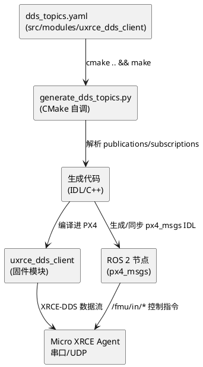

## PX4 uXRCE-DDS 话题配置指南

PX4 不会把全部 uORB 话题都桥接到 ROS 2，而是根据 `src/modules/uxrce_dds_client/dds_topics.yaml` 中的配置，挑选需要的发布/订阅项。在需要新增话题（例如 `distance_sensor`）或调整频率时，只要修改该 YAML、重新编译并刷新消息包即可。本指南介绍它的运作方式、如何扩展以及常见排错技巧。

### 1. 生成管线



构建过程要点：

1. `CMakeLists.txt` 会调用 `generate_dds_topics.py`，读取 `dds_topics.yaml`。
2. 脚本生成 C++/IDL 代码，用于 `uxrce_dds_client` 与 `px4_msgs`。
3. 若使用 [`src/modules/zenoh`] 的桥接，也会读取同一份 YAML，确保 ROS2 与 Zenoh 发布一致。

因此，只要编辑 `dds_topics.yaml`，PX4 固件与 ROS 消息定义都会同步更新（当然需要重新编译）。

### 2. `dds_topics.yaml` 结构

```yaml
publications:
  - topic: /fmu/out/vehicle_attitude
    type: px4_msgs::msg::VehicleAttitude
    rate_limit: 50.

subscriptions:
  - topic: /fmu/in/offboard_control_mode
    type: px4_msgs::msg::OffboardControlMode
```

- `topic`：ROS 侧可见的名称（惯例 `fmu/out/*`、`fmu/in/*`）。
- `type`：对应的 `px4_msgs::msg::*`；需在 `msg/` 目录存在同名 `.msg`。
- `rate_limit`（可选）：单位 Hz，用于节流高频话题；写 `MAX` 可跟随 uORB 原始频率。

### 3. 添加/修改话题的步骤

1. **编辑 YAML**：在 `publications` 或 `subscriptions` 中追加条目，保存。
2. **重新编译板级固件**：`make <board>`。构建过程中会自动重新生成客户端代码。
3. **同步 ROS 端消息**（二选一）  
   - 使用官方 `px4_ros_com` 工作区：`git pull` 最新 `px4_msgs` → `colcon build`.  
   - 直接使用 PX4 仓库 `msg/`：运行 `Tools/copy_to_ros_ws.sh <ros_ws>` 或软链接后 `colcon build --packages-select px4_msgs`。
4. **重新启动 Micro XRCE Agent**，使之加载新的话题配置。
5. **验证**：  
   - NSH：`uxrce_dds_client status` 应显示 `Running, connected`。  
   - ROS 侧：`ros2 topic list` 能看到新增的 `/fmu/out/...`，`ros2 topic echo` 可读取数据。

> 如果 `ros2` 报 “message type invalid”，通常是因为 ROS 工作区里的 `px4_msgs` 不是当前固件版本，需要重新同步 `.msg` 文件再 build。

### 4. 调整速率与命名

- `rate_limit` 设置的是**上限**，真实频率还取决于 uORB 发布频率。若想降低带宽，把参数设为更小的 Hz。
- `/fmu/out/*` / `/fmu/in/*` 命名只是约定，实际可改（例如加命名空间、区分快车/慢车），但记得同时更新 `uxrce_dds_client start` 的 `-n` 选项或参数 `UXRCE_DDS_NS_IDX`。
- 任何不在 YAML 中的消息都不会生成 IDL/话题。因此 PlotJuggler/ROS 侧看不到时，先确认 YAML 是否包含该项。

### 5. 示例：发布 `distance_sensor`

1. 在 `publications` 增加：
   ```yaml
   - topic: /fmu/out/distance_sensor
     type: px4_msgs::msg::DistanceSensor
     rate_limit: 20.
   ```
2. `make hkust_nxt-dual_default` 并刷机。
3. `ros2 topic echo /fmu/out/distance_sensor` 可看到 TFmini 数据（前提是传感器驱动已在 uORB 上发布）。

### 6. 常见问题

| 现象 | 排查 |
| --- | --- |
| `ros2` 没有新话题 | 是否重新编译固件？`uxrce_dds_client` 是否重启？`px4_msgs` 是否刷新？ |
| `message type invalid` | ROS 工作区的 `px4_msgs` 与固件版本不匹配；重新复制 `.msg` 并 `colcon build`。 |
| `uxrce_dds_client` 出现 `not running` | 串口/网络参数 (`UXRCE_DDS_CFG`, `SER_TEL*_BAUD`, Agent 连接) 未就绪；与 YAML 无关，先保证物理链路正常。 |
| 需要自定义命名空间 | 构建时更改 YAML 的 `topic` 字段，或运行时使用 `uxrce_dds_client start -n <namespace>` / `UXRCE_DDS_NS_IDX` 参数。 |

通过把“选择话题”这件事集中在 `dds_topics.yaml`，PX4 能够明确“ROS 真的需要哪些数据”，也让后续维护更简单。无论是新增传感器（例如本次的 `distance_sensor`），还是减少带宽，都遵循“改 YAML → 重构建 → 同步 `px4_msgs` → 重启 Agent”这一流程即可。***
