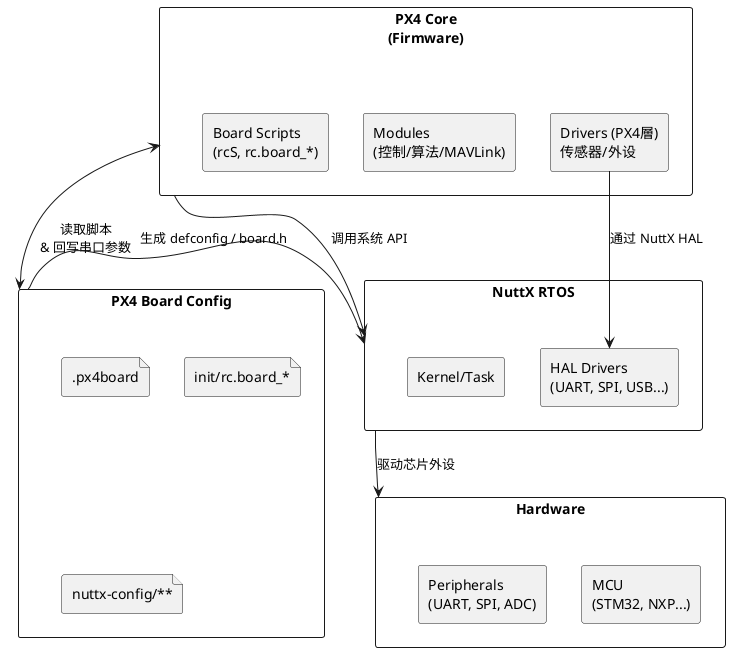
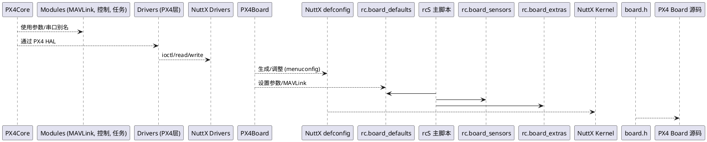
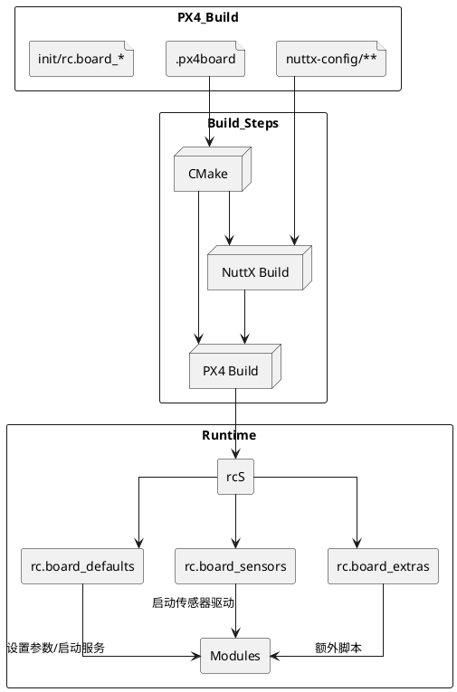

## PX4 与 NuttX：板级适配与解耦

PX4 在 NuttX 上构建，利用其 RTOS/驱动体系实现对大量芯片和开发板的兼容。本文概述 PX4 如何借助 NuttX 将核心飞控逻辑与硬件适配层解耦。

### 1. 角色划分



### 2. NuttX 层的板级配置
- `nuttx-config/nsh/defconfig`：指定 MCU 型号、启用哪些 UART/SPI/I2C、控制台端口、内存分区等。
- `nuttx-config/include/board.h`：定义引脚复用、GPIO、PWM 通道等。
- `nuttx-config/scripts/*.ld`：链接脚本，决定 Flash/SRAM 布局。
- 通过 `make px4_<board>_default menuconfig` 生成/调整，PX4 再用这些配置编译 NuttX 内核与基础驱动。

### 3. PX4 层的板适配
- `.px4board`：声明串口别名（`TELEM1=/dev/ttyS1`）、启用哪些 PX4 模块、MAVLink 实例、驱动等。CMake 会读取该文件为 `nuttx_px4_board.cmake` 生成编译宏。
- `init/rc.board_defaults` / `rc.board_sensors` / `rc.board_extras`：Shell 脚本，用于设置默认参数（电池、MAVLink、uXRCE 等）、启动板载传感器/服务，运行于 `rcS` 框架内。
- `src/boards/<vendor>/<board>/`：板级 C/C++ 代码（GPIO、SPI、FLASH、USB 等）的 PX4 封装，调用 NuttX API。



### 4. 串口/接口映射示例
- `.px4board`：
  ```text
  CONFIG_BOARD_SERIAL_TEL1="/dev/ttyS1"
  CONFIG_BOARD_SERIAL_TEL2="/dev/ttyS3"
  ```
- `nuttx-config/nsh/old_defconfig.txt`：
  ```text
  CONFIG_STM32H7_USART2=y  # ttyS1
  CONFIG_STM32H7_UART4=y   # ttyS3
  ```
- `rc.board_defaults`：
  ```sh
  param set-default MAV_0_CONFIG 301
  param set-default UXRCE_DDS_CFG 102
  ```
→ TELEM1 (USART2) 作为控制台或 MAVLink，TELEM2 (UART4) 作为 uXRCE，USB CDC 则对应 `MAV_0_CONFIG=301`。

### 5. 可插拔扩展
- 更换 MCU/Board：只需新增/修改 `nuttx-config`、`board.h`、`src/boards/...`；PX4 Modules 无需改动。
- 更换接口角色：通过 `.px4board` 和 `rc.board_defaults` 映射，压根不需要动核心 C++ 代码。
- 新增板级功能（如 USB 复合设备、外部传感器）：在 `src/boards/<board>` 中实现驱动或在脚本中配置，就能与 PX4 主逻辑配合。

### 6. PlantUML：配置流与启动顺序


### 总结
PX4 通过 NuttX 的板级配置和 shell 脚本，实现了“硬件适配层”与“飞控核心”解耦：NuttX 负责 MCU 外设，`.px4board`+`rc.board_*` 决定串口映射、驱动启停，核心模块只需按别名/参数运行。这种分层设计让同一套飞控算法可以运行在大量不同芯片和板卡上，只需提供相应的配置与板级驱动即可。
