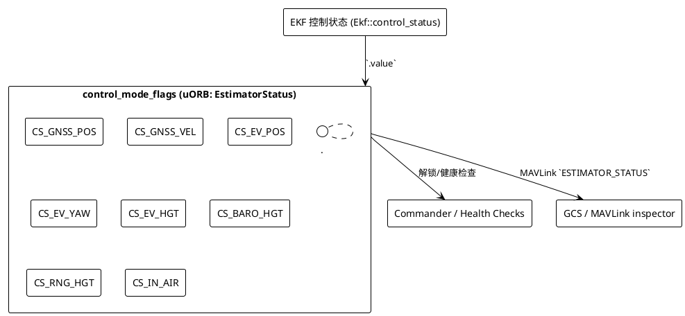

# EstimatorStatus.control_mode_flags 完全解读

`estimator_status` uORB 话题中的 `control_mode_flags` 是一个 64 位 bitmask，用来描述 EKF2 当前在融合哪些传感器/处于什么逻辑状态。本文结合 PX4 源码（commit `3e1c499d5ddb`）完整列出每个 bit 的含义，并通过 PlantUML 示意它们如何映射到 EKF2 的观测逻辑。

## 1. 源码出处

- **消息定义**：`msg/EstimatorStatus.msg`（`control_mode_flags` 及各 bit 的枚举常量）。
- **EKF2 填充位置**：`src/modules/ekf2/EKF2.cpp` 第 1815 行：`status.control_mode_flags = _ekf.control_status().value;`
  - `_ekf.control_status()` 是 `Ekf::control_status()`，返回 `control_status_u`（`src/modules/ekf2/EKF/common.h` 中的位域）。也就是说 `control_mode_flags` 直接镜像了 EKF 内部的 `control_status`。
- **Commander/Health 检查引用**：例如 `src/modules/commander/HealthAndArmingChecks/checks/estimatorCheck.cpp` 第 227 行根据 bit2/bit44 判断 GNSS 信息是否融合，用于解锁前检查。

## 2. 位定义一览

> 以下表格按 `EstimatorStatus.msg` 的注释顺序列出 bit 号及含义（单位为 bit index，从 0 开始）。

| Bit | 宏常量 | 含义 | 典型触发条件 |
| --- | --- | --- | --- |
| 0 | `CS_TILT_ALIGN` | EKF 完成倾角对齐（pitch/roll 已校准）。 | 启动后 IMU 稳定、初始静置阶段完成。 |
| 1 | `CS_YAW_ALIGN` | EKF 完成 yaw 对齐。 | 依赖磁力计或视觉/GNSS yaw。 |
| 2 | `CS_GNSS_POS` | 正在融合 GNSS 位置。 | `EKF2_AID_MASK` 包含 GPS 位置，且 GPS 健康。 |
| 3 | `CS_OPT_FLOW` | 正在融合光流。 | `EKF2_AID_MASK` 选择了光流，且传感器数据可用。 |
| 4 | `CS_MAG_HDG` | 融合“简单磁航向”。 | 当只用磁罗盘 yaw 观测时置位。 |
| 5 | `CS_MAG_3D` | 融合 3 轴磁力计。 | 磁力计模式正常，未声明故障。 |
| 6 | `CS_MAG_DEC` | 融合合成磁偏角。 | 处于磁偏角估计阶段。 |
| 7 | `CS_IN_AIR` | EKF 判断飞行器已离地。 | Commander 解锁并起飞后，基于速度/加速度判定。 |
| 8 | `CS_WIND` | EKF 估计风速。 | 多旋翼在空中且 `enable_wind_estimator`。 |
| 9 | `CS_BARO_HGT` | 融合气压高度。 |
| 10 | `CS_RNG_HGT` | 融合测距仪高度。 |
| 11 | `CS_GPS_HGT` | 融合 GPS 高度。 |
| 12 | `CS_EV_POS` | 融合外部视觉位置。 |
| 13 | `CS_EV_YAW` | 融合外部视觉 yaw。 |
| 14 | `CS_EV_HGT` | 融合外部视觉高度。 |
| 15 | `CS_BETA` | 融合合成侧滑。 |
| 16 | `CS_MAG_FIELD` | 只更新磁场状态（特定模式）。 |
| 17 | `CS_FIXED_WING` | 固定翼模式（限制侧滑）。 |
| 18 | `CS_MAG_FAULT` | 磁力计已判定故障。 |
| 19 | `CS_ASPD` | 融合空速。 |
| 20 | `CS_GND_EFFECT` | 已启用地效保护。 |
| 21 | `CS_RNG_STUCK` | 检测到测距仪卡死。 |
| 22 | `CS_GPS_YAW` | 融合 GPS yaw（双天线）。 |
| 23 | `CS_MAG_ALIGNED` | 在飞行中完成磁场对齐。 |
| 24 | `CS_EV_VEL` | 融合外部视觉速度。 |
| 25 | `CS_SYNTHETIC_MAG_Z` | 使用合成的磁 Z 测量。 |
| 26 | `CS_VEHICLE_AT_REST` | 车辆静止。 |
| 27 | `CS_GPS_YAW_FAULT` | GPS yaw 已判定故障。 |
| 28 | `CS_RNG_FAULT` | 测距仪已判定故障。 |
| 44 | `CS_GNSS_VEL` | 融合 GNSS 速度。 |
| 45 | `CS_GNSS_FAULT` | GNSS 故障。 |
| 46 | `CS_YAW_MANUAL` | yaw 由手动设定。 |

（注：bit 29~43 目前保留或在某些分支中使用。）

## 3. 解释示例：`control_mode_flags = 551970436611`

将十进制转为二进制（`0b1000'0000'1000'0100'0000'0000'0111'0110'0000'0011`），可解析出上述多个 bit 置位，例如：

- bit0/1 = 1：倾角、yaw 对齐完成。
- bit2 = 1：融合 GNSS 位置。
- bit7 = 1：已离地。
- bit9 = 1：融合气压高度。
- bit12/13/14 = 1：外部视觉位置/yaw/高度都在融合。
- bit24 = 1：外部视觉速度融合 intended。
- bit44 = 1：GNSS 速度融合。

这与 `EKF2_EV_CTRL=11`（0b1011）设置一致：EV pos/yaw/hgt + GNSS 融合。

## 4. PlantUML：bitmask 与 EKF 逻辑

## 5. 参考

- [EstimatorStatus.msg 源码](https://github.com/PX4/PX4-Autopilot/blob/main/msg/EstimatorStatus.msg)
- [EKF2.cpp 控制状态赋值](https://github.com/PX4/PX4-Autopilot/blob/main/src/modules/ekf2/EKF2.cpp)
- [Commander 健康检查使用示例](https://github.com/PX4/PX4-Autopilot/blob/main/src/modules/commander/HealthAndArmingChecks/checks/estimatorCheck.cpp)
- MAVLink `ESTIMATOR_STATUS` 消息可在 QGC Log Inspector 查看每个 bit 的实时状态。

---
**总结**：`control_mode_flags` 是 EKF2 对“当前融合策略/状态”的实时映射。读取该 bitmask 可以判断 EKF 是否在使用 GNSS、外部视觉、气压、测距等观测，也能识别传感器故障（如 `CS_RNG_FAULT`, `CS_MAG_FAULT`）。

## 附：两个常见 flags 的差异示例

| 场景 | Bitmask (十进制 / 二进制) | 典型含义 |
| --- | --- | --- |
| **全量 GNSS + 外部视觉**（示例 `551970436611`） | `0b1000'0000'1000'0100'0000'0000'0111'0110'0000'0011` | EKF 既融合 GNSS 位置/速度 (`CS_GNSS_POS`, `CS_GNSS_VEL`)，也融合外部视觉位置/速度/yaw/高度 (`CS_EV_POS`, `CS_EV_VEL`, `CS_EV_YAW`, `CS_EV_HGT`)，同时 `CS_BARO_HGT`、`CS_IN_AIR` 等正常工作。适用于“GNSS + 外部视觉双重冗余”的空中飞行。 |
| **完全依赖外部视觉**（示例 `2768710403587`） | `0b10'1000'0100'1010'0100'0000'0000'0000'0110'0000'0011` | GNSS 相关 bit2/bit44 为 0（不再融合 GNSS），但 `CS_EV_POS`/`CS_EV_HGT` 等保持 1，说明 EKF 完全依赖外部视觉；`solution_status_flags` 中也只报告局部/相对位置可信，适合室内动捕场景。 |

> 通过比较不同的 bitmask，可快速判断 EKF 当前融合了哪些来源、哪些观测被禁用，从而在调试外部视觉、GNSS 故障等场景中获取关键信息。
