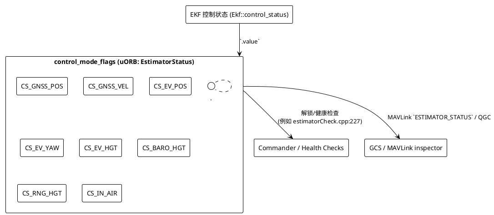

# EstimatorStatus.control_mode_flags 完全解读

`estimator_status` uORB 话题中的 `control_mode_flags` 是一个 64 位 bitmask，用来描述 EKF2 当前在融合哪些传感器/处于什么逻辑状态。本文结合 PX4 源码（commit `3e1c499d5ddb`）完整列出每个 bit 的含义，并通过 PlantUML 示意它们如何映射到 EKF2 的观测逻辑。

## 1. 源码出处

- **消息定义**：`msg/EstimatorStatus.msg`（`control_mode_flags` 及各 bit 的枚举常量）。
- **EKF2 填充位置**：`src/modules/ekf2/EKF2.cpp` 第 1815 行：`status.control_mode_flags = _ekf.control_status().value;`
  - `_ekf.control_status()` 是 `Ekf::control_status()`，返回 `control_status_u`（`src/modules/ekf2/EKF/common.h` 中的位域）。也就是说 `control_mode_flags` 直接镜像了 EKF 内部的 `control_status`。
- **Commander/Health 检查引用**：例如 `src/modules/commander/HealthAndArmingChecks/checks/estimatorCheck.cpp` 第 227 行根据 bit2/bit44 判断 GNSS 信息是否融合，用于解锁前检查。

## 2. 位定义一览

> 以下表格按 `EstimatorStatus.msg` 的注释顺序列出 bit 号及含义（单位为 bit index，从 0 开始）。

| Bit | 宏常量 / EKF 字段 | 含义 | 典型触发条件 |
| --- | --- | --- | --- |
| 0 | `CS_TILT_ALIGN` (`tilt_align`) | EKF 完成倾角对齐（pitch/roll 已校准）。 | 启动后 IMU 静置足够长。 |
| 1 | `CS_YAW_ALIGN` (`yaw_align`) | EKF 完成 yaw 对齐。 | 通过磁力计、GNSS 或外部视觉完成航向初始化。 |
| 2 | `CS_GNSS_POS` (`gnss_pos`) | 意图融合 GNSS 位置。 | `EKF2_GPS_CTRL` 含 `GnssCtrl::HPOS` 且 `gps_control.cpp` 判定条件成立。 |
| 3 | `CS_OPT_FLOW` (`opt_flow`) | 意图融合光流。 | `EKF2_OF_CTRL` 掩码允许且光流 aid 控制通过。 |
| 4 | `CS_MAG_HDG` (`mag_hdg`) | 使用磁场 yaw（简单航向）。 | `EKF2_MAG_TYPE=1` 或自动模式切到 heading。 |
| 5 | `CS_MAG_3D` (`mag_3D`) | 使用三轴磁力计。 | `EKF2_MAG_TYPE=0` 且磁场检测通过。 |
| 6 | `CS_MAG_DEC` (`mag_dec`) | 使用合成磁偏角。 | `EKF2_DECL_TYPE` 允许自动偏角更新。 |
| 7 | `CS_IN_AIR` (`in_air`) | 认为飞机已离地。 | Commander/传感器判定速度>阈值或油门大。 |
| 8 | `CS_WIND` (`wind`) | 估计风速。 | 多旋翼 enable 风估计或固定翼空速融合。 |
| 9 | `CS_BARO_HGT` (`baro_hgt`) | 融合气压高度。 | `EKF2_HGT_MODE=Baro` 或选择 baro 作为主高度源。 |
| 10 | `CS_RNG_HGT` (`rng_hgt`) | 融合测距仪高度。 | `EKF2_RNG_CTRL` 启用且测距数据健康。 |
| 11 | `CS_GPS_HGT` (`gps_hgt`) | 融合 GNSS 高度。 | `EKF2_GPS_CTRL` 含 `GnssCtrl::VPOS` 或 baro 退化。 |
| 12 | `CS_EV_POS` (`ev_pos`) | 融合外部视觉位置。 | `EKF2_EV_CTRL` bit0 置 1 且 EV 质量通过。 |
| 13 | `CS_EV_YAW` (`ev_yaw`) | 融合外部视觉 yaw。 | `EKF2_EV_CTRL` bit3 置 1。 |
| 14 | `CS_EV_HGT` (`ev_hgt`) | 融合外部视觉高度。 | `EKF2_EV_CTRL` bit1 置 1。 |
| 15 | `CS_BETA` (`fuse_beta`) | 融合合成侧滑。 | `EKF2_FUSE_BETA` enabled 或固定翼模式。 |
| 16 | `CS_MAG_FIELD` (`mag_field_disturbed`) | 侦测磁场扰动，仅更新磁状态。 | 磁强度偏离地模。 |
| 17 | `CS_FIXED_WING` (`fixed_wing`) | 以固定翼模式约束侧滑。 | Commander 切入 FW 或 VTOL FW 模式。 |
| 18 | `CS_MAG_FAULT` (`mag_fault`) | 磁力计被标记为故障。 | 创新检验失败、磁强度异常等。 |
| 19 | `CS_ASPD` (`fuse_aspd`) | 融合空速。 | `EKF2_ARSP_THR` 及空速传感器健康。 |
| 20 | `CS_GND_EFFECT` (`gnd_effect`) | 地效补偿启用。 | 贴地飞行期间触发地效保护。 |
| 21 | `CS_RNG_STUCK` (`rng_stuck`) | 测距仪卡死。 | 超过 10s 没有变化或数据无响应。 |
| 22 | `CS_GPS_YAW` (`gnss_yaw`) | 融合 GNSS yaw（双天线）。 | `EKF2_GPS_CTRL` 启用 yaw 且接收器提供基线。 |
| 23 | `CS_MAG_ALIGNED` (`mag_aligned_in_flight`) | 完成飞行中磁场对齐。 | 起飞后执行磁对齐流程。 |
| 24 | `CS_EV_VEL` (`ev_vel`) | 融合外部视觉速度。 | `EKF2_EV_CTRL` bit2 置 1。 |
| 25 | `CS_SYNTHETIC_MAG_Z` (`synthetic_mag_z`) | 合成磁 Z 分量。 | 磁 Z 不可信，由姿态/地磁推算。 |
| 26 | `CS_VEHICLE_AT_REST` (`vehicle_at_rest`) | 车辆静止。 | EKF 判断速度、加速度很小。 |
| 27 | `CS_GPS_YAW_FAULT` (`gnss_yaw_fault`) | GNSS yaw 被判定故障。 | 双天线 yaw 创新失败。 |
| 28 | `CS_RNG_FAULT` (`rng_fault`) | 测距仪被判定故障。 | `rng_control.cpp` 停止融合。 |
| 29 | `- / inertial_dead_reckoning` | 进入惯性推算（不再有水平速度约束）。 | 所有水平 aiding 丢失。 |
| 30 | `- / wind_dead_reckoning` | 依赖风相对量测导航。 | 仅剩空速/风估计可用。 |
| 31 | `- / rng_kin_consistent` | 测距仪运动学一致性通过。 | Range + 加速度匹配。 |
| 32 | `- / fake_pos` | 融合 fake position。 | `EKF2_FAKE_POS` 试飞/仿真。 |
| 33 | `- / fake_hgt` | 融合 fake height。 | `EKF2_FAKE_HGT` 试飞/仿真。 |
| 34 | `- / gravity_vector` | 融合重力向量观测。 | 外部视觉或专用传感器提供重力。 |
| 35 | `- / mag` | 仅更新磁场状态（mag states only）。 | 磁矢量更新而不约束航向。 |
| 36 | `- / ev_yaw_fault` | 外部视觉 yaw 被判故障。 | EV yaw 创新超限。 |
| 37 | `- / mag_heading_consistent` | 磁航向与状态一致。 | 检验通过后置 1。 |
| 38 | `- / aux_gpos` | 融合辅助 GNSS/定位源。 | `EKF2_AUXVEL` / `EKF2_GPS_CTRL` 的辅助位置流程激活（如 UWB）。 |
| 39 | `- / rng_terrain` | 融合测距仪用于地形高度。 | `Terrain` 模块启用 range aiding。 |
| 40 | `- / opt_flow_terrain` | 融合光流用于地形。 | 低空地形估计场景。 |
| 41 | `- / valid_fake_pos` | Fake position 数据有效。 | 同 32，但已确认可用。 |
| 42 | `- / constant_pos` | 位置被约束为常数。 | 地面锁定模式/调试。 |
| 43 | `- / baro_fault` | 气压计被判故障。 | `baro_control.cpp` 停止融合。 |
| 44 | `CS_GNSS_VEL` (`gnss_vel`) | 意图融合 GNSS 速度。 | `EKF2_GPS_CTRL` 含 `GnssCtrl::VEL` 且 `gps_control.cpp` 允许。 |
| 45 | `CS_GNSS_FAULT` (`gnss_fault`) | GNSS 被判故障。 | GNSS 创新长时间失效。 |
| 46 | `CS_YAW_MANUAL` (`yaw_manual`) | yaw 被手动设定。 | 通过 `EKF2_RESET_YAW` 命令或 MAVLink。 |
| 47 | `- / gnss_hgt_fault` | GNSS 高度被判故障。 | GNSS alt 创新失败。 |
| 48 | `- / in_transition_to_fw` | VTOL 处于过渡到固定翼阶段。 | VTOL transition 标志。 |

> 29-48 的名称来自 `filter_control_status_u`，uORB 消息未提供 `CS_*` 宏，但 bit 仍通过 `control_mode_flags` 下发。

## 3. “意图” vs “真实”融合

`filter_control_status_u` 的注释（`src/modules/ekf2/EKF/common.h:554` 起）明确写着 *“…fusion is intended”*。  
EKF2 通过不同控制逻辑把这些 bit 置 1，例如：

- `src/modules/ekf2/EKF/aid_sources/gnss/gps_control.cpp:180-235`：只要参数 `EKF2_GPS_CTRL` 允许并且 GNSS 自检通过，`_control_status.flags.gnss_pos/gnss_vel` 会保持 true；只有 `controlGnssPosFusion()`/`controlGnssVelFusion()` 判定需要停止（或宣告故障）才会清零。
- `src/modules/ekf2/EKF/aid_sources/external_vision/ev_pos_control.cpp:73-285`：`_control_status.flags.ev_*` 由 `EKF2_EV_CTRL` 位掩码与传感器健康共同决定。
- `src/modules/ekf2/EKF/aid_sources/optflow/flow_control.cpp`：光流 `opt_flow` 位由 `EKF2_OF_CTRL` 控制。

因此：

* `CS_GNSS_POS`、`CS_GNSS_VEL` = 1 表示 **EKF 仍打算使用 GNSS**。即使你希望只用外部视觉，只要 `EKF2_GPS_CTRL` 没改且 GNSS 自检通过，该位也会保持 1，直到 GNSS 被显式禁用或宣告故障。
* 如果想让 bit 变成 0，必须**改变 EKF2 的 aiding 配置**（例如把 `EKF2_GPS_CTRL` 设为 0、禁用 GNSS 驱动，或触发 `stopGnssPosFusion()`），或者让 EKF 判定 `CS_GNSS_FAULT=1`。

## 4. 解释示例：`control_mode_flags = 551970436611`

将十进制转为二进制（`0b1000'0000'1000'0100'0000'0000'0111'0110'0000'0011`），可解析出上述多个 bit 置位，例如：

- bit0/1 = 1：倾角、yaw 对齐完成。
- bit2 = 1：融合 GNSS 位置。
- bit7 = 1：已离地。
- bit9 = 1：融合气压高度。
- bit12/13/14 = 1：外部视觉位置/yaw/高度都在融合。
- bit24 = 1：外部视觉速度融合 intended。
- bit44 = 1：GNSS 速度融合。

这与 `EKF2_EV_CTRL=11`（0b1011）设置一致：EV pos/yaw/hgt + GNSS 融合。

## 5. 为什么纯动捕场景仍然看到 `CS_GNSS_* = 1`

来自用户案例：

- **示例 A（含 GNSS）：** `control_mode_flags = 551970436611 (0b1000'0000'1000'0100'0000'0000'0111'0110'0000'0011)`
- **示例 B（纯外部视觉）：** `control_mode_flags = 2768710403587 (0b10'1000'0100'1010'0100'0000'0000'0000'0110'0000'0011)`

示例 B 的 bit2/bit44 仍为 1，是因为参数 `EKF2_GPS_CTRL` 仍包含 HPOS/VEL 位且 `gps_check_fail_flags=0`，`gps_control.cpp` 认为 GNSS 目前健康，于是 `_control_status.flags.gnss_pos/vel` 维持 true。即使你只发布 `/fmu/in/vehicle_visual_odometry`，EKF 也在等待某个 GNSS driver 提供有效样本，以便随时重新开启融合——除非显式禁用或判故障。

> 解决办法：如果硬件上根本不会接 GNSS，可把 `EKF2_GPS_CTRL` 设为 0（仅保留需要的位）或直接禁用 `gps` 驱动；也可以利用参数 `EKF2_GPS_MODE=1 (Dead-reckoning)` 并确保 EKF 认为另一来源足够可靠。只有这样，GNSS 位在下一次启动时才不会置 1。

此外要理解 `gps_control.cpp:188` 中的

```
continuing_conditions_passing = gnss_pos_enabled
                               && _control_status.flags.tilt_align
                               && _control_status.flags.yaw_align
                               && !_control_status.flags.gnss_hgt_fault;
```

只要这个表达式仍为 true，EKF 就假设 GNSS 融合应该继续，并在 `control_mode_flags` 中保留 `CS_GNSS_POS/VEL`。如果 GNSS 数据短暂中断，但未触发 `fusion_timeout` 或 `stopGnssPosFusion()`，flag 仍不会马上清零。这解释了“只发布 VO 话题却仍看到 GNSS bit”的现象——需要从配置层彻底禁用 GNSS，或等待 EKF 检测到真正的 GNSS 故障。

## 6. GNSS 数据链路与关键参数

- **驱动与融合链路**
  - *硬件驱动*：`src/drivers/gps/` 支持 UART、DroneCAN 等多种 GNSS 接收机，发布 `sensor_gps` / `vehicle_gps_position` 话题。
  - *融合节点*：`src/modules/sensors/vehicle_gps_position/` 通过参数 `SENS_GPS_MASK`、`SENS_GPS_PRIME`、`SENS_GPS_TAU` 对多接收机做加权/冗余处理。
  - *选择器*：`src/modules/ekf2/EKF2Selector.cpp` 监听 `vehicle_gps_position`，挑选一个实例转发给 EKF2，并在多个 EKF 实例间复用同一个 GNSS/IMU 流。
- **EKF 相关参数（`src/modules/ekf2/params_gnss.yaml`）**
  - `EKF2_GPS_CTRL`：bitmask 控制 EKF 是否融合 GNSS lon/lat、alt、速度、双天线航向。要彻底禁用 GNSS，可把该值设为 `0`。
  - `EKF2_GPS_MODE`：融合重置策略（Auto/Dead-reckoning），影响 `isGnssPosResetAllowed()` 的行为。
  - `EKF2_GPS_CHECK` 及 `EKF2_REQ_*`：定义卫星数、PDOP、EPH/EPV、漂移等检查门限，对应 `gps_control.cpp` 的 `_gnss_checks.passed()`。
  - 噪声/延迟参数：`EKF2_GPS_P_NOISE`、`EKF2_GPS_V_NOISE`、`EKF2_GPS_DELAY` 等，决定观测方差与延迟补偿。
- **启用/弃用 GNSS 的常见做法**
  - **启用**：保持 `EKF2_GPS_CTRL` 的 HPOS/VEL 位为 1，确保 GNSS 驱动（`gps start` 或在 `rc.board_sensors` 中启用）和 `SENS_GPS_MASK` 配置正确。
  - **弃用/仅用外部视觉**：将 `EKF2_GPS_CTRL` 设置为 0（或只保留需要的位），并在板级脚本中停止 GNSS 驱动；若需要保留 GNSS 作为备用，则可通过 `EKF2_GPS_MODE=Dead-reckoning` + 提高 `EKF2_GPS_CHECK` 限制，让 EKF 在没有 GNSS 时快速进入惯性/视觉模式。

## 7. PlantUML：bitmask 与 EKF 逻辑



## 8. 参考

- [EstimatorStatus.msg 源码](https://github.com/PX4/PX4-Autopilot/blob/main/msg/EstimatorStatus.msg)
- [EKF2.cpp 控制状态赋值](https://github.com/PX4/PX4-Autopilot/blob/main/src/modules/ekf2/EKF2.cpp)
- [Commander 健康检查使用示例](https://github.com/PX4/PX4-Autopilot/blob/main/src/modules/commander/HealthAndArmingChecks/checks/estimatorCheck.cpp)
- MAVLink `ESTIMATOR_STATUS` 消息可在 QGC Log Inspector 查看每个 bit 的实时状态。

---
**总结**：`control_mode_flags` 是 EKF2 对“当前融合策略/状态”的实时映射。读取该 bitmask 可以判断 EKF 是否在使用 GNSS、外部视觉、气压、测距等观测，也能识别传感器故障（如 `CS_RNG_FAULT`, `CS_MAG_FAULT`）。

## 附：两个常见 flags 的差异示例

| 场景 | Bitmask (十进制 / 二进制) | 典型含义 |
| --- | --- | --- |
| **全量 GNSS + 外部视觉**（示例 `551970436611`） | `0b1000'0000'1000'0100'0000'0000'0111'0110'0000'0011` | `EKF2_GPS_CTRL` 默认 7（HPOS+VPOS+VEL），因此 `CS_GNSS_POS/VEL`=1；同时 `EKF2_EV_CTRL=0b1011` 让外部视觉位置/高度/yaw 都参与。适用于 GNSS + 动捕双重冗余。 |
| **“仅外部视觉 + GNSS 位仍为 1”**（示例 `2768710403587`） | `0b10'1000'0100'1010'0100'0000'0000'0000'0110'0000'0011` | 实际只用动捕，但由于 `EKF2_GPS_CTRL` 依旧包含 HPOS/VEL 且 GNSS 自检通过，EKF 保留 `CS_GNSS_POS/VEL`，等待 GNSS 随时介入；真正提供约束的是 `CS_EV_POS/CS_EV_HGT/CS_EV_YAW`。若想彻底消除 GNSS bit，需要把 `EKF2_GPS_CTRL` 清零或让 EKF 判定 GNSS 故障 (`CS_GNSS_FAULT=1`)。 |

> 通过比较不同的 bitmask，可快速判断 EKF 当前“计划融合”的来源、哪些观测已经被禁用，从而在调试外部视觉、GNSS 故障等场景中获取关键信息。
