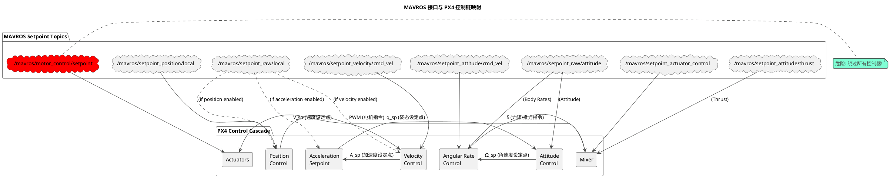

# MAVROS 控制接口与 PX4 控制链详解

本文档详细介绍了 MAVROS 中用于无人机控制的主要 Topic 接口，并清晰地将它们映射到 PX4 的内部控制链环节中，帮助开发者理解从上层指令到电机输出的完整流程。

## 控制链概览

PX4 的控制架构是一个级联控制器，其基本流程如下：

**位置 → 速度 → 加速度 → 姿态 → 角速度 → 力矩/推力 → 电机输出**

MAVROS 提供了不同层级的接口，允许开发者在控制链的任意环节注入设定点（Setpoint）。

## MAVROS 控制接口总览

| MAVROS 接口 | 发送的 msg 类型 | msg 包含的控制信息 | 对应 PX4 控制链位置 | 控制级别 |
| :--- | :--- | :--- | :--- | :--- |
| `/mavros/setpoint_position/local` | `geometry_msgs/PoseStamped` | 位置 + 偏航姿态(yaw) | 位置控制 (Position Control) | 最高层/最外环 |
| `/mavros/setpoint_velocity/cmd_vel` | `geometry_msgs/Twist` | 线速度 + 角速度 | 速度控制 (Velocity Control) | 外环 |
| `/mavros/setpoint_raw/local` | `mavros_msgs/PositionTarget` | 位置/速度/加速度/姿态的混合控制 | 位置/速度/加速度选择器 | 外环(灵活) |
| `/mavros/setpoint_raw/attitude` | `mavros_msgs/AttitudeTarget` | 姿态 + 推力 + 角速度 | 姿态控制 (Attitude Control) | 中环 |
| `/mavros/setpoint_attitude/cmd_vel` | `geometry_msgs/TwistStamped` | 姿态角速度 | 角速度控制 (Angular Rate Control) | 内环 |
| `/mavros/setpoint_attitude/thrust` | `geometry_msgs/Point` | 归一化推力 | 推力控制 | 内环(与姿态耦合) |
| `/mavros/setpoint_actuator_control` | `mavros_msgs/ActuatorControl` | 期望力矩、推力 | Mixer 输入 | 最内层(控制器输出) |
| `/mavros/motor_control/setpoint` | `mavros_msgs/ActuatorControl` | 独立的电机/舵机值 | 直接驱动电机 | 最底层(绕过Mixer) |

---

## 各接口详解

### 1. 位置控制 (Position Control)

- **Topic:** `/mavros/setpoint_position/local`
- **消息类型:** `geometry_msgs/PoseStamped`
- **Msg 内容:**
  - `position.x, y, z`: 期望的世界系(Inertial Frame)位置 `X_sp`。
  - `orientation`: 期望的姿态四元数，通常只使用 `yaw` (偏航角)，`roll` 和 `pitch` 会被 PX4 位置控制器自动计算覆盖。
- **对应 PX4 环节:** **位置控制器 (Position Control)**。这是最高层级的控制，对应控制链图的最左端。

### 2. 速度控制 (Velocity Control)

- **Topic:** `/mavros/setpoint_velocity/cmd_vel`
- **消息类型:** `geometry_msgs/Twist`
- **Msg 内容:**
  - `linear.x, y, z`: 期望的机体系(Body Frame)线速度 `V_sp`。
  - `angular.z`: 期望的偏航角速度。
- **对应 PX4 环节:** **速度控制器 (Velocity Control)**。此接口绕过了位置控制环，直接为速度PID控制器提供输入。

### 3. 混合控制 (Position/Velocity/Acceleration)

- **Topic:** `/mavros/setpoint_raw/local`
- **消息类型:** `mavros_msgs/PositionTarget`
- **Msg 内容:** 这是一个功能非常强大的接口，通过 `type_mask` 字段可以自由组合控制模式。
  - `position`: 位置设定点 `X_sp`。
  - `velocity`: 速度设定点 `V_sp`。
  - `acceleration_or_force`: 加速度设定点 `A_sp`。
  - `yaw`, `yaw_rate`: 偏航角或偏航角速度。
  - `type_mask`: 位掩码，用于指定哪些字段是有效的，从而决定无人机的控制模式。
- **对应 PX4 环节:** **位置/速度/加速度 多级控制选择器**。这是唯一可以直接向 PX4 输入加速度指令 `A_sp` 的 MAVROS 接口。

### 4. 姿态控制 (Attitude Control)

- **Topic:** `/mavros/setpoint_raw/attitude`
- **消息类型:** `mavros_msgs/AttitudeTarget`
- **Msg 内容:**
  - `orientation`: 期望的姿态四元数 `q_sp`。
  - `body_rate`: 期望的机体系角速度 `Ω_sp` (p, q, r)。
  - `thrust`: 期望的推力，是一个 `0..1` 的归一化值 `δ_Tsp`。
  - `type_mask`: 用于指定是控制姿态还是角速度。
- **对应 PX4 环节:** **姿态控制器 (Attitude Control)**。输入图中间的 `q_sp`。如果提供了 `body_rate`，则直接进入下一级的角速度控制。

### 5. 角速度控制 (Angular Rate Control)

- **Topic:** `/mavros/setpoint_attitude/cmd_vel`
- **消息类型:** `geometry_msgs/TwistStamped`
- **Msg 内容:**
  - `angular.x`: 期望的滚转角速度 (p)。
  - `angular.y`: 期望的俯仰角速度 (q)。
  - `angular.z`: 期望的偏航角速度 (r)。
- **对应 PX4 环节:** **角速度控制器 (Angular Rate Control)**。直接为最内环的角速度 PID 控制器提供输入 `Ω_sp`。

### 6. 推力控制 (Thrust Control)

- **Topic:** `/mavros/setpoint_attitude/thrust`
- **消息类型:** `geometry_msgs/Point`
- **Msg 内容:**
  - `z`: 期望的推力，是一个 `0..1` 的归一化值 `δ_Tsp`。(`x` 和 `y` 字段被忽略)
- **对应 PX4 环节:** **Mixer的推力输入**。此接口通常与姿态控制接口配合使用，单独发送推力没有意义。

### 7. 力矩/推力控制 (Actuator Controls)

- **Topic:** `/mavros/setpoint_actuator_control`
- **消息类型:** `mavros_msgs/ActuatorControl`
- **Msg 内容:**
  - `controls[0]`: 滚转力矩 (Roll torque)
  - `controls[1]`: 俯仰力矩 (Pitch torque)
  - `controls[2]`: 偏航力矩 (Yaw torque)
  - `controls[3]`: 总推力 (Collective thrust)
  - `controls[4-7]`: 其他控制量
- **对应 PX4 环节:** **Mixer的输入**。此接口绕过了所有姿态和角速度控制器，直接向 Mixer 发送滚转、俯仰、偏航的力矩和总推力指令 `δ_Asp, δ_Esp, δ_Rsp, δ_Tsp`。这需要外部程序自己完成姿态控制解算。

### 8. 电机直接控制 (Direct Motor Control)

- **Topic:** `/mavros/motor_control/setpoint`
- **消息类型:** `mavros_msgs/ActuatorControl`
- **Msg 内容:** 直接指定每个电机（或执行器）的输出值。
- **对应 PX4 环节:** **直接驱动电机 (Actuators)**。
- **⚠️ 警告:** 这是最危险的接口，它完全绕过了 PX4 中包括 Mixer 在内的所有控制和安全逻辑。仅应在非常特殊的测试和调试场景下使用。错误的使用极有可能导致飞行器失控和损坏。
