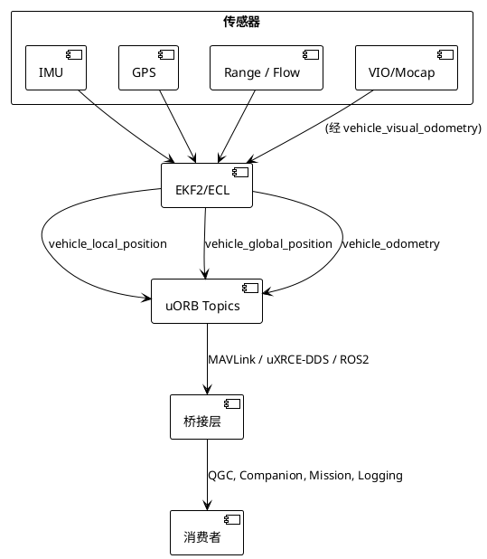
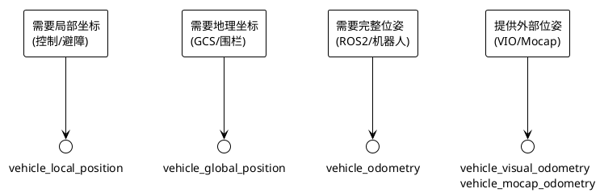

# PX4 世界/局部位置话题一览

PX4 通过 EKF2/ECL 等估计模块，向 uORB/MAVLink/ROS 输出多种“位姿”话题。虽然它们都描述飞行器在世界系的位置，但坐标系、数据字段、消费者各不相同。本节对比常见的几个话题：`vehicle_local_position`、`vehicle_global_position`、`vehicle_odometry`，以及与它们相关的输入/输出话题，帮助选择合适的数据源。

## 1. 话题速查表

| uORB 话题 | 坐标系 & 内容 | 主要字段 | 典型用途 | 对应 MAVLink / ROS2 | 生成者 |
| --- | --- | --- | --- | --- | --- |
| `vehicle_local_position` | 惯性原点在 EKF 启动时的位置，**NED**（北东地） | `x,y,z` [m]、`vx,vy,vz`、`heading`、参考点 `ref_lat/lon/alt` | 姿态/位置控制、避障、`LOCAL_POSITION_NED` | MAVLink `LOCAL_POSITION_NED` ROS2 `/fmu/out/vehicle_local_position` | EKF2 / LPE |
| `vehicle_global_position` | WGS84 **经纬高** | `lat,lon` [deg]、`alt` AMSL、`terrain_alt`、误差 `eph/epv` | QGC/HUD 显示、达位任务、`GLOBAL_POSITION_INT` | MAVLink `GLOBAL_POSITION_INT` ROS2 `/fmu/out/vehicle_global_position` | EKF2 / LPE |
| `vehicle_odometry` | 可选 `POSE_FRAME_NED/FRD`，提供姿态四元数 + 线速 + 角速 | `position[3]`、`q[4]`、`velocity[3]`、`angular_velocity[3]`、协方差 | ROS2 / RTPS 外部控制、VIO / Mocap 转发、`ODOMETRY` | MAVLink `ODOMETRY` ROS2 `/fmu/out/vehicle_odometry` | EKF2 里程计发布器 |
| `vehicle_mocap_odometry` / `vehicle_visual_odometry` | 与 `vehicle_odometry` 相同结构，但作为**输入** | 同 `vehicle_odometry` | `vehicle_visual_odometry` 可注入 EKF；`vehicle_mocap_odometry` 主要用于 MAVLink/ROS 透传（EKF 当前不消费） | MAVLink `ODOMETRY` ROS2 `/fmu/in/*` | 外部伴飞电脑 |

> 各话题的字段定义位于 `msg/versioned/*.msg`（例如 `VehicleLocalPosition.msg`、`VehicleGlobalPosition.msg`、`VehicleOdometry.msg`）。

## 2. 数据生成与消费流程

- EKF2 根据 IMU/GPS/视觉等传感器输出三种“位姿视图”。
- MAVLink 桥 (`mavlink_main`) 和 uXRCE-DDS 客户端根据需要订阅这些话题，发布到对应链路。
- 外部控制器（ROS2、Offboard）再结合任务需求选择某个话题。

## 3. 话题详解

### 3.1 `vehicle_local_position`

- **坐标系**：NED，原点在 EKF 启动时的 GPS 位置。正方向：北 (+x)、东 (+y)、地心向下 (+z)。
- **字段**：以 `x/y/z, vx/vy/vz` 表示本地位置和速度；包含 `ref_lat/lon/alt` 以便转换至 WGS84；附带误差估计 (`eph/epv/evh/evv`)、航向 `heading`、reset counter 等。
- **常用场景**：
  - PX4 内部位置/速度控制器。
  - 避障模块、mission replanner。
  - 通过 MAVLink `LOCAL_POSITION_NED` 下发给 QGC 或伴飞电脑。
- **选择建议**：需要“重力对齐、随 EKF 重置的局部坐标”时使用；适合控制、短程追踪。

### 3.2 `vehicle_global_position`

- **坐标系**：WGS84（`lat`, `lon`, `alt`），额外提供 `alt_ellipsoid`、地形高度 `terrain_alt`。
- **字段**：重置计数、地形估计、`dead_reckoning` 状态、水平/垂直误差 `eph/epv`。
- **常用场景**：
  - QGC HUD、地图显示。
  - 地理围栏、航点导航。
  - MAVLink `GLOBAL_POSITION_INT` / `HIR GPS` / uXRCE ROS2 `/fmu/out/vehicle_global_position`。
- **选择建议**：需要地理坐标、长距离任务时使用（例如 GCS 同步、日志分析）。

### 3.3 `vehicle_odometry`

- **坐标系**：字段 `pose_frame`（NED 或 FRD）+ `velocity_frame`（NED/FRD/body）；姿态为四元数 `q`；同时给出 `velocity[3]`、`angular_velocity[3]` 及协方差。
- **常用场景**：
  - ROS2 External Controller：直接通过 `/fmu/out/vehicle_odometry` 获取位姿，或将 `/fmu/in/vehicle_odometry` 用作外部观测。
  - MAVLink `ODOMETRY`（用于机器人/地面站兼容 ROS REP 147）。
  - PX4-ROS2 桥（`px4_ros_com`）和 `microRTPS`。
- **选择建议**：需要完整 pose+twist+协方差，并且希望在 ROS 生态中保持标准接口时使用。

#### `vehicle_local_position` vs `vehicle_odometry`

| 项目 | `vehicle_local_position` | `vehicle_odometry` |
| --- | --- | --- |
| 坐标系 | 固定 NED（原点在 EKF 启动处） | 可选 `POSE_FRAME_NED/FRD`，速度也可在 body frame |
| 姿态信息 | 仅 `heading`（Yaw） | 四元数 `q[4]`（完整姿态） |
| 速度/加速度 | `vx/vy/vz`、`ax/ay/az`（NED） | `velocity[3]`、`angular_velocity[3]`（可选 NED/FRD/body） |
| 误差估计 | `eph/epv/evh/evv`、`heading_var` | `position_variance`、`orientation_variance`、`velocity_variance` |
| Reset 信息 | `delta_xy/delta_z`、`reset_counter` 等 | 单一 `reset_counter`（姿态/位置/速度） |
| 典型消费者 | PX4 控制器、避障、MAVLink `LOCAL_POSITION_NED` | ROS2 External Controller、MAVLink `ODOMETRY`、VIO/Mocap 桥 |
| 在 ROS 中表现 | 需自己转换为 Pose/Twist | 完全符合 REP-147，直接可用 |

> ✅ **结论**：如果你在 PX4 内部或 MAVLink 中只需要“局部位置 + 速度”，`vehicle_local_position` 更轻量；如果需要完整姿态/速度/协方差（尤其是 ROS2 控制器或机器人应用），应使用 `vehicle_odometry`。

### 3.4 `vehicle_mocap_odometry` / `vehicle_visual_odometry`

- 与 `vehicle_odometry` 相同的数据结构，但语义为**外部输入**：
  - `/fmu/in/vehicle_visual_odometry` 会被 EKF2 订阅，用于注入外部视觉/VIO 观测，提高室内或 GPS-denied 下的定位质量。
  - `/fmu/in/vehicle_mocap_odometry` 主要用作 MAVLink/ROS 透传（供伴飞或日志使用），当前 EKF 不消费该话题。

## 4. 不同话题应该如何选择？

- **控制/避障**：`vehicle_local_position`（或其 setpoint variant）。
- **地图/围栏/任务**：`vehicle_global_position`。
- **机器人/多传感器融合**：`vehicle_odometry`。
- **向 EKF 输入额外位姿**：使用 `vehicle_visual_odometry`；若需透传 Mocap，可使用 `vehicle_mocap_odometry`（当前 EKF 不消费）。

## 5. 如何在 MAVLink/ROS2 中启用这些话题？

1. **MAVLink**：在 `rc.board_defaults` 或参数中配置 `MAV_X_MODE`/`MAV_X_RATE`，使实例发送 `LOCAL_POSITION_NED`, `GLOBAL_POSITION_INT`, `ODOMETRY` 等消息。
2. **ROS2 / uXRCE**：在 `src/modules/uxrce_dds_client/dds_topics.yaml` 中确保 `vehicle_local_position`, `vehicle_global_position`, `vehicle_odometry` 列在 `publications`。编译后即可通过 `/fmu/out/*` 订阅。
3. **日志**：`logger` 默认记录这些关键话题，方便飞行后分析。

### 5.1 MAVLink `LOCAL_POSITION_NED` vs `ODOMETRY`

| MAVLink 消息 | 对应 uORB | 数据内容 | 典型用途 |
| --- | --- | --- | --- |
| `LOCAL_POSITION_NED` | `vehicle_local_position` | `x,y,z`（NED）、`vx,vy,vz`、`yaw`，无姿态四元数、无协方差 | 低带宽、控制友好，用于 PX4 控制器、GCS HUD、伴飞电脑读取局部位置 |
| `ODOMETRY` | `vehicle_odometry`（或外部 odom 输入） | Pose + Twist + frame 标识 + 协方差（符合 ROS REP-147） | 机器人/ROS2 生态，或需要完整姿态/速度/协方差的外部控制器；也可透传外部 VIO/Mocap 数据 |

> 实际使用中，同一 MAVLink 实例可同时发布 `LOCAL_POSITION_NED`（轻量）和 `ODOMETRY`（完整），根据链路带宽与需求选择其中之一。

## 6. 结论

PX4 中关于“世界/局部位置”的话题虽然多，但遵循以下原则即可选择：

- **坐标系**：局部 NED vs WGS84 vs 任意 FRD。
- **数据内容**：是否需要速度、姿态、协方差、参考位姿。
- **消费端**：控制器、GCS、ROS2、外部传感器注入。

理解这些差别，既能在 MAVLink/ROS2 中准确订阅/发送，也能根据任务需求调试 EKF 输出。EOF
> ✅ **区别总结**：`vehicle_local_position` 是“控制友好的 NED 数组”，但不含姿态；`vehicle_odometry` 则是“完整 Pose/Twist + 协方差”，坐标系更灵活，更适合机器人/ROS2 堆栈。
