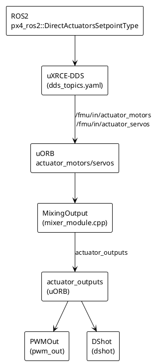

# ROS2 直通执行器：接口体系与 PWM/DShot 映射

本章面向“写 ROS2 控制器的开发者”，系统梳理**最底层控制接口**、**px4-ros2-interface-lib 的作用**、以及**从归一化输入到 PWM/DShot 的完整映射链路**。所有结论均可追溯到 PX4 主仓源码。

## 目录

- [术语与角色](#术语与角色)
- [ROS2 接口层：px4-ros2-interface-lib](#ros2-接口层px4-ros2-interface-lib)
- [最底层控制接口（PX4 内部视角）](#最底层控制接口px4-内部视角)
- [输入单位：归一化范围](#输入单位归一化范围)
- [数据链路：ROS2 → PX4 → 输出](#数据链路ros2--px4--输出)
- [PWM 映射](#pwm-映射)
- [DShot 映射](#dshot-映射)
- [“拉满推力”时的真实输出](#拉满推力时的真实输出)

## 术语与角色

- **PX4 主仓**：`PX4/PX4-Autopilot`，实现飞控逻辑、uORB、输出驱动。  
- **px4-ros2-interface-lib**：ROS2 侧接口库（Auterion 维护），封装 PX4 接口话题与 setpoint 类型。  
- **uXRCE-DDS**：PX4 内部 DDS bridge，负责 ROS2 ↔ PX4 uORB 的话题映射。  

## ROS2 接口层：px4-ros2-interface-lib

`px4_ros2::DirectActuatorsSetpointType` 属于 **px4-ros2-interface-lib**。它不是 PX4 飞控内部类型，而是 ROS2 侧的便捷封装：

- 作用：把 ROS2 端的 “直接执行器设定值” 封装为消息并发布到 PX4 的 `/fmu/in/actuator_motors` / `/fmu/in/actuator_servos`。
- 归属：**外部库**，不在 `PX4-Autopilot` 树内。
- 结果：最终仍由 PX4 内部 uORB 消息接收并处理。

> PX4 文档中对该接口的说明：[`px4_ros2_control_interface.md#L546-L551`](https://github.com/PX4/PX4-Autopilot/blob/main/docs/zh/ros2/px4_ros2_control_interface.md#L546-L551)

## 最底层控制接口（PX4 内部视角）

在 PX4 内部，真正的最低层“执行器控制输入”是 **uORB 话题**：

- `/fmu/in/actuator_motors` → uORB `actuator_motors`
- `/fmu/in/actuator_servos` → uORB `actuator_servos`

`px4_ros2::DirectActuatorsSetpointType` 最终只是在 ROS2 侧写入这些话题。

**源码依据：**

- uXRCE-DDS 输入映射：[`dds_topics.yaml#L191-L197`](https://github.com/PX4/PX4-Autopilot/blob/main/src/modules/uxrce_dds_client/dds_topics.yaml#L191-L197)
- 消息定义：
  - [`ActuatorMotors.msg#L1-L16`](https://github.com/PX4/PX4-Autopilot/blob/main/msg/versioned/ActuatorMotors.msg#L1-L16)
  - [`ActuatorServos.msg#L1-L12`](https://github.com/PX4/PX4-Autopilot/blob/main/msg/versioned/ActuatorServos.msg#L1-L12)

## 输入单位：归一化范围

是的，电机与舵机输入**都是归一化值**：

- `ActuatorMotors.control[]`：`[-1, 1]` 归一化推力
  - `1` = 最大正推力
  - `-1` = 最大反推力（不支持反转时 `<0` 会变成 NaN 并停转）
  - 来源：[`ActuatorMotors.msg#L1-L16`](https://github.com/PX4/PX4-Autopilot/blob/main/msg/versioned/ActuatorMotors.msg#L1-L16)
- `ActuatorServos.control[]`：`[-1, 1]` 归一化舵机位置
  - `1` = 最大正向、`-1` = 最大反向
  - 来源：[`ActuatorServos.msg#L1-L12`](https://github.com/PX4/PX4-Autopilot/blob/main/msg/versioned/ActuatorServos.msg#L1-L12)

## 数据链路：ROS2 → PX4 → 输出

若无法预览 PlantUML，可按下列链路理解数据流向：

1. ROS2 通过 `px4_ros2::DirectActuatorsSetpointType` 发布归一化控制量。  
2. uXRCE-DDS 把 `/fmu/in/actuator_motors` 与 `/fmu/in/actuator_servos` 写入 PX4 的 uORB。  
3. `MixingOutput` 读取 uORB，并计算 `actuator_outputs`。  
4. 输出驱动选择 PWMOut 或 DShot，将 `actuator_outputs` 写入硬件接口。  

**对应源码：**

- DDS 映射：[`dds_topics.yaml#L191-L197`](https://github.com/PX4/PX4-Autopilot/blob/main/src/modules/uxrce_dds_client/dds_topics.yaml#L191-L197)
- 归一化 → 输出值映射：[`mixer_module.cpp#L535-L570`](https://github.com/PX4/PX4-Autopilot/blob/main/src/lib/mixer_module/mixer_module.cpp#L535-L570)
  - `MixingOutput::output_limit_calc_single()`
- PWM 驱动：[`PWMOut.cpp#L128-L150`](https://github.com/PX4/PX4-Autopilot/blob/main/src/drivers/pwm_out/PWMOut.cpp#L128-L150)
- DShot 驱动：[`DShot.cpp#L375-L410`](https://github.com/PX4/PX4-Autopilot/blob/main/src/drivers/dshot/DShot.cpp#L375-L410)

## PWM 映射

PWM 的核心映射在 [`MixingOutput::output_limit_calc_single()`](https://github.com/PX4/PX4-Autopilot/blob/main/src/lib/mixer_module/mixer_module.cpp#L535-L570)：

- **电机输出**（没有 center）：
  `[-1, 1]` 线性插值到 `[PWM_MAIN_MIN, PWM_MAIN_MAX]`
- **舵机输出**（有 center）：
  `[-1, 0, 1]` 线性插值到 `[PWM_MAIN_MIN, PWM_MAIN_CENTER, PWM_MAIN_MAX]`

**数学表达（电机，$u \in [-1, 1]$）**：

$$
PWM = PWM_{min} + \frac{u + 1}{2}\,(PWM_{max} - PWM_{min})
$$

**数学表达（舵机，$u \in [-1, 1]$，含 center）**：

$$
PWM =
\begin{cases}
PWM_{center} + u\,(PWM_{max} - PWM_{center}), & u \ge 0 \\
PWM_{center} + u\,(PWM_{center} - PWM_{min}), & u < 0
\end{cases}
$$

**示例（假设 PWM_MIN=1000, PWM_CENTER=1500, PWM_MAX=2000）**：

- 电机：u = 0.2 -> PWM = 1000 + 0.6 * 1000 = 1600
- 电机：u = -0.5 -> PWM = 1000 + 0.25 * 1000 = 1250
- 舵机：u = 0.4 -> PWM = 1500 + 0.4 * 500 = 1700
- 舵机：u = -0.6 -> PWM = 1500 - 0.6 * 500 = 1200

**参数来源：** [`pwm_out/module.yaml#L1-L32`](https://github.com/PX4/PX4-Autopilot/blob/main/src/drivers/pwm_out/module.yaml#L1-L32)

常用参数（MAIN/AUX 同理）：

| 参数 | 作用 | 来源 |
| --- | --- | --- |
| `PWM_MAIN_MIN` | 最小 PWM | [`pwm_out/module.yaml#L7-L12`](https://github.com/PX4/PX4-Autopilot/blob/main/src/drivers/pwm_out/module.yaml#L7-L12) |
| `PWM_MAIN_MAX` | 最大 PWM | [`pwm_out/module.yaml#L7-L12`](https://github.com/PX4/PX4-Autopilot/blob/main/src/drivers/pwm_out/module.yaml#L7-L12) |
| `PWM_MAIN_CENTER` | 舵机中心 PWM | [`pwm_out/module.yaml#L7-L12`](https://github.com/PX4/PX4-Autopilot/blob/main/src/drivers/pwm_out/module.yaml#L7-L12) |
| `PWM_MAIN_DISARM` | 解锁前 PWM | [`pwm_out/module.yaml#L7-L12`](https://github.com/PX4/PX4-Autopilot/blob/main/src/drivers/pwm_out/module.yaml#L7-L12) |
| `PWM_MAIN_FAIL` | failsafe PWM | [`pwm_out/module.yaml#L7-L12`](https://github.com/PX4/PX4-Autopilot/blob/main/src/drivers/pwm_out/module.yaml#L7-L12) |

**硬件输出：**

- `PWMOut::updateOutputs()` 使用 `up_pwm_servo_set()` 写入硬件定时器  
  - [`PWMOut.cpp#L128-L150`](https://github.com/PX4/PX4-Autopilot/blob/main/src/drivers/pwm_out/PWMOut.cpp#L128-L150)

## DShot 映射

DShot 是 PWMOut 的**替代输出驱动**，其输出链路仍来自 `MixingOutput` 的 `actuator_outputs`，但最终发送 DShot 数字命令。

**关键点：**

- DShot 驱动在初始化时设置输出范围为：
  - 最小：`DSHOT_MIN_THROTTLE`（1）
  - 最大：`DSHOT_MAX_THROTTLE`（1999）
  - 定义：[`DShot.h#L51-L58`](https://github.com/PX4/PX4-Autopilot/blob/main/src/drivers/dshot/DShot.h#L51-L58)
- `DSHOT_MIN` 参数用于把“归一化 0~1”映射为 ESC 保持转动的最小油门：  
  - `DShot::update_params()`  
  - [`DShot.cpp#L618-L635`](https://github.com/PX4/PX4-Autopilot/blob/main/src/drivers/dshot/DShot.cpp#L618-L635)
- `DShot::updateOutputs()` 把输出值传给 `up_dshot_motor_data_set()`  
  - [`DShot.cpp#L375-L410`](https://github.com/PX4/PX4-Autopilot/blob/main/src/drivers/dshot/DShot.cpp#L375-L410)

**数学表达（非 3D、单向油门，$u \in [0, 1]$）**：

$$
DSHOT_{min} = \mathrm{clamp}(DSHOT\_MIN \cdot DSHOT\_{max},
DSHOT\_{min\_throttle}, DSHOT\_{max})
$$

$$
DSHOT = DSHOT_{min} + u\,(DSHOT_{max} - DSHOT_{min})
$$

**示例（取整，DSHOT_MAX_THROTTLE=1999）**：

- DSHOT_MIN=0.05，u=0.0 -> DSHOT_MIN_OUT=100 -> DSHOT=100
- DSHOT_MIN=0.05，u=0.5 -> DSHOT=100 + 0.5 * 1899 = 1050
- DSHOT_MIN=0.10，u=0.2 -> DSHOT_MIN_OUT=200 -> DSHOT=200 + 0.2 * 1799 = 560
- DSHOT_MIN=0.10，u=1.0 -> DSHOT=1999

**DShot 相关参数：** [`dshot/module.yaml#L1-L76`](https://github.com/PX4/PX4-Autopilot/blob/main/src/drivers/dshot/module.yaml#L1-L76)

| 参数 | 作用 | 说明 |
| --- | --- | --- |
| `DSHOT_MIN` | 最小 DShot 输出占比 | 保证电机起转（[`module.yaml#L11-L24`](https://github.com/PX4/PX4-Autopilot/blob/main/src/drivers/dshot/module.yaml#L11-L24)） |
| `DSHOT_3D_ENABLE` | 允许 3D 模式 | 正反推力（[`module.yaml#L25-L35`](https://github.com/PX4/PX4-Autopilot/blob/main/src/drivers/dshot/module.yaml#L25-L35)） |
| `DSHOT_3D_DEAD_L/H` | 3D deadband | 中间区停转（[`module.yaml#L46-L65`](https://github.com/PX4/PX4-Autopilot/blob/main/src/drivers/dshot/module.yaml#L46-L65)） |
| `DSHOT_BIDIR_EN` | 双向 DShot | RPM 反馈（[`module.yaml#L36-L45`](https://github.com/PX4/PX4-Autopilot/blob/main/src/drivers/dshot/module.yaml#L36-L45)） |

## “拉满推力”时的真实输出

- **PWM**：
  `actuator_motors.control[i] = 1.0`
  → [`output_limit_calc_single()`](https://github.com/PX4/PX4-Autopilot/blob/main/src/lib/mixer_module/mixer_module.cpp#L535-L570)
  → PWM = `PWM_MAIN_MAX`（或 AUX）

- **DShot**：
  `actuator_motors.control[i] = 1.0`
  → 输出值 = `DSHOT_MAX_THROTTLE = 1999`
  → [`up_dshot_motor_data_set(i, 1999, ...)`](https://github.com/PX4/PX4-Autopilot/blob/main/src/drivers/dshot/DShot.cpp#L405-L410)

因此“拉满”的数值并不直接等于某个 PWM 或 DShot 命令，而是通过 **MixingOutput + 输出驱动**的参数映射得到最终硬件信号。

## 小结

**ROS2 最底层控制接口 = `/fmu/in/actuator_motors` 与 `/fmu/in/actuator_servos`**。
`px4_ros2::DirectActuatorsSetpointType` 只是封装。
归一化输入最终通过 `MixingOutput` 映射到 PWM 或 DShot，关键参数分别在 [`pwm_out/module.yaml`](https://github.com/PX4/PX4-Autopilot/blob/main/src/drivers/pwm_out/module.yaml#L1-L32) 与 [`dshot/module.yaml`](https://github.com/PX4/PX4-Autopilot/blob/main/src/drivers/dshot/module.yaml#L1-L76) 中定义。
