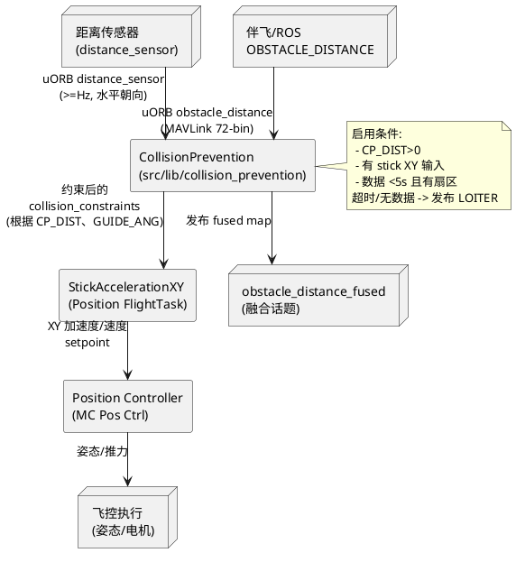

## PX4 避障（CollisionPrevention）机制速查

### 1. 入口与生效模式
- 代码位于 `src/lib/collision_prevention/CollisionPrevention.cpp/.hpp`，由 `CollisionPrevention` 类实现（构造时订阅 `obstacle_distance`/`distance_sensor`）。
- 唯一调用点在 `StickAccelerationXY::generateSetpoints()`（`src/modules/flight_mode_manager/tasks/Utility/StickAccelerationXY.cpp:117`），它先把遥杆映射成加速度，再在 `CollisionPrevention::is_active()` 返回 `true` 时调用 `modifySetpoint()`。
- `is_active()` 的条件只有一个：参数 `CP_DIST > 0`（`CollisionPrevention.cpp:72`）。因此默认关闭，只有把“最小保持距离”设为正值后才启用。
- 由于 `StickAccelerationXY` 被 `FlightTaskManualAcceleration` 使用，这个模块只在“Position 模式/Manual Position”以及 `FlightTaskAuto` 中需要手动偏移（降落时的 `sticks_xy`）才介入；Acro/AltCtl/Mission 纯自动飞行不会走这条路径。

### 2. 数据流与动作逻辑
- **输入**：任何距离传感器驱动（`distance_sensor` 话题）或外部伴飞通过 MAVLink `OBSTACLE_DISTANCE` 推送的 72 槽位栅格。`CollisionPrevention::_updateObstacleMap()` 将两者融合成机体系的 `_obstacle_map_body_frame` 并发布 `obstacle_distance_fused`。
- **动作触发流程**：
  1. `StickAccelerationXY` 把飞手遥杆映射成平面加速度 `_acceleration_setpoint`。
  2. 若 `CP_DIST>0` 且遥杆幅值 `>0.001`，`CollisionPrevention::modifySetpoint()` 会被调用。
  3. 模块以 72 个方向栅格维护最近障碍距离 `_closest_dist`。当遥杆方向与最近障碍夹角 < 90°（即 `_closest_dist_dir·setpoint > 0`）时才介入。
  4. 依据 `_closest_dist`、`CP_DIST`、`MPC_VEL_MANUAL/MPC_XY_P` 等参数计算缩放因子；结果分解成“法向（指向障碍）”与“切向（沿障碍）”两部分加速度，并按 `_getScale()` 限幅。
  5. 若距离数据在 5 秒内全部丢失，则直接把加速度清零并发送 `vehicle_command DO_LOITER`，迫使飞行器在当前位置悬停。
- **触发阈值**：
  - `_min_dist_to_keep = max(map.min_distance/100, CP_DIST)`（`CollisionPrevention.cpp:185`）——即保持距离取“当前地图最小测距”与 `CP_DIST` 的较大值。
  - `_closest_dist` 从 72 个方向里取最近一束（`CollisionPrevention.cpp:165`）。若 `_closest_dist_dir·stick_setpoint > 0`（朝向障碍物），会按 `_getScale()` 比例缩放加速度。
  - `_getScale()` 的“二段函数”使用 `scale_distance = max(CP_DIST, MPC_VEL_MANUAL / MPC_XY_P)`（`CollisionPrevention.cpp:513`），在 `CP_DIST` 内线性减到 -1，再在 `scale_distance` 内二次恢复到 1；最终把命令拆成“法向 + 切向”并分别缩放（`_constrainAccelerationSetpoint()`）。
- **其它参数**：
  - `CP_GUIDE_ANG` 允许在 `_adaptSetpointDirection()` 中改变方向，引导飞手绕开障碍。
  - `CP_GO_NO_DATA` 决定是否允许运动到“没有传感器覆盖”的扇区；若为 0，且该方向没有距离数据，则直接拒绝指令（`_checkSetpointDirectionFeasability()`）。
  - 当长达 `TIMEOUT_HOLD_US = 5 s` 没有新的距离数据时，`modifySetpoint()` 会把加速度置零并发布 `vehicle_command DO_LOITER`（`CollisionPrevention.cpp:188-205/574`），提示飞行器悬停等待。

### 3. 哪些模式/情形不会避障
- **Position 模式以外**：因为只有 `FlightTaskManualAcceleration`（即 Position 模式）调用 `StickAccelerationXY`，Acro、Stabilized、Altitude, Mission/RTL 等模式不会自动缩限遥杆指令。Mission/Auto 需要外部 Avoidance 栈（例如 ROS2 `px4-avoidance`）通过 MAVLink 推送新的轨迹点，而不是依赖 `CollisionPrevention`。
- **CP_DIST = 0**：`is_active()` 立即返回 `false`，整个模块不运行——常见于只想使用距离传感器测高而不想避障的配置。
- **没有 stick 输入**：`setpoint_length <= 0.001` 时不修改加速度（`CollisionPrevention.cpp:191`）。因此位置锁定（Hold）下只有在飞手推动摇杆时才解析障碍；悬停状态不会自动侧移。
- **数据不在水平方向**：传感器方位在 `ROTATION_DOWNWARD_FACING/UPWARD_FACING` 的测距会被忽略（`CollisionPrevention.cpp:112`）。因此仅靠垂直雷达不能触发水平避障。

### 4. PlantUML：数据与控制流

### 5. 使用建议
- **开关**：在 QGC 将 `CP_DIST` 设为大于 0 的距离（米），并根据传感器覆盖调整 `CP_GO_NO_DATA`、`CP_DELAY`（过滤迟滞）、`CP_GUIDE_ANG`（导向角）。若要记录避障状态，可订阅 `collision_constraints` 话题。
- **输入数据**：若硬件本身只输出 `distance_sensor`，确保 `orientation` 设置为前/左/右等水平方向；若通过伴飞发送 `OBSTACLE_DISTANCE`，务必提供 `increment`、`min/max_distance`、`frame` 等字段，否则 `_addObstacleSensorData()` 会直接丢弃。
- **模式限制**：Position 模式才能用；Mission/Offboard 需要在伴飞侧做路径规划（例如 PX4 Avoidance 项目），让飞控跟踪已经避障的航迹。
- **典型动作**：当障碍距离逐渐逼近 `CP_DIST` 时，飞控会先减小朝向障碍的加速度，再把方向偏向可用扇区（受 `CP_GUIDE_ANG` 限制），最终贴边滑行或完全停止。若持续无数据则进入 Loiter 模式等待。
- **操作清单**：
  1. `param set CP_DIST 3`、`param set CP_GUIDE_ANG 20`。
  2. 在伴飞侧启动 `MicroXRCEAgent` 或自定义避障节点，发布 `obstacle_distance`。
  3. 在 Position 模式下缓慢推杆并观察 `collision_constraints`；若日志存在 `vehicle_command DO_LOITER`，说明测距数据长时间缺失。
