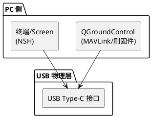
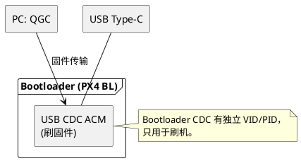
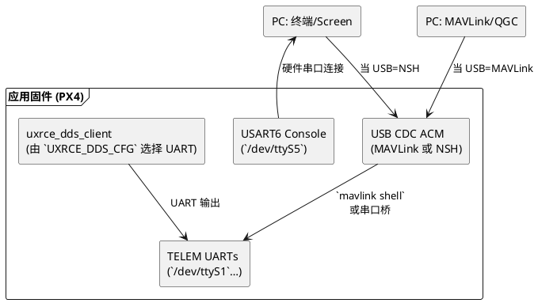

## hkust_nxt-dual：USB CDC、NSH 与刷写流程

本文回答：
1. 为什么同一个 USB-C/CDC 接口既能跑 NSH，又能刷固件？
2. 与 MAVLink/TELEM 串口的关系是什么？
3. 如果把 CDC 改成 NSH，刷机和通信会受到怎样影响？

### USB CDC 分层关系

**图1：USB CDC 层级**

**图2：Bootloader CDC**

**图3：应用 CDC 与串口**

这三个图分别展示了 PC ⇄ USB 物理层、Bootloader CDC、应用 CDC 与 UART 的组合关系，可以更清晰地理解各阶段的数据流。***

### CDC 为什么能同时承担 NSH 和刷固件？
1. **Bootloader 与应用隔离**：刷机发生在 PX4 Bootloader 阶段，使用 `hw_config.h` 中定义的 USB VID/PID、CDC ACM，实现固件传输。进入应用后，这个 CDC 实例关闭，改由 PX4 应用自己的 CDC 描述符运行。
2. **应用 CDC 的用途可配置**：默认配置下，应用 CDC 由 `CONFIG_DRIVERS_CDCACM_AUTOSTART` 启动，PX4 在其上跑 MAVLink/参数传输；如果改为 `CONFIG_CDCACM_CONSOLE`，就能把 NSH console 切到 USB。因为 Bootloader 和应用的 CDC 是两个独立实例，所以刷机流程不会受应用 CDC 用途影响。

### MAVLink vs NSH（同 CDC 端口）
- **单 CDC 限制**：应用阶段只暴露一个 CDC ACM 端口，所以默认只能选“USB 跑 MAVLink”或“USB 跑 NSH”其一。如果选择 NSH，MAVLink/参数传输就需要移到 TELEM UART 或通过 `mavlink shell`。
- **mavlink shell**：当 USB CDC 用于 MAVLink 时，可以在地面站里通过 `mavlink shell` 访问 NSH，相当于在 MAVLink 流里转发 NSH 字节流，不需要 USB 直接占用。

### 改成 USB NSH 后如何刷机？
- QGC 仍可刷机：刷机时飞控会进入 PX4 Bootloader（USB VID/PID 变成 `PX4 BL`），QGC 识别后通过 Bootloader CDC 传输固件。应用 CDC 是 NSH 也没影响。
- 唯一变化：无法再通过 USB MAVLink 发送 `reboot --bootloader` 等命令，因为应用 CDC 不再跑 MAVLink。需要通过其他串口的 MAVLink 或硬件按钮进入 Bootloader。

#### Bootloader 切换流程详解
1. **重启请求**：QGC 先通过现有的 MAVLink 链路（默认 USB）发送 `reboot` 或 `reboot --bootloader` 命令，PX4 应用执行后触发 MCU 复位。
2. **切换到 Bootloader**：复位时 Bootloader 占据控制权，启动自己的 USB CDC（VID/PID 如 `PX4 BL FMU v6` 等），与应用阶段完全不同。PC 端检测到新的 USB 设备，QGC 弹出“正在连接 Bootloader”提示。
3. **固件传输**：QGC 利用 Bootloader CDC 发送 `.px4` 固件文件。Bootloader 校验格式、擦写 Flash、最后重新启动 MCU。
4. **返回应用**：刷写成功后再次复位，应用固件启动并恢复自身 CDC（MAVLink 或 NSH）。此时 PC 端又会识别到应用阶段的 USB 设备。

因此，QGC 必须让飞控重启，才能让 Bootloader 接管 USB，完成固件更新。除非你手动按住 BOOT/Safety 按钮进入 Bootloader，否则需要先通过 MAVLink 控制台下发 `reboot` 命令才能跳转。

### 与 TELEM/UXRCE 的关系
- `UXRCE_DDS_CFG` 仅选择 UART 角色（TELEM1=101 等），指向 `/dev/ttyS*`。USB CDC 不在此列表，必须通过 TELEM 任意一口输出。
- TELEM 串口其实是 MCU 的 UART（USART1/2/...），对应 `/dev/ttyS*` 设备。USB CDC 完全绕过这些 UART，走 USB 控制器，名字是 `/dev/ttyACM*`。
- 当应用 CDC 改成 NSH 时，MAVLink 要么迁到某个 TELEM UART，要么依赖 `mavlink shell` 获取 NSH。

### 总结
- **刷机**：始终依赖 Bootloader 的 CDC，与应用 CDC 用途无关。
- **NSH**：默认在 USART6（`/dev/ttyS5`），可通过 `CONFIG_CDCACM_CONSOLE` 改到 USB。
- **MAVLink**：默认在 USB CDC，如果 NSH 占用，需要改到 TELEM。
- **uXRCE-DDS**：只走 UART，靠 `UXRCE_DDS_CFG` 选择端口，USB CDC 不参与。

理解“Bootloader CDC 与应用 CDC 是两个实体”，以及“应用 CDC 只能连接一个上层用途（NSH 或 MAVLink）”后，就能判断 USB 接口在不同阶段的行为。***
