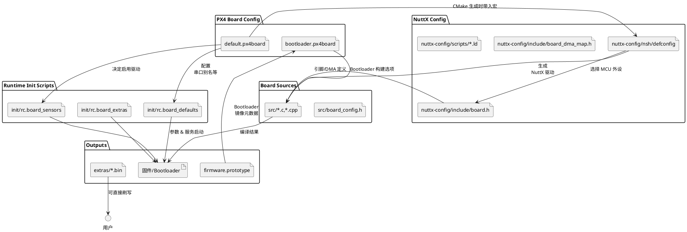

## hkust/nxt-dual 目录结构与文件关系

该目录承载 PX4 对 HKUST NXT-Dual 飞控的全部板级定义，从 bootloader 到运行时启动脚本。下文梳理关键子目录/文件的职责及相互关系。

### 总览

```
boards/hkust/nxt-dual/
├── bootloader.px4board        # Bootloader 构建配置
├── default.px4board           # 正常固件（应用）配置
├── firmware.prototype         # Bootloader 使用的固件原型元数据
├── init/                      # rc.board_* 启动脚本
├── nuttx-config/              # NuttX 板级配置（defconfig、board.h 等）
├── src/                       # C/C++ 板级驱动&初始化代码（bootloader+运行时）
└── extras/                    # 额外产物（例：预编译 bootloader）
```

### PlantUML：配置/代码数据流



### 关键文件说明

| 文件/目录 | 作用 | 关联关系 |
| --- | --- | --- |
| `default.px4board` | 描述“应用固件”应启用的 PX4 模块、驱动、串口角色（GPS/TELEM/RC 等）。构建时供 `cmake/configs/nuttx_px4_board.cmake` 读取，生成编译宏 | 影响 `px4_add_board` 生成的 CMake 选项，并驱动启动脚本对 `/dev/ttyS*` 赋予角色 |
| `bootloader.px4board` | 与上类似，但面向 bootloader 工程；控制是否构建 CDCACM、闪存驱动等 | 由 `make hkust_nxt-dual_bootloader` 使用，搭配 `src/bootloader_main.c` |
| `firmware.prototype` | Bootloader 固件镜像元数据（board_id、最大尺寸等），刷写时进入 `.px4` 包头 | 和 bootloader 源代码、`Tools/px4-px4c` 一起用于生成可刷写镜像 |
| `init/rc.board_defaults` | 板级默认参数：电池分压、机型、MAVLink 配置等 | PX4 启动流程在 `rc.board_defaults` 早期执行，覆盖 `SYS_*` 等参数 |
| `init/rc.board_sensors` | 板载传感器启动脚本：bmi088、spl06 等 | 使用 `default.px4board` 中启用的驱动，并依赖 `/dev/ttyS*` 映射 |
| `init/rc.board_extras` | 额外自定义命令（如 LED、风扇等） | 在主 `rcS` 中按需调用 |
| `nuttx-config/nsh/defconfig` | NuttX Kconfig 结果；指定 MCU 型号 (STM32H743VI)、使能的 UART/SPI、console、调试开关 | 与 `nuttx-config/Kconfig`、`board.h` 共同决定底层驱动；更改后需 `make menuconfig`/`savedefconfig` |
| `nuttx-config/include/board.h` | MCU 引脚表、GPIO 定义（包含 UART1~8、SPI、I2C、LED 等），供 NuttX 驱动与 PX4 板级代码使用 | `src/board_config.h`、`src/*` 直接包含；`defconfig` 控制哪些片上外设可用 |
| `nuttx-config/include/board_dma_map.h` | DMA 通道映射，提供给 NuttX 驱动（SPI、USART 等） | `src/*` 与 NuttX DMA 框架共享此映射 |
| `nuttx-config/scripts/*.ld` | 链接脚本（应用 & bootloader），定义 Flash/SRAM 分布、APP 起始地址 `0x08020000` 等 | 与 `src/manifest.c`、`bootloader_main.c` 保持一致 |
| `nuttx-config/bootloader/defconfig` & `nsh/defconfig` | 分别服务于 bootloader 和应用固件，两者都在本目录 | 构建流程按目标切换对应 defconfig |
| `src/board_config.h` | 运行时 board_config，声明 PWM 通道数、ADC 通道、HRT 定时器等 | 由 PX4 中间层 `px4_arch_*` 调用 |
| `src/init.c`、`src/timer_config.cpp` 等 | 板级初始化代码（GPIO 初始化、定时器配置、LED 驱动、SPI/I2C 总线配置等） | 编译进固件；调用 `board_config.h`/`board.h` 的宏。若 `defconfig` 关闭某个外设，这些代码也需对应调整 |
| `src/bootloader_main.c`、`src/usb.c` 等 | Bootloader 专用实现：CDC ACM、闪存升级流程 | 构建 bootloader 目标时编译；与 `bootloader.px4board`、`firmware.prototype` 配合 |
| `src/mtd.cpp`、`src/flash_w25q128.c` | 外部闪存驱动/Mass-storage | 为参数/日志 MTD 提供设备；默认 `board_config.h` 中启用 |
| `extras/hkust_nxt-dual_bootloader.bin` | 预编译的 bootloader 镜像，方便直接刷写 | 与 bootloader 源代码对应，更新源后需要重新生成 |

### 使用建议
1. **调整硬件映射**：从 `defconfig` 使能/关闭外设 → 修改 `board.h`/`board_dma_map.h` 引脚 → 更新 `src` 中的板级初始化。
2. **调整串口角色**：先改 `default.px4board` 中 `CONFIG_BOARD_SERIAL_*`，确保 `/dev/ttyS*` 指向正确物理口；必要时同步修改 `defconfig` 波特率与 `rc.board_defaults` 中的 MAVLink 参数。
3. **自定义参数/传感器**：修改 `init/rc.board_defaults`、`rc.board_sensors`，确保只启动已在 `default.px4board` 开启的驱动。
4. **Bootloader 相关**：如需改变 APP 起始地址或 USB VID/PID，需同时修改 `bootloader.px4board`、`nuttx-config/bootloader/defconfig`、`src/hw_config.h`/`bootloader_main.c` 以及 `firmware.prototype`。

掌握上述文件间的依赖后，可以系统性地定制 HKUST NXT-Dual 的硬件、启动流程与安全策略。***
