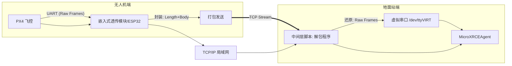

# Micro-XRCE-DDS 远程透传技术分析与实施报告

**日期：** 2025-12-13
**对象：** PX4 无人机开发团队 / 嵌入式系统架构师
**关键词：** PX4, ROS 2, Micro-XRCE-DDS, TCP/IP, 粘包, 嵌入式透传

-----

## 1\. 项目背景与目标

### 1.1 现状

目前架构采用 **PX4 飞控** 通过串口连接 **伴随计算机（M6S）**，M6S 通过局域网连接 **远程工作站（Zenbook）**。

### 1.2 目标

我们希望实现一种\*\*“透明传输（透传）”\*\*机制：

1. **轻量化机载端**：未来使用低成本、低功耗的嵌入式芯片（如 ESP32）替代昂贵的伴随计算机（M6S）。
2. **远程代理**：将 `MicroXRCEAgent`（代理服务）运行在性能更强的远程工作站上，而非机载端。
3. **数据完整性**：在局域网环境下，实现 PX4 串口数据到远程 Agent 的无损、稳定传输。

-----

## 2\. 问题诊断：为什么简单的 TCP 透传会失败？

在尝试使用 `socat` 进行 TCP 管道透传时，出现了 `BadParamException` 和 `Core Dump` 崩溃，且 PX4 端报错 `participant: 255`。

### 2.1 根本原因：流（Stream）与帧（Frame）的冲突

Micro-XRCE-DDS 的串口协议（Serial Transport）是基于\*\*帧（Frame）**设计的，它极其依赖数据的边界完整性和时序。而 TCP/IP 协议是基于**流（Stream）\*\*设计的，它不维护应用层的消息边界。

### 2.2 故障机理分析

当使用 `socat` 将串口数据直接灌入 TCP 网络时，发生了以下现象：

* **TCP 粘包（Packet Stickiness）**：
    为了提高网络效率，TCP 协议栈（Nagle 算法）往往会将 PX4 发出的多个短小的串口帧合并成一个大的 TCP 数据包发送。
  * *后果*：Agent 读取时，一次读到了“1.5 个帧”或“2 个帧粘在一起”。
* **TCP 拆包（Fragmentation）**：
    受限于 MTU 或网络拥塞，一个完整的串口帧可能被切分成两半发送。
  * *后果*：Agent 先读到了帧头，试图解析后续数据时发现数据不足。
* **解析器崩溃**：
    Agent 端的反序列化库（FastCDR）在 Serial 模式下假设数据流是原子的、连续的。当遇到上述“残缺”或“错位”的数据时，解析出的 `TopicID` 或 `Length` 字段为乱码，触发断言或异常，导致进程崩溃。

**结论**：**不能在没有任何“中间层协议”封装的情况下，直接通过 TCP 透传 XRCE-DDS 串口流。**

-----

## 3\. 现有解决方案评估

针对目前环境（Linux 伴随电脑）和未来环境（嵌入式硬件），我们评估以下方案：

| 方案 | 架构描述 | 优点 | 缺点 | 适用场景 |
| :--- | :--- | :--- | :--- | :--- |
| **A. 分布式 ROS 2 (推荐)** | Agent 跑在伴随电脑上，通过 DDS 广播 | 官方标准，极其稳定，无粘包问题 | 需要机载电脑有跑 Agent 的能力 (Linux/Win) | 现有 M6S 阶段 |
| **B. 优化工具 (Ser2Net)** | 使用 RFC 2217 协议替代 socat | 比 socat 更懂串口流控，配置简单 | 无法根除网络抖动导致的解析错误，治标不治本 | 临时调试 |
| **C. 中间层封装 (最终方案)** | **PX4 \<-\> [封包] \<-\> TCP \<-\> [拆包] \<-\> Agent** | **彻底解决粘包/丢包**，支持嵌入式，适合 TCP | 需要编写自定义收发程序 (Firmware + Script) | **嵌入式透传阶段** |

-----

## 4\. 嵌入式透传的终极方案：自定义协议隧道 (Tunneling)

为了满足 **“严格避免信息丢失”** 和 **“嵌入式硬件运行”** 的需求，**方案 C** 是唯一可行的工程路径。

我们需要构建一个轻量级的中间层，负责将“串口流”整形为“网络包”，并在接收端还原。

### 4.1 系统架构图



### 4.2 核心协议设计：Length-Prefixed (长度前缀法)

为了在 TCP 流中区分每一帧，我们采用最简单的 **TLV** 变体：**[长度 4字节] + [载荷 N字节]**。

### 4.3 嵌入式端 (MCU/ESP32) 开发指南

**任务**：从串口读取完整的一帧 XRCE-DDS 数据，加上长度头，通过 TCP 发送。

* **难点**：如何知道串口读到的是“完整一帧”？
* **策略**：利用 **UART 空闲中断 (Idle Interrupt)**。
  * XRCE-DDS 发送数据时，帧与帧之间会有微小的停顿。
  * MCU 配置串口，当检测到串口线上超过 2ms（举例）没有数据时，认为一帧结束。
  * 此时将缓冲区内的数据打包发送。

**伪代码逻辑 (C/C++)**：

```c
// 串口接收中断/任务
void on_uart_idle_detected(uint8_t* buffer, size_t len) {
    if (len > 0) {
        // 1. 构建头部：网络字节序的长度
        uint32_t net_len = htonl((uint32_t)len);

        // 2. 发送头部 (4字节)
        tcp_send(socket, &net_len, 4);

        // 3. 发送数据体 (N字节)
        tcp_send(socket, buffer, len);

        // 结果：这一帧数据在 TCP 管道里有了明确的“边界”
    }
}
```

### 4.4 电脑端 (PC) 中间层开发指南

**任务**：连接 TCP，利用长度头解决粘包，还原数据写入虚拟串口。

**Python 实现代码 (Middleware)**：

```python
import socket
import struct
import os
import pty

# 配置
BIND_IP = '0.0.0.0'
BIND_PORT = 8888

def run_middleware():
    # 1. 创建虚拟串口对 (Pseudo-Terminal)
    # master 用于脚本写入，slave 用于 Agent 连接
    master, slave = pty.openpty()
    print(f"[Info] 虚拟串口已创建，请让 Agent 连接: {os.ttyname(slave)}")

    # 2. 建立 TCP 服务端
    server = socket.socket(socket.AF_INET, socket.SOCK_STREAM)
    server.setsockopt(socket.SOL_SOCKET, socket.SO_REUSEADDR, 1)
    server.bind((BIND_IP, BIND_PORT))
    server.listen(1)
    print(f"[Info] 等待嵌入式设备连接 TCP {BIND_PORT}...")

    conn, addr = server.accept()
    print(f"[Info] 设备已连接: {addr}")

    # 辅助函数：严格读取 n 个字节
    def recv_exact(sock, n):
        data = b''
        while len(data) < n:
            packet = sock.recv(n - len(data))
            if not packet: return None
            data += packet
        return data

    try:
        while True:
            # --- 步骤 A: 解决粘包的核心 ---
            # 先只读 4 个字节，获取长度
            header = recv_exact(conn, 4)
            if not header: break

            # 解析出 Payload 的长度
            payload_len = struct.unpack('!I', header)[0]

            # --- 步骤 B: 读取完整数据帧 ---
            # 根据长度读取内容，无论 TCP 怎么分片，这里都会等到凑齐为止
            payload = recv_exact(conn, payload_len)
            if not payload: break

            # --- 步骤 C: 写入虚拟串口 ---
            # Agent 会认为这是从物理串口发来的完美一帧
            os.write(master, payload)

    except Exception as e:
        print(f"[Error] {e}")
    finally:
        conn.close()
        server.close()

if __name__ == '__main__':
    run_middleware()
```

-----

## 5\. 总结与下一步行动

### 5.1 结论

1. **直接 TCP 透传不可行**：由于 MicroXRCEAgent 对串口帧边界的敏感性，直接使用 `socat` 透传 TCP 流会导致必然的崩溃。
2. **分布式架构是当前最优解**：如果使用 M6S，直接在 M6S 上运行 Agent 是最稳定、最高效的方案。
3. **自定义封装是未来唯一解**：若要实现嵌入式硬件透传且**严格不丢包**，必须开发包含 **Length-Prefix (长度前缀)** 机制的中间件。

### 5.2 下一步行动建议

1. **短期 (使用 M6S)**：放弃 `socat`，直接在 M6S 上运行 `MicroXRCEAgent serial`，利用 ROS 2 网络分发。
2. **长期 (研发嵌入式透传模块)**：
      * 选取 ESP32 或类似 MCU。
      * 开发固件：实现 UART 空闲中断检测 + TCP 封包（加长度头）。
      * 开发 PC 脚本：实现 TCP 解包（去长度头）+ 写入 PTY。

此方案能确保你在局域网环境下的 XRCE-DDS 通讯像连接本地 USB 线一样稳定可靠。
