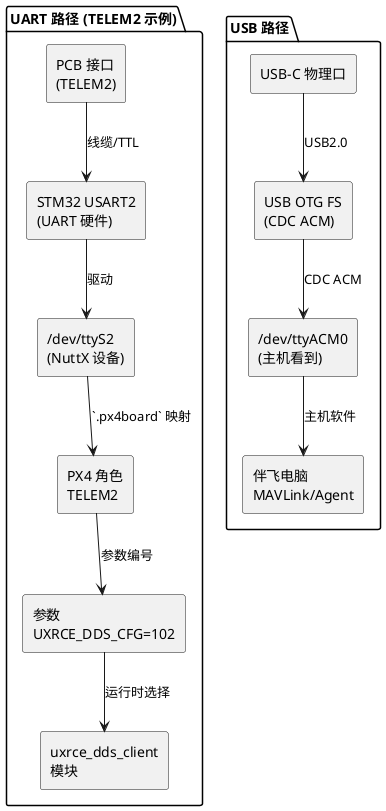

## PX4 FMU-v5 (`px4_fmu-v5_default`) uXRCE-DDS 说明

针对 Pixhawk 4 系列等 FMUv5 固件，回答以下问题：

### 1. uXRCE-DDS 端口由哪些文件决定？
- **模块启用**：`boards/px4/fmu-v5/default.px4board` 第 82 行 `CONFIG_MODULES_UXRCE_DDS_CLIENT=y`，确保固件里包含 `uxrce_dds_client` 模块。
- **串口角色映射**：同一文件冒头定义 `CONFIG_BOARD_SERIAL_TEL1="/dev/ttyS1"`、`TEL2="/dev/ttyS2"`、`TEL4="/dev/ttyS3"` 等，把物理 UART 对应到 PX4 的 TELEM/GPS/RC 角色。
- **硬件配置**：`boards/px4/fmu-v5/nuttx-config/nsh/defconfig`（通过 `make px4_fmu-v5_default boardconfig` 等生成）启用 STM32F7 的各 UART/USART，并设置波特率、DMA。
- **uXRCE 端口选择**：运行时由参数 `UXRCE_DDS_CFG` 决定（参考 `docs/en/advanced_config/parameter_reference.md#UXRCE_DDS_CFG`）。数值 `101/102/103/104` 分别代表 TELEM1/2/3/4，`201/202` 代表 GPS1/2，`300` 表示 RC，`1000` 表示以太网。当你把参数设成 102，固件就会把 uXRCE-DDS Client 绑定到 `CONFIG_BOARD_SERIAL_TEL2` 指向的 `/dev/ttyS2`（实际是 UART2）。

### 2. 默认 `UXRCE_DDS_CFG=0` 是否还能在参数界面调整？
- 可以。`UXRCE_DDS_CFG` 的默认值是 0（禁用），但模块已经编译进固件，刷机后在 QGroundControl 等参数界面就能看到并修改。只要把值改为 101/102/…，保存并重启，uXRCE-DDS 就会在对应端口运行，无需重新编译固件。

### 3. USB-C 口与 TELEM 口有什么区别？
- **协议层**：USB-C 通过 MCU 的 USB OTG FS 运行 CDC ACM（由 `CONFIG_DRIVERS_CDCACM_AUTOSTART` 控制），主机上暴露为 `/dev/ttyACM*` 虚拟串口；TELEM 口是 MCU 内部的 UART 外设（`/dev/ttyS*`），走 TTL 串行。两者是不同物理层/协议栈，属于同级别接口。
- **默认用途**：FMUv5 的 TELEM 口用于 MAVLink、伴飞等，且可被 `UXRCE_DDS_CFG` 选择；USB-C 默认用来传输 MAVLink、参数、刷机，但不是 NuttX 控制台。`UXRCE_DDS_CFG` 仅支持选择 TELEM/GPS/RC 等 UART 角色，并不能直接把 uXRCE 绑定到 USB-C。
- **如何在 USB 上使用 uXRCE**：可以在伴飞电脑上通过 USB 获取 `/dev/ttyACM0`，并运行 Micro XRCE Agent，与飞控的 UART 端 uXRCE 对接；但飞控侧仍需在参数中选择一个 TELEM/UART 角色，USB 并不在同一个配置列表里。

### 4. 术语与层级如何对应？
- **TELEM/GPS/RC（角色名）**：出现在 `.px4board`、参数 (`UXRCE_DDS_CFG=101/102/...`) 中，是 PX4 层面对串口的别名，方便在脚本里引用。
- **`/dev/ttyS*`（设备节点）**：NuttX 驱动为每个 MCU UART/USART 创建的字符设备，PX4 通过这些节点访问串口。`CONFIG_BOARD_SERIAL_TEL2="/dev/ttyS2"` 将角色与节点绑定。
- **USART/UARTX**：MCU 的硬件外设（例如 STM32 的 USART2），由 `nuttx-config/*` 里的 `CONFIG_STM32F7_USART2` 等使能、配置波特率/DMA。
- **ttyACM**：USB CDC ACM 虚拟串口；它依赖 USB 控制器，不经过 MCU 的 UART。与 `/dev/ttyS*` 性质不同。
- **uXRCE 参数编号（101/102/...）**：此层级只是告诉模块使用哪个“角色”，最终仍会落到对应的 `/dev/ttyS*`，再映射到 MCU UART 和 PCB 连接器。

从图中可见，TELEM 口涉及“物理连接器 → MCU UART → `/dev/ttyS*` → PX4 角色 → 参数 → uXRCE 模块”整条链条；USB-C 则走完全独立的 USB 协议栈。辨识层级时，只要搞清楚自己面对的是“物理接口（TELEM/USB）”、“MCU 外设（UART/USB 控制器）”、“操作系统设备节点（`/dev/ttyS*`、`/dev/ttyACM*`）”还是“PX4 参数/角色”，就能判断该问题属于哪一层。

综上，`px4_fmu-v5_default` 固件默认把 uXRCE-DDS 模块纳入构建，但不会自动启用；选择哪个端口完全靠参数 `UXRCE_DDS_CFG`，且可在刷机后随时调节。USB-C 与 TELEM 属于不同传输介质，参数里的选项仅针对 UART 角色。***
