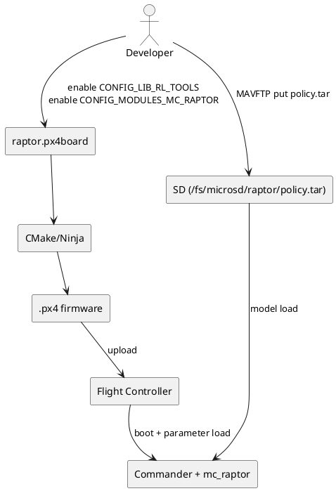

# RAPTOR 构建、部署与首飞 SOP（从 `px4board` 到起飞）

> 目标：给出一条可直接执行的实机主线，覆盖编译、上传、模型部署、参数设置、验证闭环与首飞流程。

## 目录

- [1. 概览与适用场景](#1-概览与适用场景)
- [2. 关键概念与链路](#2-关键概念与链路)
- [3. 深入解析（按主题拆分）](#3-深入解析按主题拆分)
- [4. 实操 / 对比 / 排障（按需选择）](#4-实操--对比--排障按需选择)
- [5. 术语与参考](#5-术语与参考)

---

## 1. 概览与适用场景

本文默认你在 `hkust_nxt-dual` 实机上运行 RAPTOR，且已具备基础传感校准与 RC 安全接管能力。主线目标是把 RAPTOR 作为一个“可验证、可回退”的飞行模式落地。

范围内：

- `px4board` 功能启用
- `make` 构建与上传
- `policy.tar` 部署与校验
- `MC_RAPTOR_*` 参数矩阵
- `EXT1/OFFBOARD` 入口与首飞 SOP

范围外：

- 训练新 policy
- 改动控制律源码

---

## 2. 关键概念与链路

### 2.1 从编译到实机运行的链路



### 2.2 `mamba run` 能编，`mamba activate` 不稳定的根因

典型根因是 CMake 缓存了旧 Python 解释器路径。你切换 shell 环境后，`make` 仍可能复用旧缓存，导致 `em` 包等依赖找不到。

处理原则：

1. 固定命令形态：`mamba run -n px4-py312 make ...`
2. 环境变化后先清理构建目录：`rm -rf build/hkust_nxt-dual_raptor`

---

## 3. 深入解析（按主题拆分）

### 3.1 `px4board` 功能开关（编译期开关）

目标文件：

- [`boards/hkust/nxt-dual/raptor.px4board`](https://github.com/GrooveWJH/PX4-Autopilot/blob/main/boards/hkust/nxt-dual/raptor.px4board)

至少应包含：

```text
CONFIG_LIB_RL_TOOLS=y
CONFIG_MODULES_MC_RAPTOR=y
```

结论：这两项决定“固件是否具备 RAPTOR 能力”；QGC 参数无法补齐未编译功能。

### 3.2 `make` 常见目标（你高频会用）

```bash
make list_config_targets
make hkust_nxt-dual_raptor -j8
make hkust_nxt-dual_raptor upload
make hkust_nxt-dual_raptor force-upload
make hkust_nxt-dual_raptor upload-verbose
make hkust_nxt-dual_raptor boardconfig
make hkust_nxt-dual_raptor menuconfig
make hkust_nxt-dual_raptor px4_savedefconfig
```

说明：`-O3` 不是 GNU make 参数，不能写成 `make ... -O3`。优化等级应通过 CMake build type 或 toolchain 配置传递。

### 3.3 `PX4_CMAKE_BUILD_TYPE` 选项

常见值：

- `Debug`
- `Release`
- `RelWithDebInfo`
- `MinSizeRel`

PX4 NuttX 场景通常默认 `MinSizeRel`（偏向 `-Os` + 尺寸优化），不是纯 `-O2` 档。你遇到 Flash 接近 100% 时，这个默认是有意义的。

### 3.4 ROMFS 与 SD 卡分工

- ROMFS：固件内只读资源（启动脚本等），见 [`ROMFS/CMakeLists.txt`](https://github.com/GrooveWJH/PX4-Autopilot/blob/main/ROMFS/CMakeLists.txt)
- SD：运行时可写资源（日志、模型文件），RAPTOR 模型默认走 `/fs/microsd/raptor/policy.tar`

### 3.5 `policy.tar` 是否会导致内存爆炸

`policy.tar` 在 SD 上是文件存储；运行时读取后占用 RAM 取决于网络规模，不会直接按 tar 文件大小等量常驻。你给出的 `policy.tar` 约 136 KB，通常远小于 H7 级平台可用 SRAM，实测更常见瓶颈是 CPU 周期而非模型 RAM 本身。

---

## 4. 实操 / 对比 / 排障（按需选择）

### 4.1 一次性执行清单（实机）

1. 准备环境与依赖

```bash
mamba run -n px4-py312 pip install -U pip empy pyserial kconfiglib jinja2 packaging
```

2. 清理旧构建缓存（建议）

```bash
rm -rf build/hkust_nxt-dual_raptor
```

3. 编译与上传

```bash
mamba run -n px4-py312 make hkust_nxt-dual_raptor -j8
mamba run -n px4-py312 make hkust_nxt-dual_raptor upload
```

4. 上传模型（不拔卡）

```bash
mamba run -n px4-py312 mavproxy.py --master /dev/tty.usbmodem01
```

```text
ftp mkdir /fs/microsd/raptor
ftp put src/modules/mc_raptor/blob/policy.tar /fs/microsd/raptor/policy.tar
ftp list /fs/microsd/raptor
ftp crc /fs/microsd/raptor/policy.tar
```

5. NSH 交叉验证

```bash
./Tools/mavlink_shell.py /dev/tty.usbmodem01
```

```text
ver all
param show MC_RAPTOR*
ls /fs/microsd/raptor
mc_raptor status
```

通过判据：

- `Build variant: raptor`
- `MC_RAPTOR_ENABLE/OFFB/INTREF` 三参数存在
- `/fs/microsd/raptor/policy.tar` 存在
- `mc_raptor status` 有事件计数且显示 checkpoint 名称

### 4.2 参数矩阵（OFFB x INTREF）

缩写：`MC=Multicopter`，`OFFB=Offboard`，`INTREF=Internal Reference`。

| `MC_RAPTOR_OFFB` | `MC_RAPTOR_INTREF` | 入口模式 | 轨迹来源 | 推荐场景 |
| ---: | ---: | --- | --- | --- |
| 0 | 0 | `EXT1`/RAPTOR external | 外部 `trajectory_setpoint`（通常由 ROS 2 / DDS 直接写入） | 外部电脑给参考，RAPTOR 执行控制 |
| 0 | 1 | `EXT1`/RAPTOR external | 内置 Lissajous | 机载自参考验证 |
| 1 | 0 | `OFFBOARD`（被 RAPTOR 替换） | 外部 `trajectory_setpoint`（不等于标准 MAVLink Offboard setpoint） | 仅在你明确理解替换语义时使用 |
| 1 | 1 | `OFFBOARD`（被 RAPTOR 替换） | 内置 Lissajous | 用 OFFBOARD 入口触发内置轨迹 |

关键澄清：

- RAPTOR extref 真正消费的是 uORB `trajectory_setpoint`
- 当前源码下，标准 MAVLink Offboard setpoint 并不能在 RAPTOR active 时可靠写入这条话题
- 如果你要“不改 PX4 源码”地给 RAPTOR 喂外部参考，推荐直接使用 ROS 2 / uXRCE-DDS

完整分析见：

- [`raptor_offboard_replacement_mavlink_limits_and_ros2_solutions.md`](raptor_offboard_replacement_mavlink_limits_and_ros2_solutions.md)

最小设置命令：

```text
param set MC_RAPTOR_ENABLE 1
param set MC_RAPTOR_OFFB 0
param set MC_RAPTOR_INTREF 0
param save
reboot
```

### 4.3 `EXT1` 注册与 `COM_MODE0_HASH`

RAPTOR 启动时会发送 `register_ext_component_request(name="RAPTOR")`，Commander 通过 `ModeManagement` 分配 external slot，并把模式哈希写到 `COM_MODE0_HASH..COM_MODE7_HASH`。

关键源码：

- [`mc_raptor.cpp` register request](https://github.com/GrooveWJH/PX4-Autopilot/blob/main/src/modules/mc_raptor/mc_raptor.cpp)
- [`ModeManagement.cpp`](https://github.com/GrooveWJH/PX4-Autopilot/blob/main/src/modules/commander/ModeManagement.cpp)

你看到 `COM_MODE0_HASH=-880871219`，可理解为 `ext1` 槽位绑定了 `RAPTOR`。

### 4.4 首飞 SOP（建议）

1. 在 `POSCTL` 起飞到 1~1.5 m 稳定悬停。
2. 切入 RAPTOR（`OFFB=0` 用 `EXT1`；`OFFB=1` 用 `OFFBOARD`）。
3. 观察 `listener raptor_status 1`：
- `active=true`
- `trajectory_setpoint_stale` 符合预期
4. 异常立刻切回 `POSCTL`。

为什么不建议地面直接切 RAPTOR 起飞：RAPTOR 不是自动起飞状态机，失去 setpoint 时会进入“当前位置保持”逻辑，不等价于安全起飞流程。

### 4.5 Lissajous 参考轨迹设置

```text
param set MC_RAPTOR_INTREF 1
param save
reboot
mc_raptor intref lissajous 0.3 0.3 0.0 1.0 1.0 1.0 20 5
```

参数顺序：`A B C fa fb fc duration ramp`。

### 4.6 工具边界（避免命令混淆）

- MAVProxy 是 MAVLink 命令层，支持 `param`、`ftp`、`mode`。
- `commander status` 是 NSH 命令，必须在 `mavlink_shell.py` 或串口 NSH 内执行。

---

## 5. 术语与参考

- **NSH**：NuttX Shell（飞控本地命令行）。
- **PXH**：PX4 在 SITL 中常见的 shell 提示符（和 NSH 不是同一个运行环境）。
- **Hold/Loiter**：位置保持类模式；`commander takeoff` 若未显式设置，会走默认起飞参数高度。

关键参考：

- [`Makefile`](https://github.com/GrooveWJH/PX4-Autopilot/blob/main/Makefile)
- [`kconfig.cmake`](https://github.com/GrooveWJH/PX4-Autopilot/blob/main/cmake/kconfig.cmake)
- [`platforms/nuttx/CMakeLists.txt`](https://github.com/GrooveWJH/PX4-Autopilot/blob/main/platforms/nuttx/CMakeLists.txt)
- [`upload.cmake`](https://github.com/GrooveWJH/PX4-Autopilot/blob/main/platforms/nuttx/cmake/upload.cmake)
- [`rc.mc_apps`](https://github.com/GrooveWJH/PX4-Autopilot/blob/main/ROMFS/px4fmu_common/init.d/rc.mc_apps)
- [`mc_raptor README`](https://github.com/GrooveWJH/PX4-Autopilot/blob/main/src/modules/mc_raptor/README.md)
