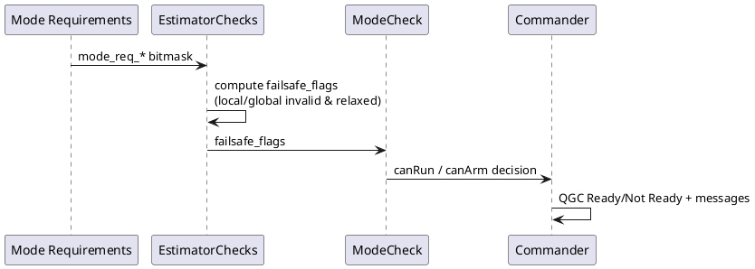

# RAPTOR 模式门限、排障与性能分析

> 目标：解释“为什么在 RAPTOR 模式会 Ready/Not Ready 抖动、为什么会报定位门限问题、如何系统降 CPU”。

## 目录

- [1. 概览与适用场景](#1-概览与适用场景)
- [2. 关键概念与链路](#2-关键概念与链路)
- [3. 深入解析（按主题拆分）](#3-深入解析按主题拆分)
- [4. 实操 / 对比 / 排障（按需选择）](#4-实操--对比--排障按需选择)
- [5. 术语与参考](#5-术语与参考)

---

## 1. 概览与适用场景

本文聚焦三件事：

1. Position Mode 与 RAPTOR Mode 的进入门限差异。
2. `local_position_invalid_relaxed` 与 `local_position_invalid` 的根因差异。
3. RAPTOR 开启后 CPU 偏高时的复现与降载路径。

---

## 2. 关键概念与链路

### 2.1 模式门限评估链路



关键源码：

- [`mode_requirements.cpp`](https://github.com/GrooveWJH/PX4-Autopilot/blob/main/src/modules/commander/ModeUtil/mode_requirements.cpp)
- [`estimatorCheck.cpp`](https://github.com/GrooveWJH/PX4-Autopilot/blob/main/src/modules/commander/HealthAndArmingChecks/checks/estimatorCheck.cpp)
- [`modeCheck.cpp`](https://github.com/GrooveWJH/PX4-Autopilot/blob/main/src/modules/commander/HealthAndArmingChecks/checks/modeCheck.cpp)

---

## 3. 深入解析（按主题拆分）

### 3.1 Position Mode vs RAPTOR Mode 进入门限对比

Position Mode（`NAVIGATION_STATE_POSCTL`）是系统内建门限；RAPTOR 作为 external mode，会通过 `arming_check_reply` 显式上报自己需要的门限。

RAPTOR 上报路径：

- [`mc_raptor.cpp` `updateArmingCheckReply()`](https://github.com/GrooveWJH/PX4-Autopilot/blob/main/src/modules/mc_raptor/mc_raptor.cpp)

对比矩阵：

| 门限项 | Position Mode | RAPTOR Mode |
| --- | --- | --- |
| `mode_req_angular_velocity` | 需要 | 需要 |
| `mode_req_attitude` | 需要 | 需要 |
| `mode_req_local_alt` | 需要 | 需要 |
| 本地位置 | `mode_req_local_position_relaxed` | `mode_req_local_position`（更严格） |
| `mode_req_manual_control` | 需要 | 不需要 |
| `mode_req_global_position` | 一般不强制 | 不需要（RAPTOR 显式 false） |

结论：RAPTOR 对 local position 的要求比 Position 更“硬”，因此同一定位质量下，Position 可能长期可用而 RAPTOR 出现间歇不可用。

### 3.2 `local_position_invalid_relaxed` vs `local_position_invalid`

两者都来自 `EstimatorChecks::setModeRequirementFlags()`，但阈值路径不同。

#### `local_position_invalid`（strict）

典型判据：

- `xy_valid` 必须为真
- 时间戳必须新鲜（不能 stale）
- 水平精度（`eph`）要满足 `COM_POS_FS_EPH` 阈值

#### `local_position_invalid_relaxed`（relaxed）

典型判据：

- 仍要求 `xy_valid` 与新鲜时间戳
- 对 `eph` 阈值放宽（近似不做严格精度门限）

#### 导致两者触发差异的典型场景

| 场景 | strict | relaxed | 说明 |
| --- | --- | --- | --- |
| `timestamp==0` 或数据过期 | 失效 | 失效 | 两者都认为 stale |
| `xy_valid=false` | 失效 | 失效 | 两者都依赖有效状态 |
| `eph` 突然变差 | 易失效 | 常可保持 | strict 看精度阈值 |
| `eph` 在阈值附近抖动 | 易红绿切换 | 更稳定 | relaxed 有天然缓冲 |

这就是“光流+测距在 Position 稳定、RAPTOR 间歇 Not Ready”最常见根因。

### 3.3 `No valid global position estimate` 周期性误报问题

你之前遇到的经典问题：RAPTOR 模式下 QGC 在 `Ready` / `Not Ready` 之间周期抖动，并报 global position 错误。

根因是旧实现中 `arming_check_reply_s` 未零初始化，导致未显式赋值 `mode_req_*` 位可能带随机值。修复后应使用：

```cpp
arming_check_reply_s arming_check_reply{};
```

对应代码已在：

- [`mc_raptor.cpp`](https://github.com/GrooveWJH/PX4-Autopilot/blob/main/src/modules/mc_raptor/mc_raptor.cpp)

### 3.4 `trajectory_setpoint_stale` 如何读

以下组合代表“外部轨迹没有喂进来”：

- `trajectory_setpoint_stale = true`
- `timestamp_last_trajectory_setpoint = 0`

原因：时间戳只在“收到并通过 finite 校验”后更新。

### 3.5 RAPTOR CPU 偏高的机制

RAPTOR 与 MC rate controller 都在 `rate_ctrl` 队列，且都受高频 IMU 角速度触发。开启 RAPTOR 相当于在高频路径上叠加一套推理与发布逻辑。

相关代码：

- [`mc_raptor.cpp`](https://github.com/GrooveWJH/PX4-Autopilot/blob/main/src/modules/mc_raptor/mc_raptor.cpp)
- [`MulticopterRateControl.cpp`](https://github.com/GrooveWJH/PX4-Autopilot/blob/main/src/modules/mc_rate_control/MulticopterRateControl.cpp)

---

## 4. 实操 / 对比 / 排障（按需选择）

### 4.1 快速定位矩阵（症状 -> 观察点 -> 处理）

| 症状 | 先看什么 | 处理动作 |
| --- | --- | --- |
| RAPTOR 模式周期性 `Not Ready` | `listener failsafe_flags 1` + `vehicle_local_position` | 优先排查 `xy_valid/eph/timestamp`，确认不是 strict 门限触发 |
| 报 `No valid global position estimate` 但你未要求 global | `listener arming_check_reply 5` | 检查 `mode_req_global_position*` 是否错误置位；确认固件含零初始化修复 |
| `trajectory_setpoint_stale=true` | `listener raptor_status 1` | 外部 setpoint 发布频率与字段 finite 校验 |
| 进 RAPTOR 后控制无输出 | `raptor_status.active` + 当前 mode | 确认已进入 RAPTOR 对应 mode id（`EXT1` 或 OFFBOARD 替换入口） |
| CPU >95% | `top once` + `uorb top -1` + `mc_raptor status` | 分级下调 `IMU_GYRO_RATEMAX`（2000->1600->1200） |

### 4.2 CPU 降载建议（目标约 90%）

优先级从低风险到高风险：

1. 下调 `IMU_GYRO_RATEMAX` 做 A/B 测试。
2. 非 RAPTOR 架次关闭 RAPTOR 模块。
3. 降低不必要 MAVLink/日志负载。
4. 代码级优化（非 active 时减少非必要发布）。

推荐流程：

```text
param set IMU_GYRO_RATEMAX 1600
param save
reboot
```

复测：

```text
top once
uorb top -1 vehicle_angular_velocity rate_ctrl_status vehicle_thrust_setpoint vehicle_torque_setpoint actuator_motors actuator_outputs
mc_raptor status
```

### 4.3 进入 RAPTOR 模式前的健康门槛

建议在切模式前满足：

1. `vehicle_local_position` 连续更新且 `xy_valid=true`。
2. `vehicle_attitude` 与 `vehicle_angular_velocity` 无 stale。
3. 外部轨迹模式下 setpoint 更新稳定（建议 >= 20 Hz）。

### 4.4 `EXT1` 与 `OFFBOARD` 的切换准则

- `MC_RAPTOR_OFFB=0`：用 `EXT1`（或 QGC 模式名 RAPTOR）。
- `MC_RAPTOR_OFFB=1`：OFFBOARD 被 RAPTOR 替换。

实际进入失败时，优先看 mode requirement，不要先怀疑控制律。

---

## 5. 术语与参考

- **strict local position**：`mode_req_local_position`，对本地定位有效性要求更严格。
- **relaxed local position**：`mode_req_local_position_relaxed`，允许在较弱精度下保持可用。
- **stale**：数据过期，通常由时间戳窗口判定。

参考链接：

- [`mc_raptor.cpp`](https://github.com/GrooveWJH/PX4-Autopilot/blob/main/src/modules/mc_raptor/mc_raptor.cpp)
- [`mode_requirements.cpp`](https://github.com/GrooveWJH/PX4-Autopilot/blob/main/src/modules/commander/ModeUtil/mode_requirements.cpp)
- [`estimatorCheck.cpp`](https://github.com/GrooveWJH/PX4-Autopilot/blob/main/src/modules/commander/HealthAndArmingChecks/checks/estimatorCheck.cpp)
- [`modeCheck.cpp`](https://github.com/GrooveWJH/PX4-Autopilot/blob/main/src/modules/commander/HealthAndArmingChecks/checks/modeCheck.cpp)
- [`RaptorStatus.msg`](https://github.com/GrooveWJH/PX4-Autopilot/blob/main/msg/versioned/RaptorStatus.msg)
