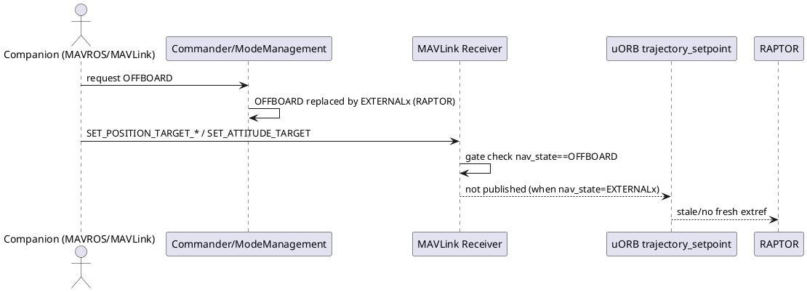
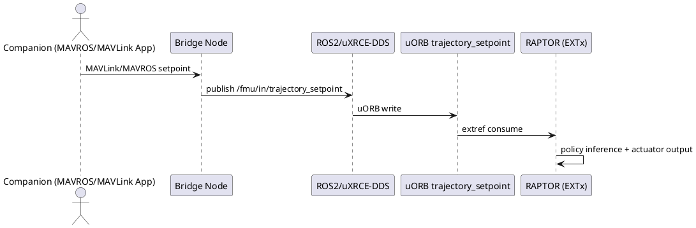

# RAPTOR Offboard 兼容策略决策指南

> 目标：把 RAPTOR 与 MAVLink/MAVROS Offboard 兼容问题讲清楚，并给出“并主线”与“自用落地”两套可执行决策。

## 目录

- [1. 一分钟结论](#1-一分钟结论)
- [2. 背景与问题定义](#2-背景与问题定义)
- [3. 当前机制事实（代码视角）](#3-当前机制事实代码视角)
- [4. 方案矩阵（5 条路线）](#4-方案矩阵5-条路线)
- [5. `rc.txt/config.txt/extras.txt` 能力边界](#5-rctxtconfigtxtextrastxt-能力边界)
- [6. 上游 Review 观点与设计边界](#6-上游-review-观点与设计边界)
- [7. 推荐路径（主线导向 vs 业务导向）](#7-推荐路径主线导向-vs-业务导向)
- [8. 最小验证闭环](#8-最小验证闭环)
- [9. FAQ](#9-faq)
- [10. 参考链接](#10-参考链接)

## 1. 一分钟结论

1. RAPTOR 在 extref 场景直接依赖 `trajectory_setpoint`，而不是直接处理 MAVLink 报文。  
2. `MC_RAPTOR_OFFB=1` 的本质是“替换 OFFBOARD 入口”，不是“自动继承 OFFBOARD 全部 setpoint 通道语义”。  
3. 当前冲突点是：替换后运行态 `nav_state` 变成 `EXTERNALx`，而 MAVLink Offboard setpoint 转发常按 `nav_state == OFFBOARD` 门限。  
4. 若目标是上游可接受，优先把影响收敛在 RAPTOR 边界（RAPTOR 专用输入/桥接），避免改 OFFBOARD 全局语义。  
5. 若目标是自用快速落地，放宽 `mavlink_receiver` gate 的效果最好，但更适合 fork 维护。

## 2. 背景与问题定义

RAPTOR 发布后，应用开发者关注度很高；但大量存量系统仍基于 MAVROS/MAVLink Offboard 工作流。现实需求是：

- 希望继续使用现有 MAVLink setpoint 发布程序；
- 同时又希望 RAPTOR 作为实际控制器接管；
- 尽量减少上层业务代码重构。

问题不在于“RAPTOR 能不能飞”，而在于“RAPTOR 接管模式下，外部 setpoint 链路如何既可用又不破坏 PX4 主线架构边界”。

## 3. 当前机制事实（代码视角）

### 3.1 链路断点图（当前问题）

### 3.2 关键机制事实

- RAPTOR 注册替换 OFFBOARD：  
  [`raptor_checkpoint_io.cpp`](https://github.com/PX4/PX4-Autopilot/blob/main/src/modules/mc_raptor/core/raptor_checkpoint_io.cpp)
- Commander replacement 机制：  
  [`ModeManagement.cpp`](https://github.com/PX4/PX4-Autopilot/blob/main/src/modules/commander/ModeManagement.cpp)
- RAPTOR active 判据（按 external mode id）：  
  [`raptor_control_pipeline.cpp`](https://github.com/PX4/PX4-Autopilot/blob/main/src/modules/mc_raptor/core/raptor_control_pipeline.cpp)
- MAVLink Offboard setpoint 路由门限：  
  [`mavlink_receiver.cpp`](https://github.com/PX4/PX4-Autopilot/blob/main/src/modules/mavlink/mavlink_receiver.cpp)
- `nav_state` / `nav_state_display` 定义：  
  [`VehicleStatus.msg`](https://github.com/PX4/PX4-Autopilot/blob/main/msg/versioned/VehicleStatus.msg)

## 4. 方案矩阵（5 条路线）

| 方案 | 详细思路描述 | 层级 | 主要改动模块 | 改动量 | 优势 | 劣势 | 上游接受度 | 自己魔改效果 |
| --- | --- | --- | --- | --- | --- | --- | --- | --- |
| 1. 放宽 `mavlink_receiver` gate（当前 PR 路线） | 保持现有 MAVLink 消息路径不变，把“仅 `nav_state==OFFBOARD` 转发 setpoint”改为“OFFBOARD 或替换 OFFBOARD 的 external mode 都可转发”。 | MAVLink 接入层 | `src/modules/mavlink/mavlink_receiver.*` | 中 | MAVROS 旧代码几乎不改，马上可用 | 影响 OFFBOARD 全局语义，可能波及其他 replacement mode | 中低 | 很高 |
| 2. 显式 opt-in contract | external mode 注册时新增“接收标准 Offboard setpoint”显式能力位；MAVLink 转发只对显式声明的模式放行。 | 模式注册协议 + MAVLink 接入层 | `register_ext_component_*`、`mavlink_receiver`、Commander/ModeManagement 部分 | 中高 | 语义清晰、边界可控 | 设计与联调复杂 | 中 | 高 |
| 3. RAPTOR 专用输入通道 | 不改 OFFBOARD 语义，新增 RAPTOR 专属 setpoint 输入（uORB/桥接）；RAPTOR active 时只消费该通道。 | RAPTOR 模块边界 + 桥接层 | `src/modules/mc_raptor/*` +（可选）`mavlink_receiver`桥接输出 | 中高 | 架构隔离好，影响收敛在 RAPTOR | 需要新增并维护新通道与文档 | 高 | 中高 |
| 4. 外部桥接转换（推荐快落地） | 不改 PX4 主线，在伴随计算机把 MAVROS/MAVLink 目标转换为 ROS2/uXRCE-DDS 输入，直写 PX4 可消费话题。 | 伴随计算机侧 | PX4 基本不改；主要改外部 bridge 节点 | 低（PX4）/中（外部） | 见效最快、主线风险最低 | 对外部系统依赖更强 | 很高 | 高 |
| 5. 保持 OFFBOARD ID 不变但让 RAPTOR 接管 | 逻辑上保持 `nav_state=OFFBOARD`，同时让 RAPTOR 激活接管。 | Commander/FMM 核心语义层 | Commander、ModeManagement、FMM、RAPTOR 激活链 | 很高 | 表面上用户直观 | 语义冲突与回归风险大 | 很低 | 低（不建议） |

## 5. `rc.txt/config.txt/extras.txt` 能力边界

### 5.1 启动入口与时机

- `/fs/microsd/etc/rc.txt`：存在即接管启动流程（默认主流程不自动继续）。  
- `/fs/microsd/etc/config.txt`：用于参数覆写。  
- `/fs/microsd/etc/extras.txt`：主系统大部分模块起来后追加执行。  

代码入口见：[`rcS`](https://github.com/PX4/PX4-Autopilot/blob/main/ROMFS/px4fmu_common/init.d/rcS) 与 [`rc.autostart_ext`](https://github.com/PX4/PX4-Autopilot/blob/main/ROMFS/px4fmu_common/init.d/rc.autostart_ext)。

### 5.2 能做 / 不能做

| 类别 | 可做 | 不可做 |
| --- | --- | --- |
| 启动编排 | 启停模块、设参数、调整启动顺序 | 改 C++ 判定逻辑 |
| 通信配置 | 自动启动 `mavlink`、`uxrce_dds_client` 等 | 改 `mavlink_receiver` 内部 gate 语义 |
| 话题数据 | 间接通过模块/外部节点发布 | 直接在脚本里构造并发布任意 uORB setpoint |

结论：`rc.txt` 适合编排，不适合替代核心路由逻辑。

## 6. 上游 Review 观点与设计边界

在 [PR #26771](https://github.com/PX4/PX4-Autopilot/pull/26771) 的讨论中，维护者核心关注点是：

1. 不要为兼容 RAPTOR 扩散修改 OFFBOARD 的全局语义。  
2. External mode registration 的设计初衷是把影响收敛在 external mode 边界。  
3. 若要兼容存量应用，优先考虑 RAPTOR 边界内方案或外部桥接方案。

这意味着：问题并非“需求不合理”，而是“实现边界需更收敛”。

## 7. 推荐路径（主线导向 vs 业务导向）

### 7.0 推荐落地链路图（不改 PX4 源码）

### 7.1 主线导向（希望 upstream 合并）

优先顺序：**方案 3 > 方案 4 > 方案 2 > 方案 1**。

- 优先 3：影响最收敛，最符合架构边界。  
- 4 作为过渡：不改 PX4，快速交付。  
- 2 可作为长期抽象化方向。  
- 1 仅在有强业务压力时再讨论。

### 7.2 业务导向（希望最快让用户能用）

优先顺序：**方案 1 > 方案 4 > 方案 3**。

- 方案 1 对现有 MAVROS 代码最友好。  
- 若需要减少飞控 fork 维护成本，改用方案 4。

## 8. 最小验证闭环

### 8.1 功能判据

- `ver all` 确认固件与 variant 正确；
- `param show MC_RAPTOR*` 参数存在且生效；
- `mc_raptor status` 有持续 cycle/interval；
- `listener raptor_status 1` 中：
  - `active=true`
  - `trajectory_setpoint_stale=false`（在 extref 正常输入时）

### 8.2 回归判据

- 非 Offboard 且非目标模式时，不应放宽 setpoint 接收边界；
- 模式切换/重启后，状态与参数行为一致；
- 控制链路异常时可快速回落到稳定模式。

## 9. FAQ

### Q1: `MC_RAPTOR_OFFB=0` 和 `=1` 本质区别是什么？
- `=0`：RAPTOR 作为普通 `EXTx` 模式，不替换 OFFBOARD。  
- `=1`：RAPTOR 声明替换 OFFBOARD 入口。

### Q2: RAPTOR 必须在 `RAPTOR/EXTx` 模式下才真正 active 吗？
是。RAPTOR active 由注册得到的 external mode id 判定。

### Q3: `nav_state` 判断看的是模式名还是 hash？
看的是 `VehicleStatus.nav_state` 的枚举 ID，不是显示名称、也不是 `COM_MODE*_HASH`。

### Q4: 仅靠 `rc.txt` 能否修复 non-OFFBOARD 的 MAVLink setpoint 路由？
不能。`rc.txt` 只能编排已有模块，不能改核心 C++ gate 语义。

### Q5: 不改 PX4 源码还能让 RAPTOR 用上存量 MAVROS 上层逻辑吗？
可以，走外部桥接：MAVROS/MAVLink -> bridge -> ROS2/uXRCE-DDS -> `trajectory_setpoint`。

## 10. 参考链接

- Issue: [#26768](https://github.com/PX4/PX4-Autopilot/issues/26768)  
- PR: [#26771](https://github.com/PX4/PX4-Autopilot/pull/26771)  
- System startup 概念文档：[`docs/en/concept/system_startup.md`](https://github.com/PX4/PX4-Autopilot/blob/main/docs/en/concept/system_startup.md)  
- RAPTOR 运行逻辑文档：[`raptor_runtime_logic_and_control.md`](./raptor_runtime_logic_and_control.md)  
- RAPTOR Offboard 限制文档：[`raptor_offboard_replacement_mavlink_limits_and_ros2_solutions.md`](./raptor_offboard_replacement_mavlink_limits_and_ros2_solutions.md)
