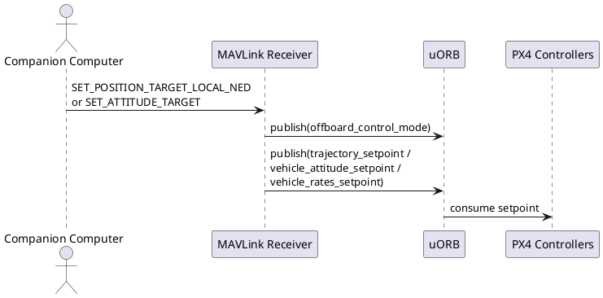
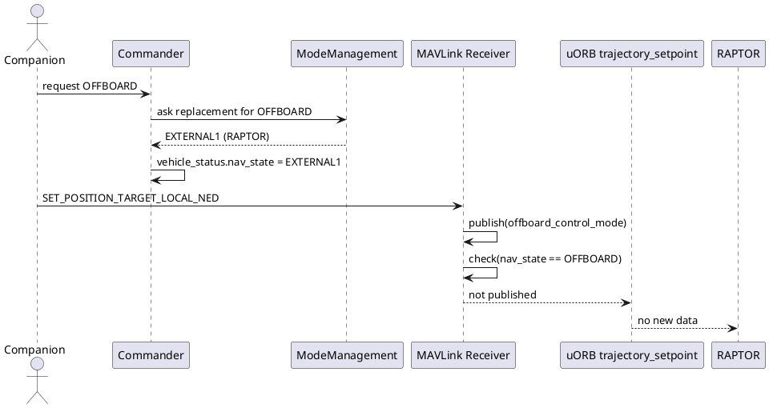
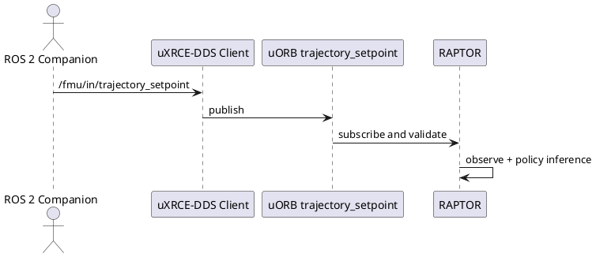

# RAPTOR Offboard 替换、MAVLink 限制与 ROS 2 解决方案

> 目标：彻底讲清一个容易误解的问题: `MC_RAPTOR_OFFB=1` 时，为什么“进入 OFFBOARD”不等于“还能继续用标准 MAVLink Offboard 目标流给 RAPTOR 喂 setpoint”。

## 目录

- [1. 结论先行](#1-结论先行)
- [2. 标准 PX4 Offboard 到底做什么](#2-标准-px4-offboard-到底做什么)
- [3. RAPTOR 真正需要的输入是什么](#3-raptor-真正需要的输入是什么)
- [4. `MC_RAPTOR_OFFB=1` 时到底发生了什么](#4-mc_raptor_offb1-时到底发生了什么)
- [5. 为什么标准 MAVLink Offboard 目标流会断](#5-为什么标准-mavlink-offboard-目标流会断)
- [6. 这不只是位置目标失效，而是整套 MAVLink Offboard setpoint 都失效](#6-这不只是位置目标失效而是整套-mavlink-offboard-setpoint-都失效)
- [7. `nav_state == OFFBOARD` 判断的是名字、ID 还是 hash](#7-nav_state--offboard-判断的是名字id-还是-hash)
- [8. 可行方案对比](#8-可行方案对比)
- [9. 推荐落地方案：ROS 2 / uXRCE-DDS 直接发布 `trajectory_setpoint`](#9-推荐落地方案ros-2--uxrce-dds-直接发布-trajectory_setpoint)
- [10. 常见误解澄清](#10-常见误解澄清)
- [11. 术语与参考](#11-术语与参考)

## 1. 结论先行

对当前这版 RAPTOR 集成，结论可以压缩成四句话：

1. RAPTOR 的 external reference 唯一直接输入是 uORB `trajectory_setpoint`。
2. `MC_RAPTOR_OFFB=1` 的作用是“让 RAPTOR 替换 OFFBOARD 的模式入口”，不是“自动兼容标准 MAVLink Offboard setpoint 链路”。
3. 当前 PX4 MAVLink 接收器只会在 `vehicle_status.nav_state == NAVIGATION_STATE_OFFBOARD` 时，把 `SET_POSITION_TARGET_*` / `SET_ATTITUDE_TARGET` 真正转成内部 setpoint。
4. 因此在 RAPTOR 已替换 OFFBOARD 的情况下，标准 MAVLink Offboard 目标流不会继续完整喂给 RAPTOR。要想稳定给 RAPTOR 喂目标，最干净的方案是 ROS 2 / uXRCE-DDS 直接发布 `trajectory_setpoint`。

这意味着：

- 如果你坚持“仅用 MAVLink Offboard 目标消息驱动 RAPTOR extref”，当前源码下不成立。
- 如果你接受 ROS 2，问题会变得非常简单，因为 ROS 2 可以绕过 MAVLink receiver 的 `NAVIGATION_STATE_OFFBOARD` 硬门限，直接写 uORB。

## 2. 标准 PX4 Offboard 到底做什么

标准 PX4 `OFFBOARD` 的职责是：允许外部计算机通过通信链路把控制目标送进飞控内部控制栈。

典型链路如下：



在标准 OFFBOARD 语义里，外部计算机控制的不是电机本身，而是目标状态：

- 位置 / 速度 / 加速度目标
- 姿态目标
- 角速度目标

这些目标由 PX4 再交给后续控制器去执行。

源码入口主要在：

- [`MavlinkReceiver::handle_message_set_position_target_local_ned`](https://github.com/GrooveWJH/PX4-Autopilot/blob/main/src/modules/mavlink/mavlink_receiver.cpp#L1036-L1155)
- [`MavlinkReceiver::handle_message_set_position_target_global_int`](https://github.com/GrooveWJH/PX4-Autopilot/blob/main/src/modules/mavlink/mavlink_receiver.cpp#L1158-L1274)
- [`MavlinkReceiver::handle_message_set_attitude_target`](https://github.com/GrooveWJH/PX4-Autopilot/blob/main/src/modules/mavlink/mavlink_receiver.cpp#L1620-L1704)

## 3. RAPTOR 真正需要的输入是什么

RAPTOR 在 `extref` 模式下并不直接消费 MAVLink 消息。它直接订阅的是 uORB `trajectory_setpoint`：

- [`mc_raptor.hpp` `_trajectory_setpoint_sub`](https://github.com/GrooveWJH/PX4-Autopilot/blob/main/src/modules/mc_raptor/mc_raptor.hpp#L121)
- [`raptor_reference_pipeline.cpp` `update_external_setpoint_subscription()`](https://github.com/GrooveWJH/PX4-Autopilot/blob/main/src/modules/mc_raptor/core/raptor_reference_pipeline.cpp#L58-L104)

而且它只接受“完整”的 external setpoint。当前 finite 校验要求以下字段全部有效：

- `position[0:2]`
- `velocity[0:2]`
- `yaw`
- `yawspeed`

对应源码：

- [`raptor_reference_pipeline.cpp` finite 检查](https://github.com/GrooveWJH/PX4-Autopilot/blob/main/src/modules/mc_raptor/core/raptor_reference_pipeline.cpp#L64-L74)

控制律里实际使用的也是这些字段：

- 位置误差：`position - trajectory_setpoint.position`
- 速度误差：`linear_velocity - trajectory_setpoint.velocity`
- 目标 yaw：用于构造目标姿态参考

对应源码：

- [`Raptor::observe()`](https://github.com/GrooveWJH/PX4-Autopilot/blob/main/src/modules/mc_raptor/core/raptor_control_pipeline.cpp#L13-L73)

所以问题本质非常清晰：  
谁能把完整目标写进 uORB `trajectory_setpoint`，谁就能当 RAPTOR extref 的上游。

## 4. `MC_RAPTOR_OFFB=1` 时到底发生了什么

`MC_RAPTOR_OFFB=1` 不是让 RAPTOR “变成原生 OFFBOARD 控制器”。  
它做的是一件更具体的事：注册 external mode 时声明“我要替换内部 OFFBOARD 入口”。

RAPTOR 注册代码：

- [`raptor_checkpoint_io.cpp`](https://github.com/GrooveWJH/PX4-Autopilot/blob/main/src/modules/mc_raptor/core/raptor_checkpoint_io.cpp#L195-L204)

核心字段：

- `enable_replace_internal_mode = MC_RAPTOR_OFFB`
- `replace_internal_mode = NAVIGATION_STATE_OFFBOARD`

Commander 收到后会把 RAPTOR external mode 标成“替换 OFFBOARD”：

- [`ModeManagement::checkNewRegistrations()`](https://github.com/GrooveWJH/PX4-Autopilot/blob/main/src/modules/commander/ModeManagement.cpp#L260-L334)

随后在运行态，Commander 会把“用户请求的 OFFBOARD”映射到 external slot：

- [`ModeManagement::getNavStateReplacementIfValid()`](https://github.com/GrooveWJH/PX4-Autopilot/blob/main/src/modules/commander/ModeManagement.cpp#L438-L462)
- [`Commander.cpp` 更新 `nav_state`](https://github.com/GrooveWJH/PX4-Autopilot/blob/main/src/modules/commander/Commander.cpp#L2411-L2416)

也就是说：

- 用户或上位机请求的是 `OFFBOARD`
- 实际激活的 `vehicle_status.nav_state` 变成的是 `EXTERNAL1/2/...` 某个 external mode id
- UI 显示上你可以把它理解成“RAPTOR 占用了 OFFBOARD 入口”

但对底层代码来说，这已经不是数值意义上的 `NAVIGATION_STATE_OFFBOARD` 了。

## 5. 为什么标准 MAVLink Offboard 目标流会断

问题的关键在 MAVLink receiver 里的这条判断：

```cpp
if (vehicle_status.nav_state == vehicle_status_s::NAVIGATION_STATE_OFFBOARD) {
    _trajectory_setpoint_pub.publish(setpoint);
}
```

源码位置：

- [`handle_message_set_position_target_local_ned()`](https://github.com/GrooveWJH/PX4-Autopilot/blob/main/src/modules/mavlink/mavlink_receiver.cpp#L1143-L1146)
- [`handle_message_set_position_target_global_int()`](https://github.com/GrooveWJH/PX4-Autopilot/blob/main/src/modules/mavlink/mavlink_receiver.cpp#L1267-L1270)

这意味着：

- MAVLink receiver 会先解析消息
- 会先发布 `offboard_control_mode`
- 但只有当“当前实际运行模式 ID 就是 OFFBOARD”时，才会真正发布 `trajectory_setpoint`

而在 `MC_RAPTOR_OFFB=1` 时，实际运行模式已经被替换成 external mode id，不再是 `OFFBOARD`。  
于是这条判断失败，`trajectory_setpoint` 不会被发布。

链路断点如下：



结果就是：

- RAPTOR 激活了
- 但 external reference 没有真正进来
- `trajectory_setpoint_stale` 最终会变成 `true`

对应 RAPTOR 侧超时处理：

- [`raptor_reference_pipeline.cpp` stale 逻辑](https://github.com/GrooveWJH/PX4-Autopilot/blob/main/src/modules/mc_raptor/core/raptor_reference_pipeline.cpp#L159-L207)

## 6. 这不只是位置目标失效，而是整套 MAVLink Offboard setpoint 都失效

这个问题不是只有 `SET_POSITION_TARGET_LOCAL_NED` 受影响。

当前 MAVLink receiver 中，以下几类标准 Offboard setpoint 都要求：

- `vehicle_status.nav_state == NAVIGATION_STATE_OFFBOARD`

包括：

| MAVLink 消息 | 内部目标 | 门限位置 |
| --- | --- | --- |
| `SET_POSITION_TARGET_LOCAL_NED` | `trajectory_setpoint` | [`mavlink_receiver.cpp#L1143-L1146`](https://github.com/GrooveWJH/PX4-Autopilot/blob/main/src/modules/mavlink/mavlink_receiver.cpp#L1143-L1146) |
| `SET_POSITION_TARGET_GLOBAL_INT` | `trajectory_setpoint` | [`mavlink_receiver.cpp#L1267-L1270`](https://github.com/GrooveWJH/PX4-Autopilot/blob/main/src/modules/mavlink/mavlink_receiver.cpp#L1267-L1270) |
| `SET_ATTITUDE_TARGET` | `vehicle_attitude_setpoint` | [`mavlink_receiver.cpp#L1667-L1679`](https://github.com/GrooveWJH/PX4-Autopilot/blob/main/src/modules/mavlink/mavlink_receiver.cpp#L1667-L1679) |
| `SET_ATTITUDE_TARGET` body-rate 分支 | `vehicle_rates_setpoint` | [`mavlink_receiver.cpp#L1697-L1700`](https://github.com/GrooveWJH/PX4-Autopilot/blob/main/src/modules/mavlink/mavlink_receiver.cpp#L1697-L1700) |

因此在当前实现里，`MC_RAPTOR_OFFB=1` 带来的不是“位置 Offboard 用不了，但 attitude Offboard 还能用”，而是标准 MAVLink Offboard setpoint 整体不再是有效上游。

## 7. `nav_state == OFFBOARD` 判断的是名字、ID 还是 hash

判断的是 **模式 ID（准确说是 `VehicleStatus.msg` 里定义的 `uint8 nav_state` 枚举值）**，不是模式名，也不是 `COM_MODE0_HASH`。

定义见：

- [`VehicleStatus.msg`](https://github.com/GrooveWJH/PX4-Autopilot/blob/main/msg/versioned/VehicleStatus.msg#L29-L66)

关键常量：

- `NAVIGATION_STATE_OFFBOARD = 14`
- `NAVIGATION_STATE_EXTERNAL1 = 23`

而 `COM_MODE0_HASH` 只是 external mode 名称哈希，用来把某个 external mode 稳定映射到某个槽位：

- [`Modes::addExternalMode()`](https://github.com/GrooveWJH/PX4-Autopilot/blob/main/src/modules/commander/ModeManagement.cpp#L95-L120)

所以：

- `nav_state`：运行时模式 ID，MAVLink receiver 真正比较的对象
- `name`：给人看的文本，例如 `RAPTOR`
- `hash`：模式注册槽位绑定信息，不参与这条判断

## 8. 可行方案对比

| 方案 | 是否改 PX4 源码 | 是否只用 MAVLink | 是否适合 RAPTOR extref | 评价 |
| --- | --- | --- | --- | --- |
| 继续用 `MC_RAPTOR_OFFB=1` + `SET_POSITION_TARGET_LOCAL_NED` | 否 | 是 | 否 | 当前源码下不可行 |
| `MC_RAPTOR_OFFB=0` + `EXT1` + 标准 MAVLink Offboard setpoint | 否 | 是 | 否 | RAPTOR 激活时 `nav_state` 仍不是 `OFFBOARD` |
| `MC_RAPTOR_OFFB=0` + `EXT1` + ROS 2 / DDS 直发 `trajectory_setpoint` | 否 | 否 | 是 | 推荐 |
| `MC_RAPTOR_OFFB=1` + ROS 2 / DDS 直发 `trajectory_setpoint` | 否 | 否 | 是 | 也可行，但更容易和“原生 Offboard 语义”混淆 |
| `MC_RAPTOR_INTREF=1` 使用机载轨迹 | 否 | 否 | 是 | 最简单验证链路 |
| 修改 MAVLink receiver 让 replacement mode 也发布 setpoint | 是 | 是 | 是 | 若你必须保留 MAVLink-only，这是最终修复方向 |

最关键的一行是第二行：  
即使 `MC_RAPTOR_OFFB=0`，只要 RAPTOR 真正处于 `EXT1`，MAVLink receiver 那边的“只有 `nav_state == OFFBOARD` 才发布 setpoint”问题依然存在。  
所以这个问题不是 `OFFB=1` 专属 bug，而是“**RAPTOR extref 与标准 MAVLink Offboard setpoint 门控不匹配**”。

## 9. 推荐落地方案：ROS 2 / uXRCE-DDS 直接发布 `trajectory_setpoint`

如果你的目标是：

- 让 RAPTOR 作为实际控制器
- 外部电脑给 RAPTOR 喂目标点 / 轨迹
- 尽量不改 PX4 主代码

那么最推荐的方案是：

1. 保持 RAPTOR 作为 external mode 使用，通常建议 `MC_RAPTOR_OFFB=0`
2. 用 ROS 2 通过 uXRCE-DDS 直接向 PX4 发布 `trajectory_setpoint`
3. 同时提供定位输入（VINS / Mocap / LiDAR SLAM 都可以）
4. 切入 `EXT1` / RAPTOR 模式

这条链的优点在于它完全绕开了 MAVLink receiver 里那条 `nav_state == OFFBOARD` 的硬门限：



为什么 ROS 2 特别适合这个问题：

- RAPTOR 本来就直接吃 uORB `trajectory_setpoint`
- ROS 2 / uXRCE-DDS 本质上就是一个“外部进程直接写 PX4 输入话题”的方案
- 它不依赖当前 `nav_state` 必须等于 `OFFBOARD`
- 语义上更干净：外部电脑负责“给参考轨迹”，RAPTOR 负责“执行控制律”

工程上建议这样做：

### 9.1 参数建议

```text
param set MC_RAPTOR_ENABLE 1
param set MC_RAPTOR_OFFB 0
param set MC_RAPTOR_INTREF 0
param save
reboot
```

理由：

- `OFFB=0`：入口清晰，RAPTOR 就是 RAPTOR，不再混淆成“替代版 Offboard”
- `INTREF=0`：明确要求外部参考

### 9.2 进入模式建议

- 起飞与安全接管仍可沿用常规 PX4 流程
- 真正需要 RAPTOR 接管时，切入 `EXT1` 或 QGC 里显示的 `RAPTOR`

### 9.3 外部电脑职责

外部电脑只需要做两件事：

1. 给 PX4 提供稳定定位
2. 持续发布 `trajectory_setpoint`

这非常适合以下组合：

- Mocap + ROS 2
- VINS-Fusion / VINS-Mono + ROS 2
- LiDAR SLAM + ROS 2

可结合以下 Handbook 文档：

- [ros2/external_controller_overview[important].md](../../ros2/external_controller_overview%5Bimportant%5D.md)
- [ros2/uxrce_dds_topic_mapping.md](../../ros2/uxrce_dds_topic_mapping.md)
- [ros2/ros2_external_controller_vs_mavros.md](../../ros2/ros2_external_controller_vs_mavros.md)

### 9.4 什么时候才该坚持 MAVLink-only

只有在你满足这两个条件时，才值得坚持 MAVLink-only：

- 你已有很重的 MAVROS / MAVSDK 历史包袱
- 你愿意接受改 PX4 源码来补齐 replacement mode 的 setpoint 发布逻辑

否则从工程收益比看，ROS 2 是更合理的方案。

## 10. 常见误解澄清

### 10.1 “我都切进 Offboard 了，为什么不算 Offboard”

从用户语义上看，你确实是“通过 Offboard 入口”进入了模式。  
但从飞控内部运行态看，当前实际 `nav_state` 已经不是 `OFFBOARD`，而是 RAPTOR external slot。

这两个层次不能混为一谈：

- 入口语义：像 Offboard
- 运行态枚举：不是 `NAVIGATION_STATE_OFFBOARD`

### 10.2 “既然会发布 `offboard_control_mode`，是不是就说明 setpoint 也已经生效了”

不是。  
当前 MAVLink receiver 会先发 `offboard_control_mode`，再根据 `nav_state` 决定是否发真正的 setpoint。  
所以你可能看到 Offboard 信号存在，但 RAPTOR 侧仍然 `trajectory_setpoint_stale=true`。

### 10.3 “那 `MC_RAPTOR_OFFB=1` 还有什么意义”

它的意义主要是：

- 用 OFFBOARD 这个用户入口激活 RAPTOR
- 让 QGC / 上位脚本不必额外知道 `EXT1`

但当前它没有自动解决“标准 MAVLink Offboard setpoint 如何继续写进 RAPTOR 输入”的问题。

### 10.4 “如果不用 ROS 2，还有没有不改 PX4 的方法”

对于“让外部电脑稳定给 RAPTOR extref 喂目标”这个问题，当前源码下没有一条等价于标准 MAVLink Offboard setpoint 的无改码方案。  
不改码又想稳定工作，最实际的就是 ROS 2 / DDS。

## 11. 术语与参考

- **Offboard**：PX4 原生外部控制入口，标准上游常见为 MAVLink。
- **External Mode**：Commander 可注册的扩展模式，运行态是 `NAVIGATION_STATE_EXTERNAL1..8`。
- **Replacement Mode**：用 external mode 替换一个内部模式入口的机制。
- **uXRCE-DDS**：PX4 的 DDS 客户端，实现 ROS 2 与 uORB 的话题映射。
- **`trajectory_setpoint`**：RAPTOR extref 的直接目标输入话题。

相关源码参考：

- [`VehicleStatus.msg`](https://github.com/GrooveWJH/PX4-Autopilot/blob/main/msg/versioned/VehicleStatus.msg)
- [`mavlink_receiver.cpp`](https://github.com/GrooveWJH/PX4-Autopilot/blob/main/src/modules/mavlink/mavlink_receiver.cpp)
- [`ModeManagement.cpp`](https://github.com/GrooveWJH/PX4-Autopilot/blob/main/src/modules/commander/ModeManagement.cpp)
- [`raptor_checkpoint_io.cpp`](https://github.com/GrooveWJH/PX4-Autopilot/blob/main/src/modules/mc_raptor/core/raptor_checkpoint_io.cpp)
- [`raptor_reference_pipeline.cpp`](https://github.com/GrooveWJH/PX4-Autopilot/blob/main/src/modules/mc_raptor/core/raptor_reference_pipeline.cpp)
- [`raptor_control_pipeline.cpp`](https://github.com/GrooveWJH/PX4-Autopilot/blob/main/src/modules/mc_raptor/core/raptor_control_pipeline.cpp)
