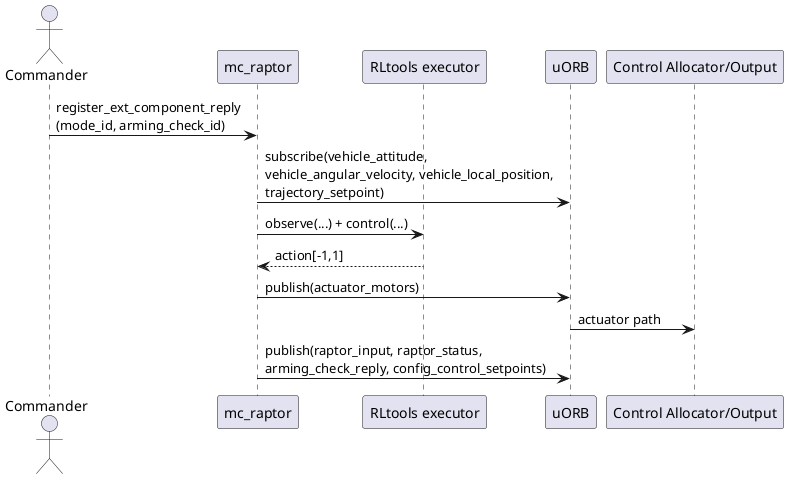
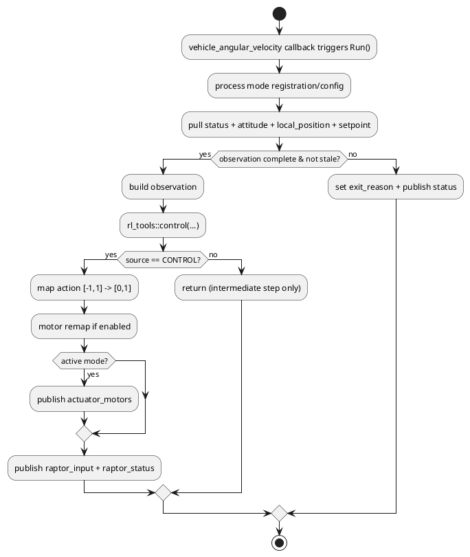

# RAPTOR 运行逻辑与控制律（输入 -> 控制 -> 输出）

> 目标：用源码视角讲清 RAPTOR 每一拍在做什么。本文只讲运行机制，不讲刷机操作。
>
> 适用基线：`hkust_nxt-dual_raptor`，`Build variant: raptor`。

## 目录

- [1. 概览与适用场景](#1-概览与适用场景)
- [2. 关键概念与链路](#2-关键概念与链路)
- [3. 深入解析（按主题拆分）](#3-深入解析按主题拆分)
- [4. 实操 / 对比 / 排障（按需选择）](#4-实操--对比--排障按需选择)
- [5. 术语与参考](#5-术语与参考)

---

## 1. 概览与适用场景

RAPTOR 是一个运行在 PX4 内部的外部模式控制模块：它接收飞行状态与轨迹参考，执行 RLtools policy 推理，输出 `actuator_motors`。它不是任务规划器，也不替代 Commander 或 EKF。

入口代码：

- [`mc_raptor.cpp`](https://github.com/GrooveWJH/PX4-Autopilot/blob/main/src/modules/mc_raptor/mc_raptor.cpp)
- [`mc_raptor.hpp`](https://github.com/GrooveWJH/PX4-Autopilot/blob/main/src/modules/mc_raptor/mc_raptor.hpp)
- [`RaptorInput.msg`](https://github.com/GrooveWJH/PX4-Autopilot/blob/main/msg/versioned/RaptorInput.msg)
- [`RaptorStatus.msg`](https://github.com/GrooveWJH/PX4-Autopilot/blob/main/msg/versioned/RaptorStatus.msg)

---

## 2. 关键概念与链路

### 2.1 模块-话题-模式总链路



### 2.2 单周期时序（Run()）



---

## 3. 深入解析（按主题拆分）

### 3.1 调度与触发

`mc_raptor` 是 `ScheduledWorkItem`，跑在 `rate_ctrl` 队列，回调触发来自 `vehicle_angular_velocity`。

- [`mc_raptor.cpp`](https://github.com/GrooveWJH/PX4-Autopilot/blob/main/src/modules/mc_raptor/mc_raptor.cpp)
- [`MulticopterRateControl.cpp`](https://github.com/GrooveWJH/PX4-Autopilot/blob/main/src/modules/mc_rate_control/MulticopterRateControl.cpp)

这意味着它和 `mc_rate_control` 共享高优先级队列与高频触发源，CPU 分析要放在系统级看，不是单模块孤立看。

### 3.2 输入合同（Input Contract）

| 输入 | 作用 | 代码路径 | 超时/校验 | 失效后行为 |
| --- | --- | --- | --- | --- |
| `vehicle_angular_velocity` | 主时钟 + 角速度观测 | `Run()` | `OBSERVATION_TIMEOUT_ANGULAR_VELOCITY` | `EXIT_REASON_ANGULAR_VELOCITY_STALE` |
| `vehicle_local_position` | 位置/速度观测 | `Run()` | `OBSERVATION_TIMEOUT_LOCAL_POSITION` | `EXIT_REASON_LOCAL_POSITION_STALE` |
| `vehicle_attitude` | 姿态观测 | `Run()` | `OBSERVATION_TIMEOUT_ATTITUDE` | `EXIT_REASON_ATTITUDE_STALE` |
| `trajectory_setpoint` | 外部参考轨迹 | `Run()` | `TRAJECTORY_SETPOINT_TIMEOUT` + finite 检查 | stale 时回退保持 |
| `MC_RAPTOR_INTREF` | 参考来源选择 | `module.yaml` | 参数读取 | 决定 external/internal 分支 |

超时常量定义见 [`mc_raptor.hpp`](https://github.com/GrooveWJH/PX4-Autopilot/blob/main/src/modules/mc_raptor/mc_raptor.hpp)。

### 3.3 `trajectory_setpoint` 实际用了哪些字段

RAPTOR 当前对外部 setpoint 的有效性检查只要求以下字段 finite：

- `position[0..2]`
- `velocity[0..2]`
- `yaw`
- `yawspeed`

并在观测构造中只使用位置/速度/yaw 误差，不使用 `acceleration` 与 `jerk` 字段。

对应实现：

- [`mc_raptor.cpp` finite check 分支](https://github.com/GrooveWJH/PX4-Autopilot/blob/main/src/modules/mc_raptor/mc_raptor.cpp)
- [`TrajectorySetpoint.msg`](https://github.com/GrooveWJH/PX4-Autopilot/blob/main/msg/versioned/TrajectorySetpoint.msg)

结论：EGO Planner 输出到 acceleration/jerk 也没问题，但 RAPTOR 目前不会直接消费这两组量。

### 3.4 观测构造与控制律输入

policy 观测向量由 5 组信息构成：

1. 位置误差：`position - trajectory_setpoint.position`
2. 速度误差：`linear_velocity - trajectory_setpoint.velocity`
3. 姿态误差四元数：由目标 yaw 与当前姿态构造
4. 当前角速度：`vehicle_angular_velocity.xyz`
5. 上一时刻动作：`previous_action`

误差会做坐标变换（FRD/NED 到 FLU + 目标坐标系）与裁剪（位置/速度上限）以保持数值稳定。

核心函数：

- [`Raptor::observe`](https://github.com/GrooveWJH/PX4-Autopilot/blob/main/src/modules/mc_raptor/mc_raptor.cpp)

### 3.5 policy 推理与动作映射

推理调用使用 RLtools executor：

- `rl_tools::control(device, executor, nanoseconds, policy, observation, action, rng)`

动作后处理：

1. 网络输出 `[-1, 1]`
2. 映射到 `[0, 1]`：`(a + 1) / 2`
3. 写入 `actuator_motors.control[0..3]`
4. 如启用 `REMAP_FROM_CRAZYFLIE`，执行电机序重排

对应实现：

- [`mc_raptor.cpp` action mapping](https://github.com/GrooveWJH/PX4-Autopilot/blob/main/src/modules/mc_raptor/mc_raptor.cpp)

### 3.6 轨迹协同：`INTREF=0` vs `INTREF=1`

#### `MC_RAPTOR_INTREF=0`（外部参考）

- 参考来自外部 `trajectory_setpoint`。
- 若超时或首次未收到，`trajectory_setpoint_stale=true`，会回退到“当前位置保持 + 当前 yaw + 零速度”。

#### `MC_RAPTOR_INTREF=1`（内部参考）

- 参考由内部轨迹生成器给出，再变换回当前激活参考系。
- 默认对外文档暴露的是 Lissajous。

相关代码：

- [`trajectories/lissajous.hpp`](https://github.com/GrooveWJH/PX4-Autopilot/blob/main/src/modules/mc_raptor/trajectories/lissajous.hpp)
- [`mc_raptor.cpp` intref command](https://github.com/GrooveWJH/PX4-Autopilot/blob/main/src/modules/mc_raptor/mc_raptor.cpp)
- [`module.yaml` `MC_RAPTOR_INTREF`](https://github.com/GrooveWJH/PX4-Autopilot/blob/main/src/modules/mc_raptor/module.yaml)

补充：源码里还存在 `circle` 内部轨迹命令分支，但参数枚举当前主流程只定义了 `None/Lissajous`，因此实机文档默认按 Lissajous 讲解。

### 3.7 输出合同（Output Contract）

| 输出 | 作用 | 消费方 |
| --- | --- | --- |
| `actuator_motors` | 电机命令输出 | 控制分配与执行器输出链路 |
| `raptor_input` | 发布策略输入快照 | 调试、日志 |
| `raptor_status` | 发布活跃状态、stale、exit reason | 调试、排障、地面站观察 |
| `config_control_setpoints` | 声明 external 模式下的控制边界 | Commander/ModeManagement |
| `arming_check_reply` | external mode 的 can_arm/can_run 与 mode requirements | Commander |

### 3.8 控制权边界（RAPTOR 不做什么）

RAPTOR 不处理：

- 任务层规划（Mission/RTL/航线规划）
- EKF 融合与定位质量判定
- 手动杆量直通控制（不订阅 `manual_control_setpoint`）

它做的是“给定状态 + 参考轨迹 -> 推理输出执行器命令”。

---

## 4. 实操 / 对比 / 排障（按需选择）

### 4.1 快速检查控制链是否在工作

```sh
./Tools/mavlink_shell.py /dev/tty.usbmodem01
```

```sh
listener raptor_status 1
listener raptor_input 1
listener actuator_motors 1
```

判据：

- `raptor_status.active=true` 时 `actuator_motors` 应连续更新。
- `trajectory_setpoint_stale=true` 且 `timestamp_last_trajectory_setpoint=0` 说明外部 setpoint 根本没进来。

### 4.2 为什么 `trajectory_setpoint_stale=true` 能推导出“没外部轨迹输入”

字面与代码两个层面一致：

1. `timestamp_last_trajectory_setpoint` 只在成功接收并通过 finite 校验后才更新。
2. stale 判据就是“未曾收到”或“收到但超时”。

所以 `stale=true` + `timestamp_last_trajectory_setpoint=0` 的组合等价于“从未接收过有效外部 setpoint”。

---

## 5. 术语与参考

- **Policy**：从状态到动作的映射函数（RAPTOR 用 `policy.tar` 持久化权重与元数据）。
- **INTREF**：Internal Reference，内部参考轨迹来源开关。
- **CTBR**：常用于描述 PX4 默认控制哲学（Cascaded/Trajectory to Body Rate 一类分层控制），而 RAPTOR 是替代其中低层控制输出路径的策略控制器。

关键源码参考：

- [`mc_raptor.cpp`](https://github.com/GrooveWJH/PX4-Autopilot/blob/main/src/modules/mc_raptor/mc_raptor.cpp)
- [`mc_raptor.hpp`](https://github.com/GrooveWJH/PX4-Autopilot/blob/main/src/modules/mc_raptor/mc_raptor.hpp)
- [`module.yaml`](https://github.com/GrooveWJH/PX4-Autopilot/blob/main/src/modules/mc_raptor/module.yaml)
- [`ModeManagement.cpp`](https://github.com/GrooveWJH/PX4-Autopilot/blob/main/src/modules/commander/ModeManagement.cpp)
- [`mode_requirements.cpp`](https://github.com/GrooveWJH/PX4-Autopilot/blob/main/src/modules/commander/ModeUtil/mode_requirements.cpp)
- [`estimatorCheck.cpp`](https://github.com/GrooveWJH/PX4-Autopilot/blob/main/src/modules/commander/HealthAndArmingChecks/checks/estimatorCheck.cpp)
- [`modeCheck.cpp`](https://github.com/GrooveWJH/PX4-Autopilot/blob/main/src/modules/commander/HealthAndArmingChecks/checks/modeCheck.cpp)
