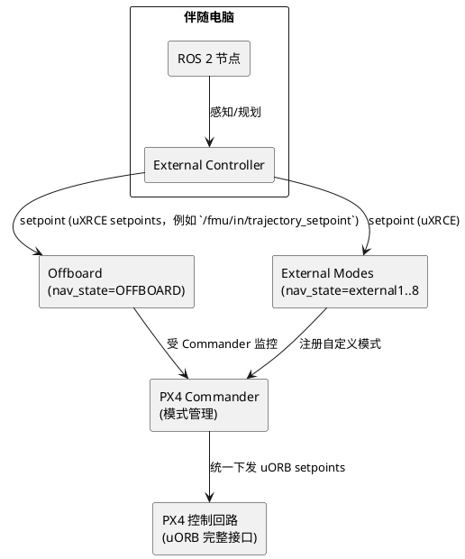

## PX4 External Controller 全景指南

> 面向希望把控制逻辑搬到伴随电脑的开发者：本文用“源码引用 + 通俗解释”的方式，梳理 External Controller、Offboard 模式、ROS 2 External Flight Modes 三者的关系，并给出实操指南。

### 1. 总览与术语

- **External Controller**：PX4 v1.14+ 引入的 ROS 2 控制组件（非上层路径规划器），通过 uXRCE-DDS 直接驱动 uORB setpoint。
- **Offboard 模式**：PX4 内建的 nav_state=Offboard，可在 ROS 2 下通过 uXRCE-DDS（例如 `/fmu/in/offboard_control_mode`、`/fmu/in/trajectory_setpoint`）运行 External Controller。
- **External Flight Modes**：PX4 1.14+ 引入的 ROS 2 自定义模式，nav_state=external1..8，使用 `px4_ros2_interface_lib` 注册并可替换内建模式。

### 2. External Controller 能做到什么？

- 只要通过 **uXRCE-DDS**，就能直接对接 PX4 的全部 uORB 接口（`src/modules/uxrce_dds_client/dds_topics.yaml`），External Controller 可以生成姿态、角速度、速度、位置、推力乃至电机/外设控制量（通过 `/fmu/in/direct_actuator_control` 等接口），能力远超只能发布“目标位置/目标速度”的旧式 MAVROS。
- Offboard 接口（无论 ROS 1/ROS 2）只开放了部分 setpoint（如 `/fmu/in/trajectory_setpoint`、`/fmu/in/offboard_control_mode`），而 External Mode 借助 `px4_ros2_interface_lib` 封装出了全套 setpoint 类型，最直观的区别就是可以直接控制电机、舵机或 VTOL 特有通道。
- External Controller 本身不是“模式”，它必须运行在某个允许外控的 nav_state（Offboard 或 external1..8）下才会真正驱动飞机。

### 3. PX4 在何时接受 External Controller？（源码+解释）

- `ModeUtil/control_mode.cpp:123` 的 `switch(nav_state)` 显示：只有当 `vehicle_status.nav_state` 属于 `NAVIGATION_STATE_OFFBOARD` 或 `NAVIGATION_STATE_EXTERNAL1..EXTERNAL8` 时，PX4 才会设置 `vehicle_control_mode.flag_control_offboard_enabled` 并把 `offboard_control_mode` 对应的 setpoint 注入控制回路。
- 同一文件的 `case NAVIGATION_STATE_OFFBOARD` 说明 Commander 只在 Offboard 分支里打开 `flag_control_offboard_enabled` 并解析 `offboard_control_mode`（位置/速度/姿态/推力/直接电机控制等）；其它 nav_state 根本不会读取这些 setpoint，自然也不会让 External Controller 生效。
- `ModeManagement.cpp:212` 中 `_external_checks.setExternalNavStates(...)` 把 external1..8 注册成“可被 ROS 2 模式使用”的导航状态；`ModeManagement.cpp:212-352` 展示了 `checkNewRegistrations()` 如何通过 `register_ext_component_request` 为 External Mode 分配 nav_state 并将哈希写入 `COM_MODE*_HASH`，确保 RC/QGC 可映射到具体 externalX。
- 翻译成白话：PX4 只在 Offboard 和 External 模式下才“真正听命于 External Controller”。其余模式（Manual/Posctl/Mission 等）依旧使用 PX4 内部 setpoint，即使外部程序在后台持续发送数据，也只会作为健康检查（`HealthAndArmingChecks/checks/offboardCheck.cpp`）记录“信号可用”，不会执行。
- 因此 PX4 v1.14/1.15 的 External Controller 可以运行在 **Offboard**（简单、轻量）或 **External Mode**（功能完全开放）两类 nav_state 下：前者沿袭旧的 setpoint 接口，后者借助 `px4_ros2_interface_lib` 提供更自由的 ROS 2 API。

### 4. 何时/如何启用 External Controller（Offboard vs External Mode）

External Controller 不是单独的 PX4 模式，它需要依附在 **Offboard** 或 **External Flight Mode** 这两类 nav_state 下运行。下面分别说明触发链路与源码依据。

#### 4.1 当 External Controller 运行在 Offboard 时

1. **持续发布 uXRCE setpoint**  
   - `HealthAndArmingChecks/checks/offboardCheck.cpp` 会订阅 `offboard_control_mode`，利用 `hrt_absolute_time()` 判断信号是否“新鲜”，并确认所需通道（位置/速度/姿态/推力/直接电机控制等）对应的估计量有效。这就是“进入 Offboard 前需连续推送 ≥2 秒 setpoint”的具体实现。
2. **Commander 切换 nav_state**  
   - 伴随电脑或 GCS 运行 `commander mode offboard`（实现在 `Commander::custom_command()` → `set_main_state()`），或由 RC 拨杆触发 `set_main_state_rc()`；当 `main_state_request == OFFBOARD` 且 `offboardCheck` 判定信号有效时，Commander 就会认为 External Controller 已经请求接管。
3. **控制权交接**  
   - `Commander::offboardControlCheck()` 会再次运行 arming 检查，并将 `_vehicle_control_mode.flag_control_offboard_enabled` 置为 true。此时 External Controller 通过 `/fmu/in/offboard_control_mode`、`/fmu/in/trajectory_setpoint`、`/fmu/in/direct_actuator_control` 等话题发送的指令就会直接驱动 uORB（包括电机/舵机），而不是仅仅变成健康检查数据。

#### 4.2 当 External Controller 运行在 External Flight Mode 时

1. **先注册再映射**  
   - ROS 2 节点通过 `px4-ros2-interface-lib` 发送 `register_ext_component_request`（`ModeManagement.cpp::checkNewRegistrations()`），`Modes::addExternalMode()` 会给该模式分配 external1..8 中的一个 nav_state，并把哈希写入 `COM_MODE*_HASH` 以便 RC/QGC 映射。Commander 因此知道“externalX = 我的自定义模式”。
2. **用户选择与激活**  
   - 当飞手在 QGC/RC 选择对应的 externalX 时，`UserModeIntention::change()` 通过 `_handler->getReplacedModeIfAny()` 将该 nav_state 提交给 Commander。随后 `ModeBase::onActivate()` 被调用，External Controller 在 `updateSetpoint()` 中持续发布（同样可以下发姿态/推力/直接电机控制等所有 uXRCE setpoint）。
3. **运行期交互**  
   - 若节点失联或 failsafe 触发，`_external_checks` 会认定该 external 模式不可用，Commander 自动回退到之前模式；External Controller 也可以在任务完成时调用 `completed()` 或 `requestModeSwitch()`，Commander 立刻切换 nav_state（参见 `px4_ros2_interface_lib/examples/cpp/modes/mode_with_executor`）。

> 举一反三：Offboard 的 RC/程序切换都默认指向 `NAVIGATION_STATE_OFFBOARD`，因此只要 setpoint 持续就能“临时拨杆进入”。External Flight Mode 则必须先通过 `ModeManagement.cpp::checkNewRegistrations()` 注册 external1..8，并写入 `COM_MODE*_HASH` 供 RC/QGC 映射，Commander 才知道“这个开关=我的自定义模式”。`UserModeIntention::change()` 也会调用 `_handler->getReplacedModeIfAny()` 来匹配 nav_state。也就是说，External Controller 虽然可以运行在 Offboard 或 External Mode 下，但想在 External Mode 中启用它必须先完成注册/映射，无法像 Offboard 那样“无配置临时进入”。

> 小结：External Controller 可以无缝运行在 Offboard（配置简单）或 External Mode（可命名、可替换内建模式）两条链路上。前者只需持续发布 setpoint + 触发 `set_mode OFFBOARD`，后者则需先注册 externalX 再让飞手/Commander 激活；两种方式最终都借助 uXRCE-DDS 把姿态/速度/推力甚至电机控制直接注入 PX4。

### 5. RC 干预与人工授权

- **Offboard**：
  - 任意 RC 模式切换都会立即退出 Offboard；
  - `COM_RC_OVERRIDE` / `COM_OBL_RC_ACT` 可限制杆量/失联时的行为；
  - 伴随电脑也可以随时下发 `set_mode OFFBOARD`，只要 `offboardControlCheck` 判定信号有效并通过 arming check，就会立即进入 Offboard。RC 开关只是“人为授权”工具，而非技术依赖。
- **External Mode**：
  - RC/GCS 切回其它模式时，Commander 会调用外部模式的 `onDeactivate()`，停止接收 setpoint；
  - 模式执行器可根据 `ManualControlInput` 决定是否因杆量过大而主动 `completed(px4_ros2::Result::Denied)`，但 Commander 永远拥有最终决定权。

### 6. External Controller 失联 / 恢复

|场景|Offboard 行为|External Mode 行为|
|---|---|---|
|Setpoint 超时|触发 `COM_OBL_ACT`（Hold/RTL/Land/Terminate 等），Commander 回退到内部模式。|`_external_checks` 认为节点无响应，发布事件并回到之前模式。|
|外部程序主动退出|只能停止发布，Commander 依 failsafe 回退。|节点可调用 `completed()` / `failed()`，Commander 知道任务状态。|
|恢复控制|重新发送 setpoint，并通过 RC/GCS 或 `set_mode OFFBOARD` 重新切换；`offboardControlCheck()` 清除 `_failsafe_flags.offboard_control_signal_lost`。|重新启动模式节点，QGC/RC 再次选择 externalX，Commander 重新触发 `onActivate()`；如使用 Mode Executor，需要在代码里处理断点继续。|

### 7. 模式选择与工程示例

|需求|推荐方案|理由|
|---|---|---|
|已有 MAVROS 工具链，快速验证算法|Offboard|配置最简单，生态成熟。|
|需要在 QGC/RC 显示自定义模式名，像官方模式一样切换|External Flight Mode|可注册 external1..8，Commander 负责 failsafe/显示。|
|任务编排（起飞→巡检→降落）且需自定义 failsafe|External Mode + Mode Executor (External Controller)|支持状态机、配置 override、可替换内建模式。|
|只想在伴随电脑上跑控制器，不关心 GCS 显示|Offboard 或 External Mode 均可，根据是否需要完整 uORB 接口决定。|

**投放快递示例**：
1. 定义 External Mode "投放快递"，或配 Mode Executor：`MPC 飞向目标 → 手动微调 + 舵机投放 → MPC 返航`。
2. 阶段 1/3 使用 ROS 2 控制器生成 setpoint（`px4_ros2_interface_lib::MulticopterGotoSetpointType`）。
3. 到达目标后请求 Commander 切到 Manual（或 `requestModeSwitch("Manual")`），飞手微调并通过 `PeripheralActuatorControls` 触发舵机。
4. 飞手切回 external 模式，Executor 进入返航阶段。若需要自动切回，可监听 RC 状态或使用自定义条件调用 `activateOwnedMode()`。

### 8. Offboard vs External Mode 能力对比

|能力|Offboard（MAVLink / 部分 uORB）|External Modes（px4_ros2_interface_lib）|交集|
|---|---|---|---|
|外部控制器/通信通道|PX4 v1.14+ 引入的 External Controller（非上层路径规划器）在 ROS 2 下只能通过 uXRCE-DDS 直接发布 `/fmu/in/*` setpoint|同样使用 uXRCE-DDS + `px4_ros2_interface_lib` 与 Commander 交互|External Controller（PX4 1.14/1.15）仅支持 uXRCE-DDS，Offboard 亦可借此通道直接驱动 PX4|
|setpoint 连续性检查|需要，`offboardCheck.cpp` 订阅 `offboard_control_mode`|同左|双方都必须持续发送|
|Commander 监管/RC 接管|`Commander::offboardControlCheck()`，RC 切换立即退出|同左|Commander 统一管理|
|可用 setpoint 类型|受限于 Offboard 接口（如 `/fmu/in/trajectory_setpoint`、`/fmu/in/offboard_control_mode`）提供的位置/速度/姿态字段|`control/setpoint_types/*` 覆盖姿态/角速率/推力/VTOL/外设等全部 uORB|External 能访问更多控制面|
|模式命名与可见性|固定“Offboard”，无法替换内建模式|可注册 external1..8、替换 RTL/Mission，QGC 显示真实名称|无交集|
|Mode Executor/任务编排|需在外部节点自己实现状态机，Commander 不感知阶段|库内置 Executor，Commander 知道任务完成/失败|External 专属|
|配置 override/Failsafe 扩展|不可|可临时禁用 auto-disarm、延后非关键 failsafe、控制外设|External 专属|
|典型场景|快速算法验证、legacy MAVLink 工具|工业任务、复杂流程、替换官方模式|视需求选择|

- **Only External Flight Modes（能力更强，源码来源 `docs/en/ros2/px4_ros2_control_interface.md` 与 `px4_ros2_interface_lib`）**  
  - **命名与替换**：可注册 external1..8，并通过 `ModeManagement.cpp` 把它们映射到既有模式（例如替换 RTL/Mission）；  
  - **Mode Executor**：在 `px4_ros2_interface_lib/examples/cpp/modes/mode_with_executor` 中演示，可串联“起飞→任务→返航”等多阶段任务，Commander 会跟踪进度；  
  - **配置 override**：运行时临时禁用 auto-disarm、延后非关键 failsafe、控制 Peripheral Actuator 等；  
  - **Setpoint 库**：`control/setpoint_types/*` 提供 MulticopterGoto、VTOL混合、姿态/速率/推力、PeripheralActuatorControls 等全部 uORB 封装；  
  - **深度集成**：Commander 知道“当前处于 externalX”，在 failsafe/RC 介入时能正确回退；而 `px4_ros2_interface_lib` 本身是完全开源的 ROS 2 库，可直接扩展/定制。

**典型场景（为什么 External Mode 更适合）**

1. **多阶段物流 / 巡检任务**：例如“起飞→飞到仓库→悬停等待确认→降落投递→再次起飞返回”。Offboard 模式下 Commander 只能看到“Offboard”这一状态，无法得知任务进度或自动在阶段间切换。而 External Mode 的 Mode Executor（`px4_ros2_interface_lib/examples/cpp/modes/mode_with_executor`）可以向 Commander 报告 `completed()`、`requestModeSwitch()`，在 QGC 中仍持续显示真实任务名，并在失败时自动回退到安全模式。
2. **自定义 RTL / Mission**：假设你要实现与众不同的返航逻辑（比如绕过禁飞区后再降落）。Offboard 无法取代 PX4 内建 RTL，飞手切 RTL 时依旧触发默认行为。External Mode 则可在 `ModeManagement.cpp` 中把 external1 注册成“自定义 RTL”，Commander 会像对待原生 RTL 一样进行 arming check、failsafe、RC 切换，且 QGC 显示你的模式名称。
3. **VTOL 或复杂外设控制**：垂直起降机通常需要在多旋翼/固定翼之间切换控制律，还可能同步驱动舵机、 payload 或吊舱。使用 MAVLink Offboard 时，这些切换需要自行管理。External Mode 可以直接使用 `control/setpoint_types/vtol/*`、`PeripheralActuatorControls`，Commander 会根据 `vehicle_status.vehicle_type` 自动选择合适的 setpoint 类型，同时保证姿态/速率/推进器命令与 PX4 内部约束一致。
4. **有合规或显示要求的工业任务**：很多作业场景要求飞行员通过 RC 或 GCS 明确授权自动任务，并在界面上显示任务名称。Offboard 永远只显示“Offboard”，无法揭示正在执行的任务。注册 External Mode 后，QGC 会列出“巡线检查”“电力巡检”等真实名称，还可以与 RC 开关映射，满足“人工批准自动控制”的安全流程。
5. **半自主送货**：假设模式命名为“半自主送货”，流程为：
   - ***阶段 1***：伴随电脑运行 MPC 控制器，通过 External Mode 发布 `MulticopterGoto` setpoint 飞到目标上空；`ModeBase::updateSetpoint()` 内部使用 `px4_ros2_interface_lib/control/setpoint_types/multicopter/goto.hpp`，Commander 因 nav_state=externalX 而接受这些 setpoint。
   - ***阶段 2***：`Mode Executor` 在 `positionReached()` 后调用 `requestModeSwitch("Manual")`（源码参考 `mode_with_executor` 示例），Commander 立即切到 Manual 并在 QGC 上提醒飞手；此时飞手可用 RC 做精确悬停，同时 External Mode 仍保持注册状态。
   - ***阶段 3***：飞手确认位置后，可通过 Companion 端 GUI/指令让外部模式调用 `set_main_state()` 或 `requestModeSwitch("Return")`，Commander 切回 RTL（`Commander::custom_command()`），无人机按内建 RTL 流程返回。
   - 这个流程之所以在 External Mode 中容易实现，关键是 Mode Executor 能通过 `completed()`、`requestModeSwitch()` 与 Commander 交互，Commander 又能安全地切换 nav_state 并让 QGC/RC 显示当前状态；Offboard 模式下，Nav state 仍是“Offboard”，无法自动提示飞手或合法地切换到 RTL，因此半自主的“交接权”难以实现。

### 9. Offboard 模式实操对比：MAVROS vs ROS 2

#### 9.1 共识
- 需要在进入 Offboard 前连续发送 setpoint（`offboardCheck.cpp` 的时间戳检查）。
- 解锁完成且 setpoint “新鲜”后，Commander 才会接受 Offboard 模式请求。

#### 9.2 ROS 1 MAVROS
- 环境：Ubuntu 20.04 + ROS Noetic，安装 `mavros`、`mavros_extras`，并运行 `rosrun mavros install_geographiclib_datasets.sh`。
- 启动：`roslaunch mavros px4.launch fcu_url:=udp://:14540@127.0.0.1:14557`。
- 参数：`COM_RC_IN_MODE=1`、`NAV_RCL_OFS=0`、`COM_OBL_ACT=2`。
- 切换：RC 开关或 `rosservice call /mavros/set_mode "custom_mode: 'OFFBOARD'"`。
- 示例节点：文档中给出了 20 Hz 发布 `mavros/setpoint_position/local` 的 Python 代码。

#### 9.3 ROS 2（px4_ros_com + uXRCE-DDS）
- 环境：ROS 2 Humble/Jazzy，工作区包含 `px4_msgs`、`px4_ros_com`，并运行 `MicroXRCEAgent udp4 -p 8888`。
- 启动：`ros2 run px4_ros_com offboard_control` + `commander mode offboard` 或 QGC 切换。
- 代码要点：同时发布 `OffboardControlMode` 与 `TrajectorySetpoint`，时间戳使用 PX4 微秒；示例见文档中的 C++ 片段。
- 常见问题：`Not armed`（需先 `commander arm`）、`Offboard lost`（频率 <10 Hz）、setpoint 为 NaN 等。

#### 9.4 对比
|项|ROS 1 MAVROS|ROS 2 px4_ros_com|
|---|---|---|
|协议|MAVLink|uXRCE-DDS|
|Setpoint 话题|`mavros/setpoint_*`|`/fmu/in/offboard_control_mode`、`/fmu/in/trajectory_setpoint`|
|依赖|ROS1 + mavros|ROS2 + px4_msgs + Micro XRCE Agent|
|模式切换|RC/GCS 或 `set_mode` 服务|同上|
|优势|生态成熟|易与 External Modes 集成、时间同步好|

### 10. 小结

- External Controller = 伴随电脑上的 ROS 2 控制算法；要让它驱动飞机，必须进入 Offboard 或 External Mode（两者均通过 uXRCE-DDS 与 PX4 交互）。
- Offboard 适合 MAVLink/legacy 场景，External Mode 则提供命名、failsafe、Mode Executor 等更深度的 Commander 集成。
- RC/GCS 永远拥有最高优先级：任何时候拨动模式开关或触发 failsafe，PX4 会立即退出外部控制；要恢复，只需再次满足相应模式的激活条件。

理解这些“源码+语义”规则，就能在项目中自如地切换 Offboard、自定义外部模式，并安心地把飞行控制交给伴随电脑。
