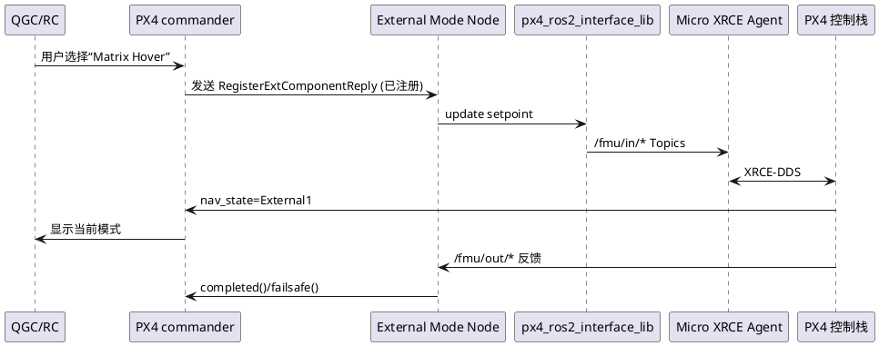

## PX4 ROS 2 Control Interface 一图读懂

> 基于官方文档 `docs/en/ros2/px4_ros2_control_interface.md`，本文用直观语言解释“ROS 2 External Flight Modes”框架：它如何注册模式、如何与 PX4 commander 交接权限、示例代码长什么样，以及何时应该优先使用它。

### 1. 它解决了什么问题？

传统 Offboard 只是一个“匿名外部控制器”：PX4 不知道谁在控制，无法替换内部模式，也不能在 QGC 中展示自定义名称。External Flight Modes 则提供：

- **命名与注册**：ROS 2 节点可把自己的模式名称（如“Matrix Hover”）注册到 PX4；QGC/GCS 能直接选择它。
- **权限交接**：commander 知道外部模式何时激活/失联，可随时收回控制权，并执行 arming check/failsafe。
- **Setpoint 抽象**：通过 `px4-ros2-interface-lib` 提供的类型（Goto、Vel、Rates…），无需手写底层 uORB 消息。
- **模式执行器（Mode Executor）**：允许定义“任务编排”（如：起飞→巡航→投放→返航）。

### 2. 架构概览



- `px4_ros2_interface_lib` 负责底层 DDS 话题，对外暴露 C++ 类。
- 模式（`ModeBase` 派生）实现 `onActivate/onDeactivate/updateSetpoint`。
- PX4 commander 监视模式状态：失联→切回原模式；模式调用 `completed()` → commander 可以切到下一个模式或回 idle。

### 3. 模式、执行器、配置

|术语|作用|
|---|---|
|Mode|单一控制逻辑，如“手动”、“巡航到点 A”。必须继承 `ModeBase`。|
|Mode Executor|状态机，用来串联多个 Mode（例如“投放任务”）。通过“owned mode” 与用户交互。|
|Configuration Overrides|模式激活时临时修改 PX4 行为，如禁止自动解锁、延后低电报警。|

这些定义保证：
- 用户随时能通过 RC/GCS 切回其它模式；
- Failsafe 可以中断外部模式；
- 多个模式/执行器可以共存，各自拥有独立名称与状态。

### 4. 开箱步骤（与官方文档对应）

1. 准备 ROS 2 工作区 + `px4_msgs`。
2. Clone `px4-ros2-interface-lib`，`colcon build`。
3. 启动 PX4 SITL、Micro XRCE Agent、QGroundControl（Daily 版）。
4. 运行示例模式，例如：
   ```sh
   ros2 run example_mode_manual_cpp example_mode_manual
   ```
5. 在 PX4 shell `commander status` 中可看到：`External Mode 1: name: My Manual Mode`。
6. 在 QGC 模式列表中选择它，解锁后模式激活；终端会打印 `Mode 'My Manual Mode' activated`。

### 5. 示例代码速览

`examples/cpp/modes/manual/include/mode.hpp` 展示了完整实现：

```cpp
class FlightModeTest : public px4_ros2::ModeBase {
public:
  explicit FlightModeTest(rclcpp::Node & node)
  : ModeBase(node, Settings{"My Manual Mode"}.preventArming(true))
  {
    _manual_control_input = std::make_shared<px4_ros2::ManualControlInput>(*this);
    _rates_setpoint = std::make_shared<px4_ros2::RatesSetpointType>(*this);
    _attitude_setpoint = std::make_shared<px4_ros2::AttitudeSetpointType>(*this);
  }

  void updateSetpoint(float dt_s) override {
    if (fabsf(_manual_control_input->roll()) > 0.9f) {
      // 切换到角速度控制
      _rates_setpoint->update(...);
    } else {
      // 否则用姿态 setpoint
      _attitude_setpoint->update(...);
    }
  }
};
```

- `Settings` 可配置模式名、arming 要求、failsafe 行为。
- `updateSetpoint()` 中可随时切换 setpoint 类型（只需申请多个 setpoint 对象）。

### 6. 与 Offboard 的关系

|特性|Offboard|External Flight Mode|
|---|---|---|
|模式显示|固定“Offboard”|可自定义名称，QGC 可选|
|权限交接|简单超时监测|和 commander 深度集成，支持 executors、配置 overrides|
|setpoint 抽象|自己发布 uORB/MAVLink|提供高层 setpoint 类（Goto、Vel、Manual）|
|替换内置模式|否|是（可把 RTL / Mission 等替换为 ROS 2 版）|

因此 Offboard 适合快速实验；若要真正“把控制器搬到 ROS 2 并像原生模式一样使用”，应使用 External Mode。

### 7. 何时使用？

- **需要自定义模式名称并在 QGC 上展示**（如“Inspection Mode”）。
- **要接入复杂流程**（起飞、任务、降落）并可能配合外部感知/规划器。
- **希望 ROS 2 节点能直接与 PX4 commander/failsafe 交互**。
- **准备替换或增强原生模式（RTL、Mission）**。

### 8. 进一步资源

- 官方仓库示例：`px4-ros2-interface-lib/examples/cpp/modes/*`
- 模式执行器模板：`examples/cpp/modes/mode_with_executor`
- 自定义 setpoint 类型：`px4_ros2/control/setpoint_types/*`
- 相关参数与 `uXRCE-DDS` topic：`src/modules/uxrce_dds_client/dds_topics.yaml`

通过理解以上结构，你可以更轻松地读懂 `docs/en/ros2/px4_ros2_control_interface.md`，并快速动手实现“我的飞行模式一号”。
