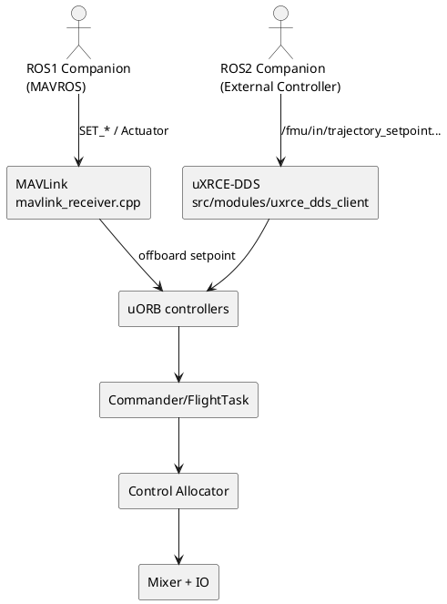

# ROS2 External Controller vs. ROS1 MAVROS 控制路径

## 目录

- [1. 概览与适用场景](#1-概览与适用场景)
- [2. 核心链路与概念](#2-核心链路与概念)
- [3. 深入解析](#3-深入解析)
  - [3.1 uORB / DDS 映射与消息粒度](#31-uorb--dds-映射与消息粒度)
  - [3.2 控制权交接与安全封装](#32-控制权交接与安全封装)
  - [3.3 外部模式注册与 Commander 集成](#33-外部模式注册与-commander-集成)
- [4. 实操与对比指南](#4-实操与对比指南)
  - [4.1 ROS1 MAVROS Offboard 快速清单](#41-ros1-mavros-offboard-快速清单)
  - [4.2 ROS2 External Controller 启用步骤](#42-ros2-external-controller-启用步骤)
  - [4.3 决策建议](#43-决策建议)
- [5. 术语与参考](#5-术语与参考)

---

## 1. 概览与适用场景

本文总结 PX4 1.14+ 推出的 **External Controller**（ROS2 / uXRCE-DDS）与传统 **ROS1 MAVROS Offboard**（MAVLink）之间的差异，聚焦“如何授予伴随计算机全面控制权”以及“PX4 如何在安全链上配合”。适合：已经熟悉 Offboard，但正计划迁移到 PX4 ROS2 控制接口的工程师。

## 2. 核心链路与概念

下图展示两条链路：

| 维度 | MAVROS Offboard (ROS1 + MAVLink) | External Controller (ROS2 + uXRCE-DDS) | 备注 |
| --- | --- | --- | --- |
| 通信层 | MAVLink `SET_POSITION_TARGET_*`, `SET_ACTUATOR_CONTROL_TARGET` 等（`mavlink_receiver.cpp`） | `/fmu/in/*` DDS 话题映射到 uORB（`dds_topics.yaml`） | External Controller 完全依赖 uXRCE-DDS，MAVLink 不提供该控制面 |
| 控制权 | 只能“覆盖” setpoint，PX4 内环仍运行；若写 actuator/motor，则需自行承担风险 | PX4 允许关闭被接管的控制器层（ROS2 模式通过库注册），同时保留 failsafe/mixer | 详见 §3.2 |
| 模式展示 | `nav_state=OFFBOARD`，GCS 只看到 Offboard | 可注册自定义 External Mode（`nav_state=EXTERNAL*`），QGC 展示自定义名字 | Commander 在 `ModeManagement.cpp` 中维护 External Mode 插槽 |
| 最细粒度 | `/mavros/setpoint_actuator` 甚至 `/mavros/motor_control/*` | `/fmu/in/actuator_motors`、`/fmu/in/vehicle_rates_setpoint`、`/fmu/in/trajectory_setpoint` 等 | uXRCE 话题覆盖控制链所有级别 |
| Failsafe 挂钩 | Offboard 丢失 → Commander 根据 `COM_OBL_ACT` 拉回内部模式；无法知道“哪个 ROS 节点” | External Mode 可以由 `mode executor` 报告完成/失败，Commander 能精确收回控制权 | 参考 `docs/en/ros2/px4_ros2_control_interface.md` |

## 3. 深入解析

### 3.1 uORB / DDS 映射与消息粒度

- External Controller 的数据面全部在 `src/modules/uxrce_dds_client/dds_topics.yaml` 中定义。比如 `/fmu/in/trajectory_setpoint`、`vehicle_rates_setpoint`、`vehicle_thrust_setpoint`、`actuator_motors` 等话题映射到 `px4_msgs` 对应消息（[源码](https://github.com/PX4/PX4-Autopilot/blob/main/src/modules/uxrce_dds_client/dds_topics.yaml#L154-L225)）。这些话题直接转发到同名 uORB 主题，意味着 ROS2 端可以精确选择接管层级（位置、姿态、速率、推力乃至电机占空比）。
- MAVROS 路径始终通过 MAVLink。`src/modules/mavlink/mavlink_receiver.cpp` 中的 `handle_message_set_position_target_local_ned()`、`handle_message_set_attitude_target()`、`handle_message_set_actuator_control_target()` 等逻辑，将 MAVLink 帧写入 `offboard_control_mode`, `trajectory_setpoint`, `actuator_controls_*` uORB（[示例源码](https://github.com/PX4/PX4-Autopilot/blob/main/src/modules/mavlink/mavlink_receiver.cpp#L1029-L1471)）。虽然也能抵达任意层，但 PX4 不会关闭对应控制器。
- 因为 External Controller 通过 uXRCE 与 uORB 同步，消息并不需要经过 MAVLink/序列化再反序列化；这在高频姿态或直接电机控制场景下能减少延迟和抖动。

### 3.2 控制权交接与安全封装

- Offboard 模式的安全策略：Commander 只识别“Offboard on/off”，并要求 Offboard 节点以 >2 Hz 发布 setpoint；一旦超时或 RC 介入，即根据 `COM_OBL_*` 退出。内环（姿态/角速/混控）始终运行，因此外部算法往往被迫“与 PX4 PID 并联”。
- External Controller 依托 PX4 ROS2 Interface Library（[官方文档](https://github.com/PX4/PX4-Autopilot/blob/main/docs/en/ros2/px4_ros2_control_interface.md)）暴露的 Mode API：
  - ROS2 模式通过 uXRCE 注册，自带“需要关闭哪些控制器/需要哪些传感器”声明。Commander/FlightTask 在激活该 mode 时，停止对应 PX4 控制器（例如关闭 PX4 速度环，仅保留姿态环），但仍保留混控 / output 限制 / failsafe。
  - 模式的 `mode executor` 可向 Commander 报告 `completed()`、`requestModeSwitch()` 等状态，Commander 可以在 RC/Failsafe 重新接管时自动恢复 PX4 内部控制链。
  - 因为所有 setpoint 都是 uORB native，PX4 仍拥有 `control_allocator` 和 `Mixer` 的最后仲裁权（参考 [`src/modules/control_allocator/ControlAllocator.cpp`](https://github.com/PX4/PX4-Autopilot/blob/main/src/modules/control_allocator/ControlAllocator.cpp#L70-L210) 处理 `VehicleThrustSetpoint`/`ActuatorMotors` 的逻辑），避免“外部节点直接写 PWM”带来的安全缺失。

### 3.3 外部模式注册与 Commander 集成

- Commander 通过 `ModeManagement` 维护 External Mode 插槽，`NAVIGATION_STATE_EXTERNAL1~8` 均可在 QGC 中显示为自定义名称。核心逻辑见 [`src/modules/commander/ModeManagement.cpp`](https://github.com/PX4/PX4-Autopilot/blob/main/src/modules/commander/ModeManagement.cpp#L84-L215)：
  - `addExternalMode()` 会根据 ROS2 模式注册时提供的名字为其分配 nav_state，并将 hash 写入 `COM_MODE*_HASH` 以便 RC 杆位绑定。
  - `ModeManagement::printStatus()` 能在 `commander status` 中列出所有注册模式；Commander 也会把这些 nav_state 返回给 GCS，因此 QGC 能显示“半自主送货”“矩阵巡航”等自定义模式名称。
- 模式可声明“替换哪个 PX4 内建模式”，例如将 `NAVIGATION_STATE_AUTO_LAND` 替换为 ROS2 版本；若 ROS2 节点掉线，Commander 依据注册信息回落到对应 PX4 内部实现。

## 4. 实操与对比指南

### 4.1 ROS1 MAVROS Offboard 快速清单

1. 启动 MAVROS：`roslaunch mavros px4.launch fcu_url:=udp://:14540@127.0.0.1:14557`。
2. 发布 setpoint（至少 2 Hz）：`/mavros/setpoint_raw/local`、`/mavros/setpoint_raw/attitude` 等。
3. 切换模式：`rosservice call /mavros/set_mode 0 OFFBOARD`。
4. 监控 failsafe：`listener offboard_control_mode`、`listener vehicle_status`。

### 4.2 ROS2 External Controller 启用步骤

1. 配置 uXRCE：PX4 端 `UXRCE_DDS_ACT=1` 并启动 `MicroXRCEAgent`。
2. ROS2 端引入 `px4_msgs` 与 [PX4 ROS2 Interface Library](https://github.com/PX4/px4-ros2-interface-lib)。
3. 在 ROS2 模式中选择合适的 setpoint 类型（`TrajectorySetpoint`, `VehicleRatesSetpoint`, `ActuatorMotors` 等）。
4. 调用库 API 注册模式与（可选）mode executor；Commander 会在 QGC 中显示该模式。
5. 发布控制量，PX4 根据模式声明关闭相应控制器并把 uXRCE setpoint 送入 `control_allocator`。
6. 通过 `listener vehicle_command` / `listener offboard_control_mode` / `commander status` 验证模式是否在位。

### 4.3 决策建议

| 需求 | 推荐方案 | 理由 |
| --- | --- | --- |
| 现有 ROS1 stack、只需位置/速度 Offboard | 继续使用 MAVROS | 成熟、部署简单，但依赖 MAVLink，无法停用 PX4 内环 |
| 需要接管姿态/速率甚至直接电机，但仍想保留 PX4 failsafe/mixer | External Controller + uXRCE | 允许逐层声明控制权，Commander 识别 ROS2 模式状态 |
| 需要 GCS 中显示“自定义模式名”（如“投放快递”）并可配合 executor | External Controller | `ModeManagement` 支持 nav_state=EXTERNAL* 的动态展示 |
| 计划在多机或 DDS/Zenoh 网络下扩展 | External Controller | uXRCE-DDS QoS + 官方 ROS2 库可轻松做命名空间、桥接 |

## 5. 术语与参考

- **External Controller**：PX4 1.14+ 引入的 ROS2 控制体系，通过 uXRCE-DDS 话题及 ROS2 Interface Library 在 Commander 中注册模式，并声明接管的控制层级。
- **uXRCE-DDS**：PX4 的 DDS 客户端模块，源代码位于 [`src/modules/uxrce_dds_client`](https://github.com/PX4/PX4-Autopilot/tree/main/src/modules/uxrce_dds_client)。
- **Mode Executor**：ROS2 Interface Library 中的可选状态机，可按任务流程激活不同模式并向 Commander 报告 `completed()`、`requestModeSwitch()`（详见 [PX4 ROS2 Control Interface](https://github.com/PX4/PX4-Autopilot/blob/main/docs/en/ros2/px4_ros2_control_interface.md)）。
- **参考阅读**：
  - [PX4 ROS2 Control Interface](https://github.com/PX4/PX4-Autopilot/blob/main/docs/en/ros2/px4_ros2_control_interface.md)
  - [PX4 ROS2 Interface Library 示例](https://github.com/PX4/px4-ros2-interface-lib)
  - [mavlink_receiver 源码](https://github.com/PX4/PX4-Autopilot/blob/main/src/modules/mavlink/mavlink_receiver.cpp)
  - [ModeManagement Commander 模块](https://github.com/PX4/PX4-Autopilot/blob/main/src/modules/commander/ModeManagement.cpp)
