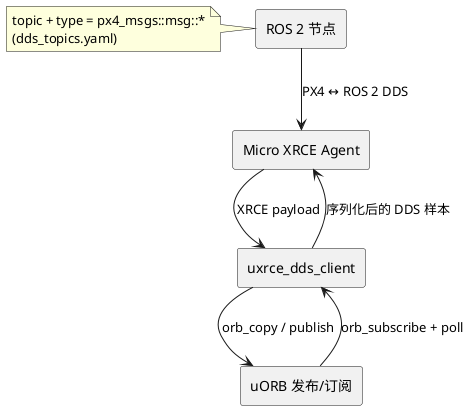

## 解析 `dds_topics.yaml`：PX4 uXRCE-DDS ↔︎ uORB 映射指南

> 目标：弄清 [src/modules/uxrce_dds_client/dds_topics.yaml](../../src/modules/uxrce_dds_client/dds_topics.yaml) 与 uORB 的关系、`topic`/`type` 字段含义，以及 `publications`/`subscriptions` 各自对应的 ROS ↔︎ PX4 数据流。

### 1. YAML 在桥上的角色

- 构建时 `generate_dds_topics.py` 读取 YAML，并+EmPy 模板 `dds_topics.h.em` 生成 C++ 源码（`SendTopicsSubs`/`RcvTopicsPubs`）。
- `publications` 描述 “PX4 (uORB) -> DDS -> ROS 2”；`subscriptions`/`subscriptions_multi` 描述 “ROS 2 -> DDS -> PX4 (uORB)`。
- YAML 中的 `topic` 是 ROS 侧使用的 `/fmu/out/...` 或 `/fmu/in/...` 名称，`type` 是 `px4_msgs::msg::*`。脚本会根据 `type` 推导出对应的 uORB 元数据 (`ORB_ID(vehicle_status)` 等)。

### 2. `type` 如何映射到 uORB？（含正/反例）

源码可参考 `src/modules/uxrce_dds_client/generate_dds_topics.py` 与 `dds_topics.h.em`：

1. **正例**：`px4_msgs::msg::VehicleStatus`
   - `process_message_type()` 取 `simple_base_type = vehicle_status`（通过正则把驼峰转 snake_case），模板里引用 `ORB_ID(vehicle_status)`、`ucdr_serialize_vehicle_status()`。
   - 因为 `msg/VehicleStatus.msg` 与 uORB `vehicle_status` 同源，映射一一对应，可桥接。
2. **反例**：`type: std_msgs::msg::String`
   - 不在 `px4_msgs` 名称空间，生成阶段找不到 `uORB/topics/string.h`，构建会失败。
3. **实例映射**：`instance: N` → 生成 `orb_subscribe_multi(..., N)` / `uORB::PublicationMulti`，比如 `actuator_servos`。

### 3. `publications`: uORB → DDS → ROS 2

对应模板 `SendTopicsSubs`（`dds_topics.h.em:39-158`）：

- 每个条目生成 `ORB_ID(topic_simple)` 订阅。例如：
  - **正例** `/fmu/out/vehicle_status` → `orb_subscribe(vehicle_status)`；Commander 发布 uORB 后，ROS 2 就能收到样本。
  - **反例** `/fmu/out/some_unused_topic`：若 PX4 未发布该 uORB，即使在 YAML 中列出，ROS 侧也不会收到任何数据。
- `static_assert(sizeof(simple_base_type_s) <= max_topic_size)` 确保 ROS 2 消息不会超过 XRCE 缓冲大小。
- `dds_type` 自动替换为 `px4_msgs::msg::dds_::*`，`ucdr_serialize_*` 用于序列化。

### 4. `subscriptions` / `subscriptions_multi`: ROS 2 → DDS → uORB

对应模板 `RcvTopicsPubs`（`dds_topics.h.em:161-218`）：

- 生成 `uORB::Publication` 或 `PublicationMulti`。XRCE 收到 DDS 样本时：
  - `ucdr_deserialize_<simple_base_type>()` 反序列化；
  - `publish()` 到 `ORB_ID(topic_simple)`。
- `create_data_reader(... queue_depth ...)` 依据 `orb_get_queue_size()` 创建 DDS DataReader，以匹配 uORB 队列长度并稍作加倍。
- **正例** `/fmu/in/vehicle_command`：`commander` 订阅 `vehicle_command`，所以 ROS 2 发命令后 PX4 会执行。
- **反例** `/fmu/in/custom_test`：若 PX4 没有任何模块订阅该 uORB，数据被写入 uORB 但无人消费。

### 5. 常见疑问解答（附例）

1. **`topic` 与 `type` 为什么看不到 uORB？** `type` 来自 `px4_msgs`，如 `px4_msgs::msg::TrajectorySetpoint`。生成代码 include `uORB/topics/trajectory_setpoint.h` 并使用 `ORB_ID(trajectory_setpoint)`；如果写 `std_msgs`（反例），编译时即报错。
2. **如何知道 `type` ↔ uORB？** `Foo` → `foo` 规则；在 `msg/Foo.msg` 或 `uORB/topics/foo.h` 查阅即可。`Tools/msg/generate_msg_docs.py` 也会生成对照表。
3. **`publications` 是否保证有数据？** 不保证。示例：`/fmu/out/sensor_combined` 在 SITL 有内容，但在一个无 IMU 的机型上就不会有输出。
4. **`subscriptions` 是否保证 PX4 响应？** 取决于内部订阅者。`/fmu/in/trajectory_setpoint` 在 MC 控制器中订阅 → 有效；`/fmu/in/rc_channels` 没有内部订阅 → 数据被丢弃。

### 6. 参考

- `src/modules/uxrce_dds_client/dds_topics.yaml`
- `src/modules/uxrce_dds_client/generate_dds_topics.py` + `dds_topics.h.em`
- `docs/en/middleware/uxrce_dds.md`
- `px4_msgs` 与自动生成脚本 `Tools/msg/*`

综上，`dds_topics.yaml` 是桥接配置表：通过 `px4_msgs::msg::*` 与 uORB 的同源关系、加上生成脚本自动展开 `ORB_ID`/`Publication`/`Subscription`，决定了 PX4 ↔ ROS 2 可以互通的消息集合；是否真正有数据/响应，还要看 PX4 内部是否发布/订阅对应的 uORB。
