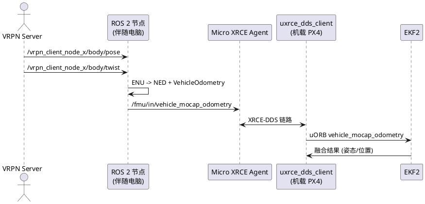

## VRPN 动捕数据通过 uXRCE-DDS 反馈 PX4 指南

> 适用对象：已经在伴随电脑运行 ROS 2 Jazzy + Micro XRCE Agent，并且 VRPN 节点能输出 `/vrpn_client_node_<id>/<机体名>/pose` / `twist` 话题，希望让 PX4 EKF2 融合该外部位姿。

### 1. 总览



- uXRCE-DDS 端点由 `src/modules/uxrce_dds_client/dds_topics.yaml` 定义，PX4 Jazzy 分支默认启用 `/fmu/in/vehicle_mocap_odometry` 与 `/fmu/in/vehicle_visual_odometry` 两个入口（类型 `px4_msgs::msg::VehicleOdometry`）。
- 伴随电脑只需把 VRPN 输出来回填该消息，并通过 XRCE Agent 传回飞控。

### 2. PX4 侧准备

1. **确认话题已启用**：`dds_topics.yaml` 中第 166/172 行分别列出了 mocap/视觉里程计订阅，如需自定义 topic 名称，可在该文件修改并重新编译固件与 `px4_msgs`。
2. **开启 uXRCE 客户端**：
   ```sh
   param set UXRCE_DDS_ACT 1
   param set UXRCE_DDS_NS_IDX 1   # 可选命名空间
   uxrce_dds_client start
   ```
3. **配置 EKF2**（按用途二选一）：
   - Mocap：`EKF2_AID_MASK` 打开 `MOCAP_POS`/`MOCAP_VEL`，必要时开启 `MOCAP` yaw；若传感器安装有偏移，设置 `EKF2_MOCAP_ID`、`EKF2_EV_POS_X/Y/Z`。
   - 外部视觉：`EKF2_AID_MASK` 选 `EV_POS`/`EV_YAW`，并设置 `EKF2_EV_DELAY`、`EKF2_EV_TAU`。
4. **检查链路**：`uxrce_dds_client status` 应显示 `running, connected`；PX4 shell 可 `listener vehicle_mocap_odometry` 验证数据。

### 3. ROS 2 侧实现

核心任务：订阅 VRPN Pose/Twist → 转成 NED 坐标系 → 发布 `px4_msgs::msg::VehicleOdometry` 到 `/fmu/in/vehicle_mocap_odometry`（或视觉话题）。

#### 3.1 ENU→NED 转换辅助函数

```python
from geometry_msgs.msg import PoseStamped, TwistStamped
from px4_msgs.msg import VehicleOdometry
import numpy as np

def enu_to_ned_position(p):
    return np.array([p.y, p.x, -p.z])

def enu_to_ned_quaternion(q):
    return [q.y, q.x, -q.z, q.w]

def enu_to_ned_velocity(v):
    return np.array([v.y, v.x, -v.z])
```

#### 3.2 rclpy 示例节点

```python
import rclpy
from rclpy.node import Node
from geometry_msgs.msg import PoseStamped, TwistStamped
from px4_msgs.msg import VehicleOdometry

class VrpnToPx4(Node):
    def __init__(self):
        super().__init__('vrpn_to_px4')
        self.pose = None
        self.twist = None
        self.create_subscription(PoseStamped,
                                 '/vrpn_client_node_0/my_uav/pose',
                                 self.pose_cb, 10)
        self.create_subscription(TwistStamped,
                                 '/vrpn_client_node_0/my_uav/twist',
                                 self.twist_cb, 10)
        self.publisher = self.create_publisher(
            VehicleOdometry,
            '/fmu/in/vehicle_mocap_odometry',
            10)
        self.timer = self.create_timer(1/60.0, self.publish_odom)

    def pose_cb(self, msg):
        self.pose = msg

    def twist_cb(self, msg):
        self.twist = msg

    def publish_odom(self):
        if not self.pose or not self.twist:
            return
        odom = VehicleOdometry()
        now_us = int(self.get_clock().now().nanoseconds / 1000)
        odom.timestamp = odom.timestamp_sample = now_us
        pos = enu_to_ned_position(self.pose.pose.position)
        odom.position = pos.tolist()
        odom.q = enu_to_ned_quaternion(self.pose.pose.orientation)
        vel = enu_to_ned_velocity(self.twist.twist.linear)
        odom.velocity = vel.tolist()
        ang = enu_to_ned_velocity(self.twist.twist.angular)
        odom.angular_velocity = ang.tolist()
        odom.pose_frame = VehicleOdometry.POSE_FRAME_FRD
        odom.velocity_frame = VehicleOdometry.VELOCITY_FRAME_FRD
        odom.position_variance = [0.01, 0.01, 0.01]
        odom.orientation_variance = [0.001, 0.001, 0.001]
        odom.velocity_variance = [0.01, 0.01, 0.01]
        self.publisher.publish(odom)

def main():
    rclpy.init()
    node = VrpnToPx4()
    rclpy.spin(node)
    node.destroy_node()
    rclpy.shutdown()

if __name__ == '__main__':
    main()
```

要点：
- `timestamp`/`timestamp_sample` 尽量使用 PX4 时间基；若已订阅 `/fmu/out/timesync_status`，可以改用该消息提供的 `timestamp`。
- `position_variance`/`orientation_variance`/`velocity_variance` 的 3 个元素对应对角线，可依实测噪声调整，避免 EKF 权重不合理。
- 若只想输入姿态，可把速度设 `NaN` 并在 EKF2 中关闭对应融合位。

#### 3.3 rclcpp 片段（可选）

```cpp
#include <px4_msgs/msg/vehicle_odometry.hpp>
#include <geometry_msgs/msg/pose_stamped.hpp>
#include <geometry_msgs/msg/twist_stamped.hpp>
#include <rclcpp/rclcpp.hpp>

class VrpnBridge : public rclcpp::Node {
public:
  VrpnBridge() : Node("vrpn_bridge") {
    pose_sub_ = create_subscription<geometry_msgs::msg::PoseStamped>(
        pose_topic_, 10,
        std::bind(&VrpnBridge::poseCallback, this, std::placeholders::_1));
    twist_sub_ = create_subscription<geometry_msgs::msg::TwistStamped>(
        twist_topic_, 10,
        std::bind(&VrpnBridge::twistCallback, this, std::placeholders::_1));
    odom_pub_ = create_publisher<px4_msgs::msg::VehicleOdometry>(
        "/fmu/in/vehicle_visual_odometry", 10);
    timer_ = create_wall_timer(
        std::chrono::milliseconds(20),
        std::bind(&VrpnBridge::publishOdom, this));
  }
private:
  void poseCallback(const geometry_msgs::msg::PoseStamped &msg) { pose_ = msg; }
  void twistCallback(const geometry_msgs::msg::TwistStamped &msg) { twist_ = msg; }
  void publishOdom() {
    if (!pose_ || !twist_) return;
    auto odom = px4_msgs::msg::VehicleOdometry();
    const auto now_us = (this->get_clock()->now().nanoseconds()) / 1000;
    odom.timestamp = odom.timestamp_sample = now_us;
    // TODO: 调用与上面相同的 ENU->NED 转换函数
    odom.pose_frame = px4_msgs::msg::VehicleOdometry::POSE_FRAME_FRD;
    odom.velocity_frame = px4_msgs::msg::VehicleOdometry::VELOCITY_FRAME_FRD;
    odom_pub_->publish(odom);
  }
  std::string pose_topic_ = "/vrpn_client_node_0/my_uav/pose";
  std::string twist_topic_ = "/vrpn_client_node_0/my_uav/twist";
  geometry_msgs::msg::PoseStamped::SharedPtr pose_;
  geometry_msgs::msg::TwistStamped::SharedPtr twist_;
  rclcpp::Subscription<geometry_msgs::msg::PoseStamped>::SharedPtr pose_sub_;
  rclcpp::Subscription<geometry_msgs::msg::TwistStamped>::SharedPtr twist_sub_;
  rclcpp::Publisher<px4_msgs::msg::VehicleOdometry>::SharedPtr odom_pub_;
  rclcpp::TimerBase::SharedPtr timer_;
};
```

### 4. 测试与排错

| 现象 | 处理 |
| --- | --- |
| `ros2 topic list` 没有 `/fmu/in/vehicle_mocap_odometry` | Agent 未连接或 `dds_topics.yaml` 被改动后未重新编译；重启 `uxrce_dds_client` 并确认 `px4_msgs` 同步。 |
| PX4 `listener vehicle_mocap_odometry` 不刷新 | 发布频率过低、时间戳倒退、或 EKF2 未开启相关融合；检查节点日志并校准时间。 |
| EKF2 `WARN: EV DELAY` | `EKF2_EV_DELAY` 过小；根据延迟估算（VRPN + 传输）后设置，或在消息中填入 `timestamp_sample = now_us - latency_us`。 |
| 姿态翻转 / 坐标轴反了 | ENU→NED 转换错误；确认北/东/地与前/右/下的映射，尤其是四元数顺序。 |

### 5. 扩展建议

- 如果还有其它感知源（VIO、AprilTag），可在同一节点复用转换逻辑，只需在 `dds_topics.yaml` 中保持对应 `/fmu/in/...` 条目。
- 对延迟敏感场合，可订阅 `/fmu/out/timesync_status`，用 PX4 给的 `pps_offset` 修正本地时间，并在 `VehicleOdometry` 中设置 `timestamp_sample` 为观测实际产生的时刻。
- 若要为多机体部署，可通过参数化命名空间：运行 `uxrce_dds_client start -n drone1` 并在 ROS 节点把发布目标改为 `/drone1/fmu/in/...`。
