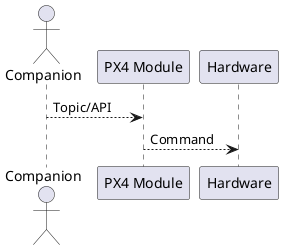
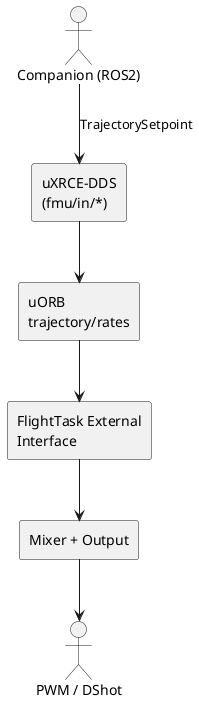

# 文档写作模板（示范）

> 要点：模板强调“结构化与可验证”，不是固定章节。可根据内容类型（概念对比、链路讲解、排障指南）选择适用段落。
>
> 要点：所有源码引用**必须使用 GitHub 链接形式**（例如 `[MixingOutput::output_limit_calc_single](https://github.com/PX4/PX4-Autopilot/blob/main/src/lib/mixer_module/mixer_module.cpp#L535-L570)`），不要只写路径或文件名，确保读者可以直接点击跳转。

## 目录（示例）

> 要点：目录只列出本篇实际包含的章节，顺序遵循“概览 → 深入 → 实操/对比 → 附录”。

- [1. 概览与适用场景](#1-概览与适用场景)
- [2. 关键概念与链路](#2-关键概念与链路)
- [3. 深入解析（按主题拆分）](#3-深入解析按主题拆分)
- [4. 实操 / 对比 / 排障（按需选择）](#4-实操--对比--排障按需选择)
- [5. 术语与参考](#5-术语与参考)

---

## 1. 概览与适用场景

> 要点：用 2-3 句话交代本文目的、解答的问题、读者需具备的前置知识。适合概念对比类文章（如 External Controller vs MAVROS）。

- 示例：本文比较 ROS2 External Controller 与 MAVROS 在控制接口、通信协议、Failsafe 上的差异，面向正在迁移工具链的工程师。

## 2. 关键概念与链路

> 要点：梳理核心术语、流程或数据流。可使用表格、PlantUML、或分段文字。若篇幅以对比为主，可放置对照表。
>
> 要点：所有流程图一律使用 **PlantUML** 语法，方便在仓库中复用与渲染。



- 示例：展示 ROS2 External Controller 的执行链：



- 对比型文章：可用表格，如

| 项目 | External Controller | MAVROS | 说明 |
| --- | --- | --- | --- |
| 通道 | `/fmu/in/trajectory_setpoint` | `/mavros/setpoint_*` | [PX4 Doc](https://github.com/PX4/PX4-Autopilot/blob/main/docs/...) |

## 3. 深入解析（按主题拆分）

> 要点：针对每个关键点开子节，每节先给结论，再引用源码/文档佐证。章节数量依文档需求决定，可包含以下类型：
>
> - **机制解读**：例如“External Controller 如何通过 uXRCE-DDS 控制 PX4”，附源码路径。
> - **数学/公式**：提供推导或公式时，加 `LaTeX` 与源码出处。
> - **架构细节**：列出涉及的文件/类/参数。

| 模块 | GitHub 链接 | 解释 |
| --- | --- | --- |
| MixingOutput | [`src/lib/mixer_module/mixer_module.cpp#L535-L570`](https://github.com/PX4/PX4-Autopilot/blob/main/src/lib/mixer_module/mixer_module.cpp#L535-L570) | 将归一化 control 映射为 `actuator_outputs`。 |

## 4. 实操 / 对比 / 排障（按需选择）

> 要点：这是可选章节，依文章类型选用其一或多项：
>
> - **实操步骤**：提供命令行、参数设置、ROS 2 节点示例等。
> - **对比总结**：若主旨是比较两个方案，可在此放对比表或决策建议。
> - **排障指南**: 列出最常见的 3-5 个问题，对应诊断步骤与源码参考。

```sh
# 示例命令（仅在实操场景需要）
ros2 run my_pkg direct_actuator_node
listener actuator_motors
```

| 现象 | 诊断 | 对应源码 | 解决 |
| --- | --- | --- | --- |
| `Offboard lost` | `listener offboard_control_mode` 无新时间戳 | [`offboard_control_mode.msg`](https://github.com/PX4/PX4-Autopilot/blob/main/msg/OffboardControlMode.msg) | 提升发布频率 ≥ 20 Hz |

## 5. 术语与参考

> 要点：术语首次出现必须解释，可在文末集中整理；附带延伸阅读。

- **uXRCE-DDS**：PX4 的 DDS 客户端，负责 ROS2 ↔ uORB 映射（[`src/modules/uxrce_dds_client`](https://github.com/PX4/PX4-Autopilot/tree/main/src/modules/uxrce_dds_client)）。
- 延伸阅读：
  - `docs/en/ros2/px4_ros2_control_interface.md`
  - 官方参数参考：[`src/drivers/dshot/module.yaml`](https://github.com/PX4/PX4-Autopilot/blob/main/src/drivers/dshot/module.yaml)

---

> 要点：如需附录（示例代码、配置文件、推导细节），可在末尾新增“附录”章节。保持同样的引用与排版规范。
